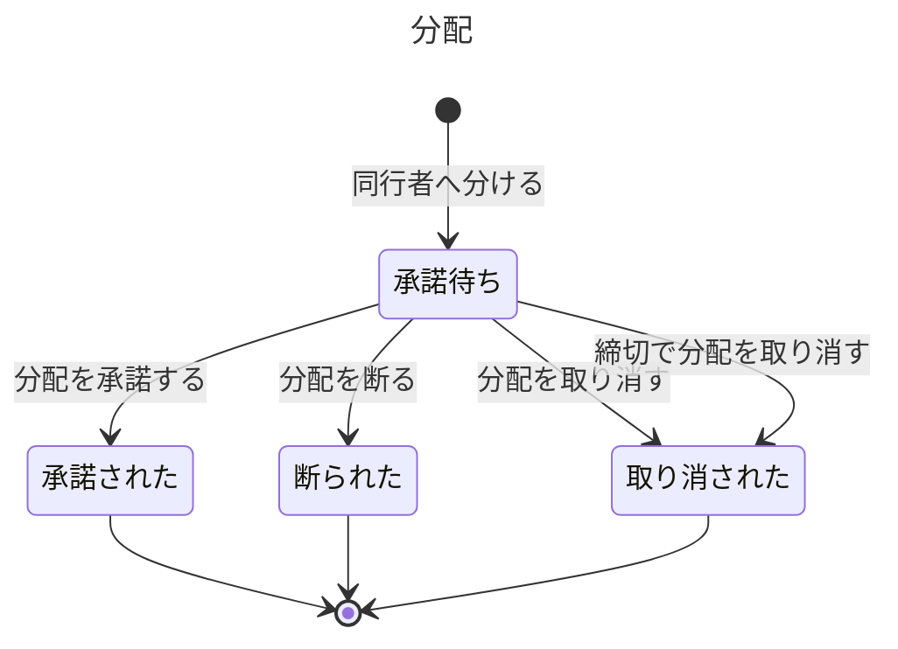

# チケットの業務知識

来場者、同行者、ステージパスの運営スタッフが、一枚のチケットについて「いま誰が入場できる権利を持っているか」を同じ言葉で判断するための業務知識である。読み手は、業務を知る人と、後ろにコマンドデータモデルとクエリデータモデルを作る作り手である。この業務は、購入が成立してチケットを発券したときに始まり、同行者への分配が承諾されるか、取り消されるか、断られるかで一つの分配を終える。リセールで買い手が付いたとき、入場に使われたとき、払い戻しを決めたときの判断は、それぞれ隣の業務が持つ。

# 概要

チケットの業務は、購入で生まれた入場できる権利を一枚ずつのチケットにし、その権利を持つ保有者を、発券と同行者への分配を通じて一人に決め続ける業務である。紙のチケットでは、券面を渡すことと権利を正式に移すことが区別できず、主催者も今の持ち主を知らなかった（`input/業務要件.md`「なぜ作るのか」）。そこで、購入者が同行者へチケットを分けるときは、同行者が承諾した時点で初めて保有者が変わり、承諾されるまでの間は誰もそのチケットで入場できない形にする。こうすれば、一枚のチケットの権利を二人が同時に持つことが無く、来場者は入場前に自分の権利の状態を確かめられ、運営スタッフは問い合わせに一つの答えで応じられる。

この業務が担わないことは次のとおりである。購入の成立と、購入に付く席（または整理番号）の決定は販売の業務が担う。出品とリセールで買うことは、リセールの業務が担う。入場、退場、止めることは入場の業務が、払い戻しと返金は払い戻しの業務が担う。公演、会場、席、席の種類、整理番号、分配の締切は主催者の管理機能が決め、会員と本人確認は会員管理が持つ。どれもこの業務では所与として扱う。入場に使う画面の表示（入場コード）が時間ごとに変わることと、分配を同行者へ知らせる手段は、仕組みの話なので業務の決まりに入れない（送り先は「業務の行い」の各節と「まだ決まっていないこと」に書いた）。

# ユビキタス言語

業務の言葉と英名の対応は次のとおりである。持ち主が隣の業務の行は、持ち主の資料がまだ無いので英名を `未定` にした。持ち主が検証の外にある行は、要件の文書を指して参照する。

| 業務の言葉 | 英名 | 種類 | 持ち主 |
|---|---|---|---|
| チケット | Ticket | 業務用語 | この資料 |
| チケット番号 | TicketNumber | 業務用語 | この資料 |
| 購入者 | Purchaser | 業務用語 | この資料 |
| 保有者 | Holder | 業務用語 | この資料 |
| 同行者 | Companion | 業務用語 | この資料 |
| 分配 | Distribution | 業務用語 | この資料 |
| 譲渡済み | TransferredAway | 業務用語 | この資料 |
| チケットを発券した | TicketIssued | 業務イベント | この資料 |
| 同行者へ分けた | DistributedToCompanion | 業務イベント | この資料 |
| 分配を承諾した | DistributionAccepted | 業務イベント | この資料 |
| 分配を断った | DistributionDeclined | 業務イベント | この資料 |
| 分配を取り消した | DistributionCancelled | 業務イベント | この資料 |
| 締切で分配を取り消した | DistributionCancelledAtDeadline | 業務イベント | この資料 |
| 承諾待ち | AwaitingAcceptance | 状態 | この資料 |
| 承諾された | Accepted | 状態 | この資料 |
| 断られた | Declined | 状態 | この資料 |
| 取り消された | Cancelled | 状態 | この資料 |
| チケットを発券する | IssueTicket | コマンド | この資料 |
| 同行者へ分ける | DistributeToCompanion | コマンド | この資料 |
| 分配を承諾する | AcceptDistribution | コマンド | この資料 |
| 分配を断る | DeclineDistribution | コマンド | この資料 |
| 分配を取り消す | CancelDistribution | コマンド | この資料 |
| 締切で分配を取り消す | CancelDistributionAtDeadline | コマンド | この資料 |
| 自分のチケットを見る | ViewMyTickets | クエリ | この資料 |
| 購入 | 未定 | 業務用語 | [販売の業務知識](../販売/business-knowledge.md) |
| 購入が成立した | 未定 | 業務イベント | [販売の業務知識](../販売/business-knowledge.md) |
| 出品 | 未定 | 業務用語 | [リセールの業務知識](../リセール/business-knowledge.md) |
| リセールで買った | 未定 | 業務イベント | [リセールの業務知識](../リセール/business-knowledge.md) |
| 入場 | 未定 | 業務用語 | [入場の業務知識](../入場/business-knowledge.md) |
| 払い戻し | 未定 | 業務用語 | [払い戻しの業務知識](../払い戻し/business-knowledge.md) |
| 来場者 | 未定 | 業務用語 | 範囲の外: [業務要件（会員管理）](../../input/業務要件.md) |
| 会員 | 未定 | 業務用語 | 範囲の外: [業務要件（会員管理）](../../input/業務要件.md) |
| 主催者 | 未定 | 業務用語 | 範囲の外: [業務要件（主催者の管理機能）](../../input/業務要件.md) |
| 運営スタッフ | 未定 | 業務用語 | 範囲の外: [業務要件（ステージパスの運営）](../../input/業務要件.md) |
| 公演 | 未定 | 業務用語 | 範囲の外: [業務要件（主催者の管理機能）](../../input/業務要件.md) |
| 公演の日時 | 未定 | 業務用語 | 範囲の外: [業務要件（主催者の管理機能）](../../input/業務要件.md) |
| 会場 | 未定 | 業務用語 | 範囲の外: [業務要件（主催者の管理機能）](../../input/業務要件.md) |
| 席 | 未定 | 業務用語 | 範囲の外: [業務要件（主催者の管理機能）](../../input/業務要件.md) |
| 席の種類 | 未定 | 業務用語 | 範囲の外: [業務要件（主催者の管理機能）](../../input/業務要件.md) |
| 整理番号 | 未定 | 業務用語 | 範囲の外: [業務要件（主催者の管理機能）](../../input/業務要件.md) |
| 席を見せる時点 | 未定 | 業務用語 | 範囲の外: [業務要件（主催者の管理機能）](../../input/業務要件.md) |
| 分配の締切 | 未定 | 業務用語 | 範囲の外: [業務要件（主催者の管理機能）](../../input/業務要件.md) |

要件は「座席」と「席」を同じ意味で使っているので、この資料では分け方にそろえて「席」と書く。状態の四つの名前は要件に言葉が無いので、分けた購入者が自分の分配を言う言葉として仮に置いた（「まだ決まっていないこと」に書いた）。

## 業務用語

### チケット

一つの公演の、一つの席（スタンディングの公演では一つの整理番号）に入場できる権利を、一枚として表したものである。発券で生まれ、保有者が変わっても同じチケットのままである。一枚のチケットで入場できるのは一人だけなので、分配も、リセールも、払い戻しも、一枚ずつのチケットについて判断する。

### チケット番号

一枚のチケットを特定する番号である。発券したときに付き、保有者が変わっても変わらない。運営スタッフが問い合わせで「どのチケットの話か」を確かめるとき、また同じ公演の中でチケットを並べるときの最後の決め手に使う。

### 購入者

そのチケットの購入をした会員である。購入者は発券の後も変わらない。保有者との違いは、分配やリセールで権利が移っても購入者は元のままだという点にある。同行者へ分けられるのは購入者だけで、払い戻しの返金を受けるのも購入者である（払い戻しの判断は払い戻しの業務が持つ）。

### 保有者

そのチケットで、いま入場できる権利を持つ会員である。発券した時点では購入者が保有者で、分配が承諾されると同行者に、リセールで買い手が付くと買い手に変わる。保有者であることと、いま入場に使えることは別である。出品中、分配の承諾待ち、払い戻しを決めた後は、保有者でも入場に使えない。

### 同行者

購入者からチケットを分けられ、自分のスマートフォンで入場する来場者である。同行者も会員である（`input/業務要件.md`「関係する人」）。購入者が指名した時点では分配の相手で、承諾すると、そのチケットの保有者になる。

### 分配

購入者が、自分の購入のチケット一枚を、指名した同行者へ無償で分けることである。購入者が分けたときに承諾待ちで始まり、同行者の承諾、購入者の取消、同行者の断り、締切での取消のどれかで終わる。一枚のチケットについて、承諾待ちの分配は同時に一つだけである。購入者と同行者の間でお金をやり取りすることは分配に含まない（`input/業務要件.md`「同行者への分配」）。

### 譲渡済み

自分が保有者だったチケットが、分配の承諾かリセールで買い手が付いたことで他の会員へ移り、もう入場に使えないことを表す、元の保有者から見た言葉である。要件はリセールで売れたチケットについてこの言葉を使う（`input/業務要件.md`「買う」）。分配で承諾されたチケットにも同じ言葉を使うのは、自分のチケットを見るの仮置きの答えである。

## 業務イベント

### チケットを発券した

購入が成立したので、ステージパスがその購入の枚数だけチケットを生んだ。各チケットには購入に付いた席（または整理番号）が付き、保有者は購入者になる。ここから、そのチケットは入場の業務で使え、分配とリセールの対象になる。

### 同行者へ分けた

購入者が、自分の購入のチケット一枚を、指名した同行者へ分けた。分配は承諾待ちで始まる。保有者は購入者のままだが、購入者はそのチケットで入場できなくなり、出品もできなくなる。

### 分配を承諾した

指名された同行者が、承諾待ちの分配を承諾した。分配は承諾されたになり、そのチケットの保有者が同行者に変わる。購入者から見ると、そのチケットは譲渡済みになる。

### 分配を断った

指名された同行者が、承諾待ちの分配を断った。分配は断られたになり、チケットは購入者の手元へ戻って入場に使える。（仮説：断れることは要件に無く、仮置きである。）

### 分配を取り消した

購入者が、承諾待ちの分配を取り消した。分配は取り消されたになり、チケットは購入者の手元へ戻って入場に使える。

### 締切で分配を取り消した

分配の締切を過ぎても承諾されていなかったので、ステージパスが分配を取り消した。分配は取り消されたになり、チケットは購入者の手元へ戻って入場に使える。（仮説：締切での取消は要件に無く、仮置きである。）

# 概念

## チケットは権利そのもので、画面の表示ではない

チケットは入場できる権利そのものであり、入場に使う画面の表示ではない。画面を保存したり複写したりしても権利は移らず、権利が移るのは、分配の承諾とリセールで買い手が付いたときだけである。入場に使う画面の表示（入場コード）がどれだけの間隔で変わるかは、仕組みを変えれば消える話なので、この資料では扱わず、品質要求の `input/入場口の運用と非機能要件.md`「入場コードの変わり方」に置いた。

## 保有者は、最後に起きた権利の移り変わりで決まる

一枚のチケットの保有者は、そのチケットについて起きた「チケットを発券した」「分配を承諾した」「リセールで買った」のうち、最後に起きたものが指す会員である（仮説：分け方の「業務をまたいで同じ答えにすべき問い」の一つ目への仮置きの答え）。発券なら購入者、分配の承諾なら同行者、リセールで買ったなら買い手である。承諾待ちの分配や出品中の出品は、保有者を変えない。

保有者が、いまそのチケットを入場に使えるかは、保有者であることとは別に、隣の業務の事実と合わせて決まる。この業務が決めるのは、承諾待ちの分配がある間は保有者（購入者）が入場に使えないことだけである。出品中なら使えないことはリセールの業務が、払い戻しを決めたら使えないことは払い戻しの業務が、すでに入場に使われていれば止めることは入場の業務が判断する。

## 分配は、承諾されるまで権利を動かさない

分配は、購入者が一枚のチケットを同行者へ分ける約束で、承諾されるまでは権利を動かさない。承諾待ちの間、保有者は購入者のままだが、購入者はそのチケットで入場できない。承諾の前に購入者が入場に使えると、承諾の後に同行者も入場しようとして、同じチケットで二人が入口に来ることになるからである。

分けられるのは、複数枚を買った購入者が、自分の分以外のチケットを分けるときだけである（`input/業務要件.md`「同行者への分配」）。自分の分以外とは、分けた後も、その購入のチケットのうち少なくとも一枚を購入者自身が保有者として手元に持つことをいう。分けられた相手は、承諾すれば保有者になり、断るか、購入者が取り消すか、締切が過ぎれば、チケットは購入者の手元へ戻る。

分けた先の同行者がさらに別の人へ分けること、承諾の後に購入者が取り戻すことは、初期リリースでは認めない（仮説：要件で未決。主催者の多くが再分配を認めたくないと言っていることに合わせた仮置き）。

## 一枚のチケットに進められる移転は一つだけ

一枚のチケットについて、同時に進められる移転は一つだけである（`input/業務要件.md`「分配とリセールの関係」）。移転とは、分配とリセールのことである。この業務は「同行者へ分ける」で、出品中のチケットと、すでに承諾待ちの分配があるチケットを拒む。承諾待ちのチケットを出品できないことは、リセールの業務が「出品する」で判断する（仮説：分け方の二つ目の問いへの仮置きの答え。判断を、移転を始める行いを持つ業務ごとに置いた）。

# 常に守られること

### 一枚のチケットの保有者は、いつも一人だけである

保有者が二人いると、同じチケットで二人が入口に来たときに係員が判断できず、主催者も案内を誰へ届ければよいか分からなくなる。要件が一番大事な性質として挙げる「同じチケットの権利を二人に持たせない」に当たる（`input/入場口の運用と非機能要件.md` の冒頭）。

### 一つの購入からは、購入の枚数だけのチケットを一度だけ発券する

支払い完了の知らせが二度届いたときに二度発券すると、一人分の代金で二人が入場でき、席の数より多いチケットが出回る（`input/入場口の運用と非機能要件.md`「整合性」）。

### チケットの席（または整理番号）は、発券した後に変わらない

席は購入に付いたものをそのまま写す（仮説：席を決めるのは販売の業務という仮置き）。発券した後に席が変わると、来場者が確かめた席と入場の日に座る席が食い違い、販売の業務が守る「一つの席を二人に売らない」をチケットの側で崩すことになる。席を来場者に見せる時点は主催者が決めるが、見せる前も席そのものは決まっている（`input/業務要件.md`「発券する」）。

### 一枚のチケットで承諾待ちの分配は同時に一つだけで、出品中とは重ならない

承諾待ちの分配が二つあると、二人の同行者がどちらも承諾して保有者が二人になる。出品中のチケットを分けると、リセールの買い手と同行者の二人へ同じ権利が移りうる。どちらも、要件の「同時に進められる移転は一つだけ」を破る。

### 承諾待ちの分配があるチケットでは、購入者は入場できない

分けたチケットで購入者が入場できると、承諾した同行者と購入者の二人が同じチケットで入場しようとする（`input/業務要件.md`「同行者への分配」「分けたチケットは、購入者の画面から入場に使えなくなる」）。

### 分配を承諾できるのは、指名された同行者だけである

指名されていない会員が承諾できると、購入者が意図しない人へ権利が移り、購入者は取り戻せない（承諾の後の取戻しは初期リリースで認めない仮置き）。

### 権利の移り変わりは、起きた順に崩れない

たとえば、リセールで権利が移った後に、元の保有者による分配の承諾が成立してはならない（`input/入場口の運用と非機能要件.md`「整合性」）。順が入れ替わると、保有者の決め方（最後に起きた移り変わり）が別の人を指してしまう。

### 運営スタッフは、一枚のチケットについて誰が買い、いつ誰へ分けたかを、順に後から説明できる

問い合わせのとき、運営スタッフは一枚のチケットについて、誰が買い、いつ誰へ分け、いつ誰へリセールで移り、いつどの入口で入場と退場をしたかを順に説明できなければならない（`input/業務要件.md`「後から説明できること」）。この業務が説明に出すのは、チケットを発券した、同行者へ分けた、分配を承諾した、分配を断った、分配を取り消した、締切で分配を取り消した、の六つの事実と、その起きた順である。承諾されなかった分配を含めるのは、その間は購入者が入場に使えなかったことを説明するためである（仮説：含めるかは要件に無く仮置き）。この説明は公演の後も少なくとも3年できるようにする（`input/入場口の運用と非機能要件.md`「説明できることと保存期間」）。拒否された分配の操作（締切を過ぎた分配など）は、説明のために残すことを求めない（`input/業務要件.md`「後から説明できること」）。

# 状態と、その移り変わり

## 分配は、承諾待ちから四つの終わりのどれかへ移る



承諾された、断られた、取り消されたは、どれも終わりの状態で、そこから移ることはない。承諾されたから承諾待ちへ戻る移り変わり（取戻し）を置かないのは、初期リリースで取戻しを認めない仮置きによる。断られたへの移り変わりと、締切で分配を取り消すによる移り変わりも仮置きである。断られたか取り消された後、購入者は同じチケットを改めて分けられ、そのときは新しい分配が承諾待ちで始まる。

## チケット

チケットそのものは、この業務の決まりとしては状態を持たない。保有者は業務イベントの順から決まり（「概念」の節）、いま入場に使えるかは、この業務の承諾待ちの分配と、隣の業務の出品、払い戻し、入場の事実から決まるからである。

# 業務の行い

## コマンド

### チケットを発券する

行うのはステージパスで、販売の業務の「購入が成立した」を受けて行う。来場者も主催者も発券しない。誰かが購入の成立を待たずに発券できると、代金を受け取っていない権利が生まれ、席の数より多いチケットが出回るからである。

購入が成立した購入についてだけ、購入の枚数と同じ枚数のチケットを一度だけ発券する。支払いの結果が分からない間は、購入が成立したとも失敗したとも言わないので発券しない（`input/業務要件.md`「支払いの結果は遅れて分かる」）。各チケットには購入に付いた席の種類と席（スタンディングの公演では整理番号）を一つずつ写し、チケット番号を付け、保有者を購入者にする。発券すると、チケットごとに「チケットを発券した」が起きる。どの席を購入に付けるかは販売の業務が決め、この業務は席を選ばない（仮説：Q1 の仮置き）。

#### 拒む理由: すでに発券した購入に発券する

一つの購入から二度発券すると、一人分の代金で二倍の権利が生まれる。支払い完了の知らせが二度届いたときがこれに当たる。

#### 拒む理由: 成立していない購入に発券する

代金を受け取ったと決まっていない購入から権利を生むと、代金を払わない人が入場でき、後で支払いが失敗したときに権利を取り消す相手が分からなくなる。

### 同行者へ分ける

行えるのは、そのチケットの購入者で、いまも保有者である会員だけである。ほかの会員が分けられると、買った人の知らないうちに権利が他人へ移る。分けられた同行者がさらに分けることは、初期リリースでは認めない（仮説：Q5 の仮置き）。

分けられるのは、次のすべてが成り立つときである。購入者が同じ購入で2枚以上を買っていること。分けた後も、その購入のチケットのうち少なくとも1枚を購入者自身が保有者として手元に持ち、そのチケットに承諾待ちの分配が無いこと。たとえば4枚を買い、2枚を分けて承諾待ち、1枚を分けて承諾されたなら、残る1枚は分けられない。そのチケットに承諾待ちの分配が無く、出品中でもないこと。相手が購入者本人ではなく、その公演のチケットの保有者でも、その公演のほかの分配で承諾待ちの相手でもない会員であること（仮説：Q2 の仮置き）。払い戻しを決めた公演のチケットではなく、入場に使われたチケットでもないこと（仮説：どちらも要件に無く仮置き）。受け付けた時刻が分配の締切の時刻ちょうどまでであること。締切が2026年12月20日 16:00なら16:00ちょうどは分けられ、それより後は分けられない（`input/業務要件.md`「締切を過ぎると、分配も取消もできない」の文言による。受け付けた時刻を使うのは仮置き）。

分けると、分配が承諾待ちで生まれ、「同行者へ分けた」が起きる。保有者は購入者のままで、購入者はそのチケットで入場できなくなる。同行者へ分けたことをどう知らせるかは、仕組みの話なので物理設計に置いた。

#### 拒む理由: 購入者でない会員が分ける

分けられるのは、そのチケットを買った購入者だけである。ほかの会員が分けると、権利を持たない人が権利の行き先を決めることになる。

#### 拒む理由: 受け取ったチケットを分ける

同行者が受け取ったチケットをさらに分けると、主催者の多くが認めたくない再分配になり、権利の行き先を購入者も主催者も追えなくなる。（仮説：Q5 の仮置き。）

#### 拒む理由: 一枚だけの購入のチケットを分ける

分けられるのは複数枚を買った購入者だけである（`input/業務要件.md`「同行者への分配」）。1枚だけを買った人が行けなくなったときのために、リセールがある。

#### 拒む理由: 購入者の手元に一枚も残らなくなる分配

購入者が分けられるのは自分の分以外で、全部を分けると、分配の形で購入の権利を丸ごと他人へ移せてしまう。購入者自身が行けないときは、リセールで手放す。

#### 拒む理由: 承諾待ちのチケットを分ける

承諾待ちの分配があるチケットをさらに分けると、二人の同行者がどちらも承諾し、保有者が二人になりうる。

#### 拒む理由: 出品中のチケットを分ける

出品中のチケットを分けると、リセールの買い手と同行者の二人へ同じ権利が移りうる。出品中かどうかはリセールの業務の事実である。

#### 拒む理由: 自分自身へ分ける

自分へ分けても権利は動かず、承諾待ちの間だけ誰も入場できないチケットが生まれる。

#### 拒む理由: 同じ公演のチケットを持つ会員へ分ける

同行者は自分のスマートフォンで一人入場する人で、一枚のチケットで入場できるのは一人だけである。同じ公演のチケットを二枚持つ会員は一枚しか使えず、残りは実質の譲渡になり、一人が買える枚数の上限の抜け道にもなる。（仮説：Q2 の仮置き。）

#### 拒む理由: 払い戻しを決めた公演のチケットを分ける

払い戻しを決めた公演のチケットは入場に使えず、返金は購入者へ行うので、分けても同行者に何も渡らない。払い戻しを決めたかは払い戻しの業務の事実である。（仮説：要件に無く仮置き。）

#### 拒む理由: 入場に使われたチケットを分ける

入場に使われたチケットを分けると、同行者も同じチケットで入場しようとし、同じチケットで二人を入場させない性質を分配の側から崩す。入場に使われたかは入場の業務の事実である。（仮説：要件に無く仮置き。）

#### 拒む理由: 分配の締切を過ぎた分配

締切を過ぎると分配はできない（`input/業務要件.md`「同行者への分配」）。締切の後に権利が動くと、入場の直前に誰が入れるかが変わり、入口で係員が判断できなくなる。

### 分配を承諾する

行えるのは、その分配で指名された同行者だけである。ほかの会員が承諾できると、購入者が意図しない人へ権利が移る。

承諾できるのは、分配が承諾待ちで、受け付けた時刻が分配の締切の時刻ちょうどまでのときである（仮説：承諾も締切までとするのは Q3 の仮置き）。承諾すると、分配は承諾されたになり、「分配を承諾した」が起きて、そのチケットの保有者が同行者に変わる。同行者はそのチケットで入場でき、購入者から見るとそのチケットは譲渡済みになる。

#### 拒む理由: 指名されていない会員が承諾する

購入者が分ける相手として選んだのは指名した同行者だけである。ほかの会員が承諾すると、購入者の選んでいない人へ権利が移る。

#### 拒む理由: 承諾待ちでない分配を承諾する

取り消された、断られた、すでに承諾された分配は終わった約束である。終わった分配を承諾できると、購入者の手元へ戻ったチケットの権利が、購入者の知らないうちに移る。

#### 拒む理由: 分配の締切を過ぎた承諾

締切の後に承諾で保有者が変わると、入場の直前に誰が入れるかが変わる。（仮説：Q3 の仮置き。）

### 分配を断る

行えるのは、その分配で指名された同行者だけである（仮説：断れること自体が Q4 の仮置き）。ほかの会員が断れると、指名された同行者が受け取れるはずのチケットを他人が止められる。

断れるのは、分配が承諾待ちのときである。断ると、分配は断られたになり、「分配を断った」が起きる。チケットは購入者の手元へ戻り、購入者はそのチケットで入場でき、改めて分けられる。締切の後は、分配はすでに締切で取り消されているので断ることは起きない。

#### 拒む理由: 指名されていない会員が分配を断る

断るかどうかは、分けられた同行者の意思である。

#### 拒む理由: 承諾待ちでない分配を断る

終わった分配は変わらない。

### 分配を取り消す

行えるのは、その分配をした購入者だけである。同行者やほかの会員が取り消せると、購入者の意思と関係なく分配が止まる。同行者が受け取りたくないときは、分配を断る。

取り消せるのは、分配が承諾待ちで、受け付けた時刻が分配の締切の時刻ちょうどまでのときである（`input/業務要件.md`「同行者への分配」）。取り消すと、分配は取り消されたになり、「分配を取り消した」が起きる。チケットは購入者の手元へ戻り、入場に使える。

#### 拒む理由: 購入者でない会員が分配を取り消す

分配を始めたのは購入者で、取り消すかは購入者が決める。

#### 拒む理由: 承諾された分配を取り消す

承諾で保有者はすでに同行者に変わっている。取り消せると、同行者が受け取って入場のつもりでいた権利が、同行者の知らないうちに失われる。（仮説：取戻しを認めないのは Q5 の仮置き。）

#### 拒む理由: 承諾待ちでない分配を取り消す

断られた、取り消された分配は、すでに購入者の手元へ戻っている。

#### 拒む理由: 分配の締切を過ぎた取消

締切を過ぎると取消もできない（`input/業務要件.md`「同行者への分配」）。

### 締切で分配を取り消す

行うのはステージパスで、分配の締切を過ぎたときに行う。来場者は行わない。（仮説：この行い自体が Q3 の仮置き。）

分配の締切の時刻を過ぎた時点で承諾待ちのままの分配を、すべて取り消す。締切の時刻ちょうどまでに承諾、断り、取消が受け付けられた分配は、その結果のままで、この行いの対象にならない。取り消すと、分配は取り消されたになり、「締切で分配を取り消した」が起きる。チケットは購入者の手元へ戻り、購入者はそのチケットで入場できる。締切の後なので、購入者は同じチケットを改めて分けられない。

#### 拒む理由: 承諾待ちでない分配を締切で取り消す

承諾された分配を締切で取り消すと、同行者がすでに持つ権利が失われる。断られた、取り消された分配は、すでに購入者の手元にある。

#### 拒む理由: 分配の締切を過ぎていない分配を締切で取り消す

締切の時刻ちょうどまでは、同行者が承諾できる約束の期間である。

## クエリ

### 自分のチケットを見る

行えるのは会員本人だけで、見えるのは本人に関わるチケットだけである。他人のチケットが見えると、誰がどの公演のどの席へ行くかが漏れる。運営スタッフが問い合わせで一枚のチケットの経緯を説明することは、この行いとは別で、「常に守られること」の説明の決まりに従う。

見せるのは、次の三つのチケットである（仮説：見せる範囲は Q6 の仮置き）。一つ目は、本人が保有者のチケットで、入場に使えない事実（本人が分けて承諾待ち、出品中、払い戻しを決めた）があれば一緒に見せる。二つ目は、本人が相手に指名された承諾待ちの分配のチケットで、承諾するか断るかを選べることを見せる。三つ目は、本人の手を離れたチケット（本人が分けて承諾された、リセールで買い手が付いた）で、譲渡済みとして見せ、入場に使えないことを示す。取り消された、断られた分配の相手には、そのチケットを見せない。

チケットごとに、チケット番号、公演、公演の日時、会場、席の種類と、席（スタンディングの公演では整理番号）を見せる。席は、主催者が決めた席を見せる時点より後だけ見せ、それより前は席の種類だけを見せる（`input/業務要件.md`「発券する」）。席と整理番号の表し方（列と番号など）は、持ち主の主催者の管理機能が決める。

並びは、公演の日時の早い順とし、同じ公演ならチケット番号の順にする（仮説：並び順は要件に無く仮置き）。入場の近いチケットから確かめられ、チケット番号で同じ位置の二枚が無くなる。一覧を分けて返すか、一度に何枚返すか、続きの位置の表し方は、表示対象と並び順を変えないので API の契約に置いた（仮説：分け方の六つ目の問いへの仮置き）。表示の速さ（95%を1秒以内）は品質要求の `input/入場口の運用と非機能要件.md`「通常の操作」に置いた。

#### 拒む理由: 他人のチケットを見る

どの会員がどの公演のどの席へ行くかは、その本人のものである。

# 導出されること

保有者は、そのチケットについて起きた「チケットを発券した」「分配を承諾した」「リセールで買った」のうち、最後に起きたものが指す会員である（仮説：分け方の一つ目の問いへの仮置き）。

購入者の手元に残る枚数は、その購入のチケットのうち、購入者が保有者で、承諾待ちの分配が無いチケットの数である。同行者へ分けられるのは、分けた後もこの数が1枚以上残るときである。

分配の締切を過ぎたかは、行いを受け付けた時刻が、主催者が公演ごとに決めた分配の締切の時刻より後かで決まる（仮説：受け付けた時刻を使うのは分け方の四つ目の問いへの仮置き）。分配の締切の値（多くの公演で開演の2時間前）は主催者の管理機能が決める。

# 同時に起きたとき

### 同時に起きること: 同じ分配の承諾と取消が重なる

先に受け付けた方が通る。承諾が先なら保有者は同行者に変わり、取消は通らない。取消が先なら分配は取り消されたになり、承諾は通らない。承諾待ちの分配は一つの結果にしか終わらず、保有者が二人になってはならないからである（BDD-031）。

### 同時に起きること: 同じチケットを分けるのと出品するのが重なる

先に受け付けた方だけが通る。分けるのが先なら出品は通らず、出品が先なら分けるのは通らない。一枚のチケットに進められる移転は一つだけだからである（BDD-032）。

### 同時に起きること: 同じチケットを二人の同行者へ同時に分ける

先に受け付けた一つの分配だけが承諾待ちで生まれ、もう一つは生まれない。承諾待ちの分配が二つあると、保有者が二人になりうるからである（BDD-033）。

### 同時に起きること: 締切の直前の承諾と、締切での取消が重なる

締切の時刻ちょうどまでに受け付けた承諾が通り、締切での取消はその分配を対象にしない。締切の時刻までは同行者が承諾できる約束の期間だからである（BDD-034）。（仮説：締切での取消は Q3 の仮置き。）

### 同時に起きること: 同じ購入の成立の知らせが二度届く

一つの購入からの発券は一度だけ通り、二度目では何も発券しない。一つの購入からは購入の枚数だけを一度だけ発券するからである（BDD-035）。

### 同時に起きること: 同じ購入の最後の二枚を同時に分ける

購入者の手元に1枚も残らなくなる二つの分配が同時に来たら、先に受け付けた一つだけが通る。購入者の手元に少なくとも1枚を残すからである（BDD-036）。

# まだ決まっていないこと

次の項目は、答えを仮に置いて本文を書いた。仮置きの箇所は、本文でも「仮説」と書いた。

**保有者をどの事実から決めるか（分け方の問い一つ目）。** 仮置き：「発券した」「分配を承諾した」「リセールで買った」のうち最後に起きたものが指す会員とし、入場に使えるかはそれぞれの事実の持ち主の業務が判断する。根拠：分け方で保有者の語の持ち主はチケットの業務で、要件は権利を持つことと使えることを分けて書いている（出品中も権利は出品者にある）。採らなかった案：入場の業務が「入場できる人」を一か所で決める案。語の持ち主と決め方の持ち主が離れるので採らなかった。決める人：依頼元（業務の分け方の持ち主）。リセール、入場、払い戻しの業務知識と同じ答えにそろえる。

**移転は一つだけ、をどの業務の判断に置くか（分け方の問い二つ目）。** 仮置き：移転を始める行いを持つ業務ごとに、自分の行いの成り立つ条件として置く（チケットは「同行者へ分ける」、リセールは「出品する」）。根拠：要件が行いごとの拒否として書いている。採らなかった案：チケットの業務に「移転中」という一つの判断を置き、ほかの業務がそれを問い合わせる案。決める人：依頼元。リセールと払い戻しの業務知識と同じ答えにそろえる。

**一覧を分けて返すときの続きの位置（分け方の問い六つ目）。** 仮置き：業務知識では並び順を全順序（公演の日時、チケット番号）まで決め、分けるか、何枚ずつか、続きの位置の表し方は API の契約に置く。続きは前に返した最後のチケットの並びの次から。根拠：一回に返す件数は業務の判断を変えない。採らなかった案：一覧の続きの位置を業務知識で「ページ番号」として決める案。並びが変わるとチケットが抜けたり重なったりする。決める人：依頼元と API の契約の持ち主。主催者の集計と同じ答えにそろえる。

**業務の時刻（分け方の問い四つ目）。** 仮置き：分ける、承諾する、断る、取り消すの締切の判断には、ステージパスが受け付けた時刻を使う。根拠：これらは来場者がステージパスへ直接行う行いで、起きた時刻と受け付けた時刻を分ける場面が無い。採らなかった案：来場者の端末で操作した時刻を使う案。端末の時計は来場者が変えられる。決める人：依頼元。入場、販売、リセールの業務知識と同じ答えにそろえる。

**席を決める業務（Q1）。** 仮置き：抽選でも先着でも、席（または整理番号）は販売の業務が購入に決め、発券はそれを写すだけにする。根拠：要件は「座席は発券の時点で決まる」（`input/業務要件.md` 37行目）と「座席そのものは購入の時点で決まっている」（同53行目）の両方を書き、購入の成立と発券は続けて起きる。席の在庫と「一つの席を二人に売らない」は販売の決まりである。採らなかった案：抽選の購入では発券が席を選ぶ案。同じ席の重複を二つの業務で守ることになる。決める人：主催者と事業部。販売の業務知識と同じ答えにそろえる。

**分ける相手の条件（Q2）。** 仮置き：購入者本人、その公演のチケットの保有者、その公演のほかの分配で承諾待ちの相手には分けられない。根拠：同行者は自分のスマートフォンで一人入場する人で、一枚で入場できるのは一人だけ。採らなかった案：会員であれば誰へでも分けられる案。一人が同じ公演のチケットを複数持ち、上限の抜け道になる。決める人：主催者。

**締切の時点で承諾待ちの分配（Q3）。** 仮置き：承諾も締切まで。締切を過ぎたらステージパスが取り消し、購入者の手元へ戻す。根拠：このままでは誰も入場に使えないチケットが残る。リセールの締切での自動の取り下げと同じ形。採らなかった案：締切の後も承諾だけは受け付ける案。入場の直前に保有者が変わる。決める人：主催者。

**同行者が断れるか（Q4）。** 仮置き：断れ、断るとチケットは購入者の手元へ戻る。根拠：承諾は同行者の意思で、断れないと購入者は締切まで分け直せない。採らなかった案：断る行いを置かず、購入者の取消か締切を待つ案。決める人：主催者と事業部。

**承諾の後の取戻しと、同行者による再分配（Q5）。** 仮置き：初期リリースではどちらも認めない。根拠：要件で未決で、主催者の多くは再分配を認めたくないと言っている。認めない側に置けば、後で認めるとき拒む理由を外すだけで済む。採らなかった案：同行者が急に来られなくなったときのため、締切までの取戻しを認める案。決める人：主催者、会場、法務（`input/業務要件.md`「まだ決まっていないこと」）。同行者が受け取ったチケットを出品できるかは、リセールの業務知識で決める。

**自分のチケットを見るの表示範囲（Q6）。** 仮置き：保有者のチケット、指名された承諾待ちの分配のチケット、手を離れた（譲渡済みの）チケットの三つを見せる。分配で承諾されたチケットにも「譲渡済み」を使う。根拠：来場者が入場前に自分の権利の状態を確かめられることが目的で、リセールで売れたチケットを譲渡済みと表示すると要件にある。採らなかった案：保有者のチケットだけを見せる案。同行者が承諾する前に分けられたチケットを確かめられない。決める人：事業部。

**自分のチケットを見るの並び順。** 仮置き：公演の日時の早い順、同じ公演ならチケット番号の順。根拠：入場の近いチケットから確かめられ、チケット番号で全順序になる。採らなかった案：発券の新しい順。直近の公演が埋もれる。決める人：事業部。

**払い戻しを決めた公演と、入場に使われたチケットの分配。** 仮置き：どちらも分けられない。根拠：払い戻しの返金は購入者へ行い、入場に使われたチケットを分けると同じチケットで二人が入場しようとする。採らなかった案：分配は受け付け、入場と払い戻しの業務の判断に任せる案。同行者に使えない権利が渡る。決める人：主催者。払い戻しと入場の業務知識と同じ答えにそろえる。

**承諾されなかった分配を後から説明する対象に含めるか。** 仮置き：含める。根拠：承諾待ちの間は購入者が入場に使えなかった事実を問い合わせで説明するのに要る。採らなかった案：承諾された分配だけを残す案。決める人：事業部とステージパスの運営。

**分配の状態の名前。** 仮置き：承諾待ち、承諾された、断られた、取り消されたは、要件に言葉が無いので、分けた購入者が自分の分配を言う言葉として置いた。根拠：要件の「承諾」「取り消す」の語から取った。採らなかった案：「受け取り済み」のように説明のために作った語。決める人：事業部。来場者の画面の言葉と合わせて確かめる。

次の項目は、答えを置いていない。

**席と整理番号の表し方。** 列と番号をどう表すかは、持ち主の主催者の管理機能が決める。この資料では、チケットに席が一つ付くことだけを決めた。

**分けたことを同行者へ知らせる手段。** 通知の送り方は業務の決まりに入れず、物理設計に置いた。業務の決まりとしては、同行者は自分のチケットを見れば承諾待ちの分配を確かめられる。

# BDD

ここまでの決まりが、具体の場面でどう働くかを示す。**ここに上で書いていない決まりを持ち込まない。** 見出しに「仮説」とある BDD は、「まだ決まっていないこと」の仮置きに基づく。

特に断りの無い場面では、公演 P-100 は座席指定の公演で、公演の日時は2026年12月20日 18:00開演、分配の締切は2026年12月20日 16:00、席を見せる時点は2026年12月13日 00:00である。

## チケットを発券する

### [BDD-001] 購入が成立すると、購入の枚数だけチケットが生まれ、保有者は購入者になる

```gherkin
Given: 会員 M-001 の購入 O-5001 は、公演 P-100 の S席4枚で、席は1階A列1番から4番である
  And: 購入 O-5001 からはまだ一枚も発券していない
When: 2026年10月1日 10:00に購入 O-5001 が成立した
Then: ステージパスがチケット T-0001 から T-0004 の4枚を発券する
  And: 各チケットには1階A列1番から4番の席が一つずつ付く
  And: 4枚とも購入者と保有者は会員 M-001 である
```

### [BDD-002] スタンディングの購入では、整理番号ごとに一枚発券する

```gherkin
Given: 公演 P-200 はスタンディングの公演である
  And: 会員 M-005 の購入 O-6001 は公演 P-200 の2枚で、整理番号は101番と102番である
  And: 購入 O-6001 からはまだ一枚も発券していない
When: 購入 O-6001 が成立した
Then: チケット T-0101（整理番号101番）と T-0102（整理番号102番）の2枚を発券する
  And: 2枚とも購入者と保有者は会員 M-005 である
```

### [BDD-003] すでに発券した購入には、もう発券しない

```gherkin
Given: 購入 O-5001 からはチケット T-0001 から T-0004 の4枚を発券している
When: 購入 O-5001 の成立の知らせがもう一度届き、ステージパスが発券しようとする
Then: 新しいチケットは生まれず、購入 O-5001 のチケットは4枚のままである
  NOTE: Rule: すでに発券した購入に発券する
    Reason: 一つの購入から二度発券すると、一人分の代金で二倍の権利が生まれる
```

### [BDD-004] 支払いを確認している間の購入には発券しない

```gherkin
Given: 会員 M-006 の購入 O-5002 は、支払いの結果がまだ分からず、成立していない
When: ステージパスが購入 O-5002 のチケットを発券しようとする
Then: チケットは生まれない
  NOTE: Rule: 成立していない購入に発券する
    Reason: 代金を受け取ったと決まっていない購入から権利を生まない
```

## 同行者へ分ける

### [BDD-005] 購入者が同行者へ分けると承諾待ちになり、購入者はそのチケットで入場できなくなる

```gherkin
Given: 会員 M-001 は購入 O-5001 のチケット T-0001 から T-0004 の4枚の購入者で保有者である
  And: チケット T-0002 には承諾待ちの分配が無く、出品中でもない
  And: 会員 M-002 は公演 P-100 のチケットの保有者でも、承諾待ちの分配の相手でもない
When: 会員 M-001 が2026年11月1日 12:00にチケット T-0002 を会員 M-002 へ分ける
Then: チケット T-0002 の分配が会員 M-002 を相手に承諾待ちで生まれる
  And: チケット T-0002 の保有者は会員 M-001 のままである
  And: 会員 M-001 はチケット T-0002 で入場できない
```

### [BDD-006] 分配の締切の時刻ちょうどには分けられる

```gherkin
Given: 会員 M-001 はチケット T-0003 の購入者で保有者で、同じ購入のチケット T-0001 も手元に持っている
  And: チケット T-0003 には承諾待ちの分配が無く、出品中でもない
  And: 会員 M-003 は公演 P-100 のチケットの保有者でも、承諾待ちの分配の相手でもない
When: 会員 M-001 が2026年12月20日 16:00ちょうどにチケット T-0003 を会員 M-003 へ分ける
Then: チケット T-0003 の分配が承諾待ちで生まれる
```

### [BDD-007] 分配の締切を過ぎると分けられない

```gherkin
Given: 会員 M-001 はチケット T-0003 の購入者で保有者で、同じ購入のチケット T-0001 も手元に持っている
  And: チケット T-0003 には承諾待ちの分配が無く、出品中でもない
When: 会員 M-001 が2026年12月20日 16:01にチケット T-0003 を会員 M-003 へ分ける
Then: 分配は生まれず、チケット T-0003 は会員 M-001 の手元のままである
  NOTE: Rule: 分配の締切を過ぎた分配
    Reason: 締切を過ぎると分配はできない
```

### [BDD-008] 1枚だけ買った購入者は分けられない

```gherkin
Given: 会員 M-007 は購入 O-5003 でチケット T-0201 の1枚だけを買い、その保有者である
When: 会員 M-007 が2026年11月1日にチケット T-0201 を会員 M-002 へ分ける
Then: 分配は生まれない
  NOTE: Rule: 一枚だけの購入のチケットを分ける
    Reason: 分けられるのは複数枚を買った購入者だけである
```

### [BDD-009] 手元の最後の一枚は分けられない

```gherkin
Given: 会員 M-001 は購入 O-5001 の4枚のうち、チケット T-0002 と T-0003 を分けて承諾待ち、チケット T-0004 を分けて承諾されている
  And: 会員 M-001 の手元に残るのはチケット T-0001 の1枚だけである
When: 会員 M-001 が2026年11月2日にチケット T-0001 を会員 M-008 へ分ける
Then: 分配は生まれず、チケット T-0001 は会員 M-001 の手元のままである
  NOTE: Rule: 購入者の手元に一枚も残らなくなる分配
    Reason: 購入者が分けられるのは自分の分以外である
```

### [BDD-010] 購入者でない会員はチケットを分けられない

```gherkin
Given: チケット T-0001 の購入者で保有者は会員 M-001 である
When: 会員 M-009 が2026年11月1日にチケット T-0001 を会員 M-002 へ分ける
Then: 分配は生まれない
  NOTE: Rule: 購入者でない会員が分ける
    Reason: 分けられるのはそのチケットを買った購入者だけである
```

### [BDD-011] 承諾待ちのチケットは、さらに別の人へ分けられない

```gherkin
Given: チケット T-0002 には、会員 M-001 が会員 M-002 へ分けた承諾待ちの分配がある
When: 会員 M-001 が2026年11月2日にチケット T-0002 を会員 M-003 へ分ける
Then: 新しい分配は生まれず、会員 M-002 への分配は承諾待ちのままである
  NOTE: Rule: 承諾待ちのチケットを分ける
    Reason: 承諾待ちの分配が二つあると保有者が二人になりうる
```

### [BDD-012] 出品中のチケットは分けられない

```gherkin
Given: 会員 M-001 はチケット T-0003 の購入者で保有者で、チケット T-0003 はリセールに出品中である
When: 会員 M-001 が2026年11月3日にチケット T-0003 を会員 M-002 へ分ける
Then: 分配は生まれず、チケット T-0003 は出品中のままである
  NOTE: Rule: 出品中のチケットを分ける
    Reason: 一枚のチケットに進められる移転は一つだけである
```

### [BDD-013] 自分自身へは分けられない

```gherkin
Given: 会員 M-001 はチケット T-0003 の購入者で保有者で、同じ購入のチケット T-0001 も手元に持っている
When: 会員 M-001 が2026年11月1日にチケット T-0003 を会員 M-001 へ分ける
Then: 分配は生まれない
  NOTE: Rule: 自分自身へ分ける
    Reason: 自分へ分けても権利は動かない
```

### [BDD-014] 同じ公演のチケットを持つ会員へは分けられない（仮説）

```gherkin
Given: 会員 M-001 はチケット T-0003 の購入者で保有者で、同じ購入のチケット T-0001 も手元に持っている
  And: 会員 M-010 は公演 P-100 のチケット T-0301 の保有者である
When: 会員 M-001 が2026年11月1日にチケット T-0003 を会員 M-010 へ分ける
Then: 分配は生まれない
  NOTE: Rule: 同じ公演のチケットを持つ会員へ分ける
    Reason: 一枚のチケットで入場できるのは一人だけで、二枚目は実質の譲渡になる
```

### [BDD-015] 同行者は受け取ったチケットをさらに分けられない（仮説）

```gherkin
Given: チケット T-0004 は、会員 M-001 が分け、会員 M-004 が承諾したので、保有者は会員 M-004 である
When: 会員 M-004 が2026年11月5日にチケット T-0004 を会員 M-011 へ分ける
Then: 分配は生まれず、チケット T-0004 の保有者は会員 M-004 のままである
  NOTE: Rule: 受け取ったチケットを分ける
    Reason: 同行者による再分配は初期リリースで認めない
```

### [BDD-016] 払い戻しを決めた公演のチケットは分けられない（仮説）

```gherkin
Given: 公演 P-300 は払い戻しを決めた公演である
  And: 会員 M-012 は公演 P-300 のチケット T-0401 と T-0402 の購入者で保有者である
When: 会員 M-012 がチケット T-0402 を会員 M-002 へ分ける
Then: 分配は生まれない
  NOTE: Rule: 払い戻しを決めた公演のチケットを分ける
    Reason: 払い戻しを決めた公演のチケットは入場に使えず、分けても同行者に何も渡らない
```

### [BDD-017] 入場に使われたチケットは分けられない（仮説）

```gherkin
Given: 公演 P-400 の分配の締切は2026年12月25日 19:00で、開場は18:00である
  And: 会員 M-013 は公演 P-400 のチケット T-0501 と T-0502 の購入者で保有者である
  And: チケット T-0502 は2026年12月25日 18:10に入場に使われた
When: 会員 M-013 が2026年12月25日 18:30にチケット T-0502 を会員 M-002 へ分ける
Then: 分配は生まれない
  NOTE: Rule: 入場に使われたチケットを分ける
    Reason: 同じチケットで二人を入場させない
```

## 分配を承諾する

### [BDD-018] 同行者が承諾すると、保有者が同行者に変わる

```gherkin
Given: チケット T-0002 には、会員 M-001 が会員 M-002 へ分けた承諾待ちの分配がある
When: 会員 M-002 が2026年11月1日 20:00にその分配を承諾する
Then: 分配は承諾されたになり、チケット T-0002 の保有者は会員 M-002 に変わる
  And: 会員 M-002 はチケット T-0002 で入場できる
  And: 会員 M-001 から見て、チケット T-0002 は譲渡済みである
```

### [BDD-019] 指名されていない会員は承諾できない

```gherkin
Given: チケット T-0002 には、会員 M-001 が会員 M-002 へ分けた承諾待ちの分配がある
When: 会員 M-003 がその分配を承諾する
Then: 分配は承諾待ちのままで、チケット T-0002 の保有者は会員 M-001 のままである
  NOTE: Rule: 指名されていない会員が承諾する
    Reason: 購入者が選んだのは指名した同行者だけである
```

### [BDD-020] 取り消された分配は承諾できない

```gherkin
Given: チケット T-0002 の会員 M-002 への分配は、会員 M-001 が取り消したので取り消されたである
When: 会員 M-002 がその分配を承諾する
Then: 分配は取り消されたのままで、チケット T-0002 の保有者は会員 M-001 のままである
  NOTE: Rule: 承諾待ちでない分配を承諾する
    Reason: 終わった分配は変わらない
```

### [BDD-021] 分配の締切を過ぎると承諾できない（仮説）

```gherkin
Given: チケット T-0003 には、会員 M-001 が会員 M-003 へ分けた承諾待ちの分配がある
  And: ステージパスは、まだその分配を締切で取り消していない
When: 会員 M-003 が2026年12月20日 16:01にその分配を承諾する
Then: 分配は承諾されたにならず、チケット T-0003 の保有者は会員 M-001 のままである
  NOTE: Rule: 分配の締切を過ぎた承諾
    Reason: 締切の後に承諾で保有者が変わると、入場の直前に誰が入れるかが変わる
```

## 分配を断る

### [BDD-022] 同行者が断ると、チケットは購入者の手元へ戻る（仮説）

```gherkin
Given: チケット T-0002 には、会員 M-001 が会員 M-002 へ分けた承諾待ちの分配がある
When: 会員 M-002 が2026年11月2日にその分配を断る
Then: 分配は断られたになる
  And: チケット T-0002 の保有者は会員 M-001 のままで、会員 M-001 はチケット T-0002 で入場できる
```

### [BDD-023] 指名されていない会員は分配を断れない（仮説）

```gherkin
Given: チケット T-0002 には、会員 M-001 が会員 M-002 へ分けた承諾待ちの分配がある
When: 会員 M-003 がその分配を断る
Then: 分配は承諾待ちのままである
  NOTE: Rule: 指名されていない会員が分配を断る
    Reason: 断るかどうかは分けられた同行者の意思である
```

## 分配を取り消す

### [BDD-024] 承諾の前に購入者が取り消すと、チケットは購入者の手元へ戻る

```gherkin
Given: チケット T-0002 には、会員 M-001 が会員 M-002 へ分けた承諾待ちの分配がある
When: 会員 M-001 が2026年11月2日にその分配を取り消す
Then: 分配は取り消されたになる
  And: 会員 M-001 はチケット T-0002 で入場でき、改めて分けられる
```

### [BDD-025] 承諾された分配は取り消せない（仮説）

```gherkin
Given: チケット T-0004 の会員 M-004 への分配は承諾されたで、保有者は会員 M-004 である
When: 会員 M-001 が2026年11月10日にその分配を取り消す
Then: 分配は承諾されたのままで、チケット T-0004 の保有者は会員 M-004 のままである
  NOTE: Rule: 承諾された分配を取り消す
    Reason: 承諾の後の取戻しは初期リリースで認めない
```

### [BDD-026] 分配の締切を過ぎると取り消せない

```gherkin
Given: チケット T-0003 には、会員 M-001 が会員 M-003 へ分けた承諾待ちの分配がある
When: 会員 M-001 が2026年12月20日 16:01にその分配を取り消す
Then: 会員 M-001 による取消は通らない
  NOTE: Rule: 分配の締切を過ぎた取消
    Reason: 締切を過ぎると取消もできない
```

### [BDD-027] 同行者は分配を取り消せない

```gherkin
Given: チケット T-0002 には、会員 M-001 が会員 M-002 へ分けた承諾待ちの分配がある
When: 会員 M-002 がその分配を取り消す
Then: 分配は承諾待ちのままである
  NOTE: Rule: 購入者でない会員が分配を取り消す
    Reason: 取り消すかは分配を始めた購入者が決める
```

## 締切で分配を取り消す

### [BDD-028] 締切を過ぎて承諾待ちの分配は取り消され、チケットは購入者の手元へ戻る（仮説）

```gherkin
Given: チケット T-0003 には、会員 M-001 が会員 M-003 へ分けた承諾待ちの分配がある
When: 分配の締切の2026年12月20日 16:00を過ぎ、ステージパスが締切で分配を取り消す
Then: 分配は取り消されたになる
  And: 会員 M-001 はチケット T-0003 で入場でき、改めて分けることはできない
```

### [BDD-029] 承諾された分配は、締切で取り消されない（仮説）

```gherkin
Given: チケット T-0004 の会員 M-004 への分配は、2026年12月20日 15:30に承諾された
When: 分配の締切を過ぎ、ステージパスがその分配を締切で取り消す
Then: 分配は承諾されたのままで、チケット T-0004 の保有者は会員 M-004 のままである
  NOTE: Rule: 承諾待ちでない分配を締切で取り消す
    Reason: 承諾された分配を取り消すと、同行者がすでに持つ権利が失われる
```

### [BDD-030] 締切の前には、締切で取り消さない（仮説）

```gherkin
Given: チケット T-0003 には、会員 M-001 が会員 M-003 へ分けた承諾待ちの分配がある
When: 2026年12月20日 15:59にステージパスがその分配を締切で取り消す
Then: 分配は承諾待ちのままである
  NOTE: Rule: 分配の締切を過ぎていない分配を締切で取り消す
    Reason: 締切の時刻ちょうどまでは、同行者が承諾できる約束の期間である
```

## 同時に起きたとき

### [BDD-031] 承諾と取消が同時に来ると、先に受け付けた承諾だけが通る

```gherkin
Given: チケット T-0002 には、会員 M-001 が会員 M-002 へ分けた承諾待ちの分配がある
  And: 2026年11月1日 20:00に、会員 M-002 の承諾と会員 M-001 の取消が同時に来た
When: 承諾が先に受け付けられる
Then: 分配は承諾されたになり、チケット T-0002 の保有者は会員 M-002 に変わる
  And: 取消は通らず、分配は取り消されたにならない
```

### [BDD-032] 分けるのと出品するのが同時に来ると、先に受け付けた分配だけが通る

```gherkin
Given: 会員 M-001 はチケット T-0003 の購入者で保有者で、同じ購入のチケット T-0001 も手元に持っている
  And: チケット T-0003 には承諾待ちの分配が無く、出品中でもない
  And: 2026年11月3日 10:00に、会員 M-001 の会員 M-003 への分配と、同じチケットの出品が同時に来た
When: 分配が先に受け付けられる
Then: チケット T-0003 の分配が承諾待ちで生まれる
  And: 出品は通らず、チケット T-0003 は出品中にならない
```

### [BDD-033] 同じチケットを二人へ同時に分けると、一つの分配だけが生まれる

```gherkin
Given: 会員 M-001 はチケット T-0003 の購入者で保有者で、同じ購入のチケット T-0001 も手元に持っている
  And: チケット T-0003 には承諾待ちの分配が無い
  And: 会員 M-001 の会員 M-002 への分配と会員 M-003 への分配が、チケット T-0003 について同時に来た
When: 会員 M-002 への分配が先に受け付けられる
Then: 会員 M-002 を相手にした分配だけが承諾待ちで生まれる
  And: 会員 M-003 への分配は生まれない
```

### [BDD-034] 締切ちょうどに受け付けた承諾は、締切での取消より優先される（仮説）

```gherkin
Given: チケット T-0003 には、会員 M-001 が会員 M-003 へ分けた承諾待ちの分配がある
  And: 会員 M-003 の承諾が2026年12月20日 16:00ちょうどに受け付けられた
When: 締切を過ぎ、ステージパスが締切で分配を取り消す
Then: 分配は承諾されたで、チケット T-0003 の保有者は会員 M-003 である
  And: 締切での取消はこの分配を対象にせず、分配は取り消されたにならない
```

### [BDD-035] 同じ購入の成立の知らせが同時に二度届いても、発券は一度だけである

```gherkin
Given: 会員 M-001 の購入 O-5001 は S席4枚で、まだ一枚も発券していない
  And: 購入 O-5001 の成立の知らせが同時に二度届いた
When: ステージパスが一度目の知らせで発券する
Then: チケット T-0001 から T-0004 の4枚だけが発券される
  And: 二度目の知らせでは、チケットは生まれない
```

### [BDD-036] 手元の最後の二枚を同時に分けると、先に受け付けた一枚だけが分けられる

```gherkin
Given: 会員 M-001 は購入 O-5001 の4枚のうち、チケット T-0003 と T-0004 を分けて承諾されている
  And: 会員 M-001 の手元に残るのはチケット T-0001 と T-0002 の2枚である
  And: 会員 M-001 のチケット T-0001 の分配とチケット T-0002 の分配が同時に来た
When: チケット T-0002 の分配が先に受け付けられる
Then: チケット T-0002 の分配だけが承諾待ちで生まれる
  And: チケット T-0001 の分配は生まれず、チケット T-0001 は会員 M-001 の手元に残る
```

## 自分のチケットを見る

### [BDD-037] 自分に関わるチケットが、公演の日時の早い順、同じ公演ならチケット番号の順に見える（仮説）

```gherkin
Given: 会員 M-001 は公演 P-100（2026年12月20日 18:00開演）のチケット T-0001 の保有者で、承諾待ちの分配は無い
  And: 会員 M-001 はチケット T-0002 を会員 M-002 へ分けて承諾待ちである
  And: 会員 M-001 が会員 M-004 へ分けたチケット T-0004 は承諾された
  And: 会員 M-001 は公演 P-500（2026年11月15日 19:00開演）のチケット T-0601 の保有者で、T-0601 は出品中である
  And: 会員 M-014 が会員 M-001 へ分けた公演 P-600（2027年1月10日 17:00開演）のチケット T-0701 の分配が承諾待ちである
When: 会員 M-001 が2026年11月1日に自分のチケットを見る
Then: チケット T-0601（出品中で入場に使えない）、T-0001、T-0002（分けて承諾待ちで入場に使えない）、T-0004（譲渡済み）、T-0701（承諾するか断るかを選べる）の順に見える
```

### [BDD-038] 席を見せる時点より前は、席の種類だけが見える

```gherkin
Given: 会員 M-001 はチケット T-0001 の保有者で、席は1階A列1番、席の種類はS席である
  And: 公演 P-100 の席を見せる時点は2026年12月13日 00:00である
When: 会員 M-001 が2026年12月1日に自分のチケットを見る
Then: チケット T-0001 は席の種類のS席とともに見え、席の1階A列1番は見えない
```

### [BDD-039] 席を見せる時点より後は、席が見える

```gherkin
Given: 会員 M-001 はチケット T-0001 の保有者で、席は1階A列1番、席の種類はS席である
  And: 公演 P-100 の席を見せる時点は2026年12月13日 00:00である
When: 会員 M-001 が2026年12月14日に自分のチケットを見る
Then: チケット T-0001 はS席の1階A列1番として見える
```

### [BDD-040] リセールで買い手が付いたチケットは、元の保有者に譲渡済みとして見える

```gherkin
Given: 会員 M-001 はチケット T-0001 の保有者だったが、リセールで会員 M-015 が買った
When: 会員 M-001 が自分のチケットを見る
Then: チケット T-0001 は譲渡済みとして見え、入場に使えないことが示される
```

### [BDD-041] 取り消された分配の相手には、そのチケットは見えない（仮説）

```gherkin
Given: 会員 M-001 が会員 M-002 へ分けたチケット T-0002 の分配は、取り消された
  And: 会員 M-002 は公演 P-100 のほかのチケットの保有者でも、ほかの分配の相手でもない
When: 会員 M-002 が自分のチケットを見る
Then: チケット T-0002 は見えない
```

### [BDD-042] 他人のチケットは見られない

```gherkin
Given: 会員 M-001 はチケット T-0001 の保有者である
When: 会員 M-009 が会員 M-001 のチケットを見ようとする
Then: 会員 M-001 のチケットは何も見えない
  NOTE: Rule: 他人のチケットを見る
    Reason: どの会員がどの公演のどの席へ行くかは、その本人のものである
```
