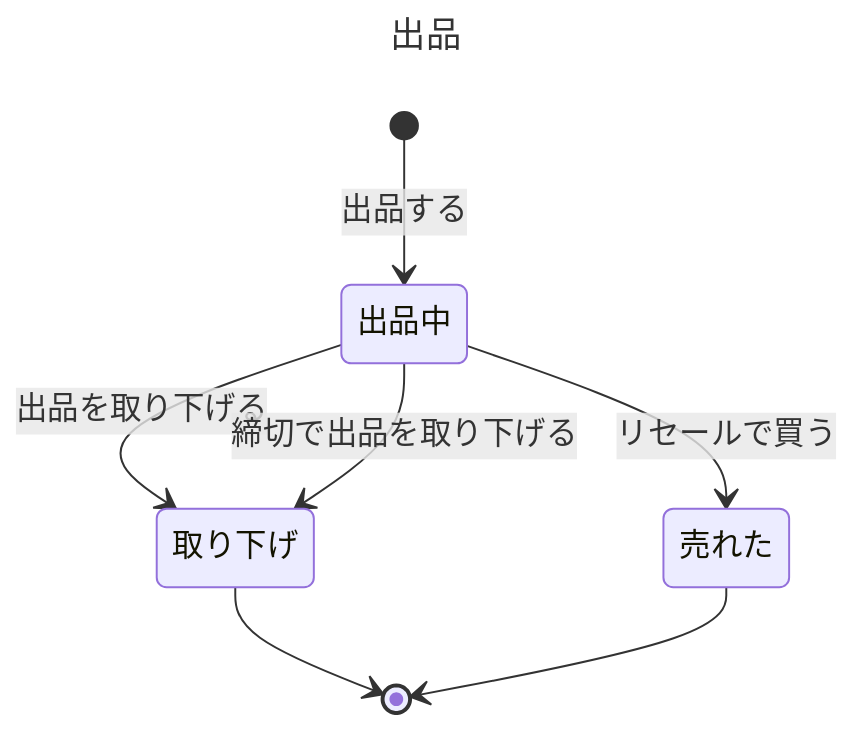
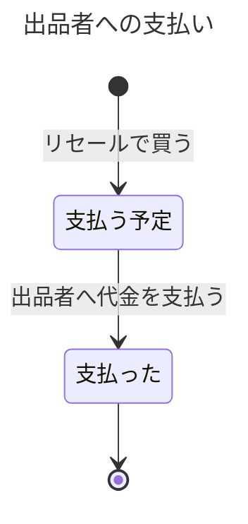
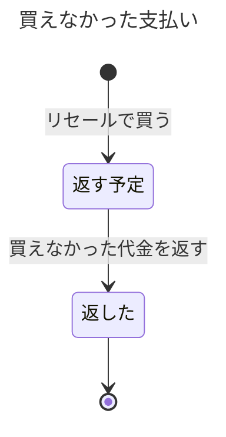

# リセールの業務知識

ステージパスのリセールで、保有者、リセールの買い手、主催者、運営スタッフが、どのチケットを出品でき、誰が買え、いつ権利が移り、出品者にいくら支払うかを同じ言葉で判断するための業務知識である。リセールは保有者がチケットを出品したときに始まり、出品が取り下げられるか、売れた代金を出品者へ支払い終えたときに終わる。この資料には、要件で決まっていない答えを仮置きした箇所がある。仮置きした箇所には「仮置き」と書き、中身を「まだ決まっていないこと」にまとめた。

# 概要

リセールは、行けなくなった保有者のチケットを、ほかの会員へ定価で正式に移す業務である。券面や画面を渡すだけでは入場できる権利が移ったのか分からず、非正規の取引で手に入れた券が使えないという相談が17件あった（業務要件「なぜ作るのか」）。リセールでは、買い手の支払いが成立した時点で元の保有者の権利が失われ、買い手が新しい保有者になる。一枚のチケットの権利を二人に持たせないために、同じ出品を買えるのは一人だけで、買えなかった人には受け取った代金を全額返す。売れた代金から手数料を差し引いた額は、公演の後に出品者へ支払う。

出品している間も権利は出品者にあるが、そのチケットは入場に使えず、分配もできない。出品を取り下げれば、再び入場に使える。リセールの受付は主催者が公演ごとに決めた締切までで、締切の時点で売れていない出品はステージパスが取り下げ、出品者の手元へ戻す。

この業務が担わないことは次のとおりである。チケット、保有者、購入者、同行者、分配の語と、保有者を変えることはチケットの業務が持つ。リセールで買ったことが起きると、チケットの業務がそれを根拠に保有者を買い手へ変える（仮置き。「まだ決まっていないこと」の「入場できる権利を持つ人を決める事実」）。公演の中止で代金を返す払い戻しは払い戻しの業務が、入口で入場させるかの判断は入場の業務が持つ。公演、定価、リセールを許すか、リセールの締切は主催者の管理機能が決め、代金の受け取り、出品者への送金、返金の中で起きることは決済事業者が持つ。来場者への通知の送り方と入口端末への情報の配り方は物理設計が持つ。

# ユビキタス言語

業務の言葉と英名の対応は次のとおりである。持ち主が「この資料」の語だけを、この資料で定義する。チケットの業務と払い戻しの業務の資料はまだ置かれていないので、その語は予定の置き場へのリンクにし、英名は持ち主が決めるまで `未定` とした。範囲の外の持ち主の語は、要件の文書を指す。

| 業務の言葉 | 英名 | 種類 | 持ち主 |
|---|---|---|---|
| 出品 | Listing | 業務用語 | この資料 |
| 出品者 | Seller | 業務用語 | この資料 |
| リセールの買い手 | ResaleBuyer | 業務用語 | この資料 |
| リセールの購入 | ResalePurchase | 業務用語 | この資料 |
| 出品価格 | ListingPrice | 業務用語 | この資料 |
| 手数料 | ResaleFee | 業務用語 | この資料 |
| 出品者への支払い | SellerPayout | 業務用語 | この資料 |
| 出品者への支払額 | SellerPayoutAmount | 業務用語 | この資料 |
| 買えなかった支払い | UnacceptedResalePayment | 業務用語 | この資料 |
| 出品した | TicketListed | 業務イベント | この資料 |
| 出品を取り下げた | ListingWithdrawn | 業務イベント | この資料 |
| 締切で出品を取り下げた | ListingWithdrawnAtDeadline | 業務イベント | この資料 |
| リセールで買った | ResaleTicketBought | 業務イベント | この資料 |
| リセールで買えなかった | ResalePurchaseFailed | 業務イベント | この資料 |
| 出品者へ代金を支払った | SellerPaid | 業務イベント | この資料 |
| 買えなかった代金を返した | ResalePaymentReturned | 業務イベント | この資料 |
| 出品中 | Listed | 状態 | この資料 |
| 取り下げ | Withdrawn | 状態 | この資料 |
| 売れた | Sold | 状態 | この資料 |
| 支払う予定 | PayoutScheduled | 状態 | この資料 |
| 支払った | PaidOut | 状態 | この資料 |
| 返す予定 | ReturnScheduled | 状態 | この資料 |
| 返した | Returned | 状態 | この資料 |
| 出品する | ListTicket | コマンド | この資料 |
| 出品を取り下げる | WithdrawListing | コマンド | この資料 |
| 締切で出品を取り下げる | WithdrawListingAtDeadline | コマンド | この資料 |
| リセールで買う | BuyResaleTicket | コマンド | この資料 |
| 出品者へ代金を支払う | PaySeller | コマンド | この資料 |
| 買えなかった代金を返す | ReturnUnacceptedResalePayment | コマンド | この資料 |
| チケット | 未定 | 業務用語 | [チケットの業務知識](../チケット/business-knowledge.md) |
| 保有者 | 未定 | 業務用語 | [チケットの業務知識](../チケット/business-knowledge.md) |
| 購入者 | 未定 | 業務用語 | [チケットの業務知識](../チケット/business-knowledge.md) |
| 同行者 | 未定 | 業務用語 | [チケットの業務知識](../チケット/business-knowledge.md) |
| 分配 | 未定 | 業務用語 | [チケットの業務知識](../チケット/business-knowledge.md) |
| 払い戻し | 未定 | 業務用語 | [払い戻しの業務知識](../払い戻し/business-knowledge.md) |
| 来場者 | 未定 | 業務用語 | 範囲の外: [業務要件](../../input/業務要件.md) |
| 主催者 | 未定 | 業務用語 | 範囲の外: [業務要件](../../input/業務要件.md) |
| 運営スタッフ | 未定 | 業務用語 | 範囲の外: [業務要件](../../input/業務要件.md) |
| 公演 | 未定 | 業務用語 | 範囲の外: [業務要件](../../input/業務要件.md) |
| 定価 | 未定 | 業務用語 | 範囲の外: [業務要件](../../input/業務要件.md) |
| リセールの締切 | 未定 | 業務用語 | 範囲の外: [業務要件](../../input/業務要件.md) |
| 決済事業者 | 未定 | 業務用語 | 範囲の外: [業務要件](../../input/業務要件.md) |

## 業務用語

### 出品

一人の出品者が、一枚のチケットをリセールで売りに出した約束である。複数枚を持っていても、出品はチケット一枚ごとにある。同じチケットを取り下げた後にまた出品すれば、別の出品になる。出品中かどうかで、そのチケットを入場に使えるか、分配できるかが決まる。

### 出品者

チケットを出品した保有者である。出品が売れるまで、そのチケットの保有者のままで、売れた代金から手数料を差し引いた額を受け取る。出品者であることは出品ごとに決まり、同じ人が別のチケットではリセールの買い手になることもある。

### リセールの買い手

ほかの会員の出品を買う来場者である。支払いが成立し、リセールで買ったことが起きると、そのチケットの新しい保有者になる。購入者（販売で買った人）とは別の語で、リセールで買った人は購入者にならない。

### リセールの購入

一人のリセールの買い手が、一つの出品を代金を払って買ったという事実である。一つの出品にリセールの購入は多くても一つしか成立しない。

### 出品価格

出品者が出品するときに付ける値で、リセールの買い手が払う代金になる。定価を超えられない。定価より安くできるかは決まっておらず、この資料では定価だけを認める（仮置き。「まだ決まっていないこと」の「定価より安い出品」）。

### 手数料

売れた代金から差し引く額で、そのチケットの定価の10%である（業務要件「買う」）。出品価格ではなく定価から計算する。1円未満の端数の扱いは決まっていない（「まだ決まっていないこと」の「手数料の端数」）。

### 出品者への支払い

売れた出品一つについて、出品者へ出品者への支払額を一度だけ支払う約束である。リセールで買ったときに生まれ、決済事業者が支払いの成功を知らせたときに果たされる。

### 出品者への支払額

売れた代金から手数料を差し引いた額である。定価8,000円のチケットが8,000円で売れたなら、手数料は800円、出品者への支払額は7,200円である。

### 買えなかった支払い

リセールの買い手の支払いが決済事業者で成立したのに、その出品を買えなかったときに、ステージパスがその買い手へ全額返す約束である。

## 業務イベント

### 出品した

保有者が一枚のチケットを出品した。出品中の出品が生まれ、そのチケットは入場に使えず、分配もできなくなる。保有者は出品者になる。

### 出品を取り下げた

出品者が、買い手が付く前に出品を取り下げた。出品は取り下げになり、そのチケットは再び入場に使え、分配もできる。

### 締切で出品を取り下げた

リセールの締切が来たとき、売れていなかった出品をステージパスが取り下げた。出品は取り下げになり、チケットは出品者の手元へ戻る。

### リセールで買った

リセールの買い手の支払いが成立し、出品中の出品を買った。出品は売れたになり、元の保有者の権利は失われ、買い手が新しい保有者になる。出品者への支払いが支払う予定で生まれる。

### リセールで買えなかった

リセールの買い手の支払いが成立したが、その出品はもう買えなかった。権利は移らず、買えなかった支払いが返す予定で生まれる。

### 出品者へ代金を支払った

決済事業者が、出品者への支払額を出品者へ支払ったと知らせた。出品者への支払いは支払ったになる。

### 買えなかった代金を返した

決済事業者が、買えなかった支払いを買い手へ全額返したと知らせた。買えなかった支払いは返したになる。

# 概念

## 出品は、権利を持ったままチケットを売りに出す約束である

出品は、保有者が権利を持ったまま、その権利を定価でほかの会員へ移すと申し出ている状態である。出品の間に権利が二つに割れないように、出品中のチケットは入場に使えず、分配もできない。出品は、出品者が取り下げるか、リセールの締切が来るか、買い手が付くかのどれかで終わる。どれで終わったかで、チケットが出品者の手元に戻るか、買い手へ移るかが決まる。

一枚のチケットに同時に進められる移転は一つだけである（業務要件「分配とリセールの関係」）。この決まりの持ち主はチケットの業務とし、リセールは、分配の承諾待ちのチケットと、すでに出品中のチケットの出品を拒む（仮置き。「まだ決まっていないこと」の「移転は一つだけ、を誰の判断に置くか」）。

## リセールの購入は、支払いの成立をステージパスが受け取ったときに決まる

リセールの買い手の支払いが成立したかは、決済事業者が知らせてくるまで分からない。ステージパスは、支払い成立の知らせを受け取った時点で、その出品がまだ出品中かを判断し、出品中なら権利を買い手へ移し、そうでなければ買えなかったとして代金を返す。同じ出品に何人が支払いを進めていてもよく、先に知らせを受け取った一人だけが買える（仮置き。「まだ決まっていないこと」の「二人の支払いのどちらを先とするか」「業務の時刻」）。支払いの結果が分からない間に買い手へ何を見せるか、結果の知らせが遅れたときにどう確かめるかは、決済事業者と仕組みに委ねる。

## 出品者への支払いと、買えなかった支払いは、決済事業者が成功を知らせたときに果たされる

出品者への支払いと買えなかった支払いは、どちらもステージパスが決済事業者に依頼して果たす約束である。ステージパスは、決済事業者が成功を知らせるまで約束を果たしたと扱わない。依頼が受け付けられなかったときに依頼を続けること、二度支払わないよう依頼に番号を付けることは仕組みの側の手段で、業務の決まりは「一つの出品者への支払いは一度だけ支払い、一つの買えなかった支払いは一度だけ返す」ことである。

# 常に守られること

### 一つの出品に成立するリセールの購入は一つだけである

二人の買い手が同じチケットの新しい保有者になれば、一枚のチケットの権利を二人に持たせることになる（非機能要件「同じチケットの権利を二人に持たせないこと」）。入口では片方が止められ、正しく代金を払った人が入場できない。

### 一枚のチケットに出品中の出品は多くても一つである

同じチケットの出品が二つあれば、二つの出品それぞれに買い手が付き、権利を二人に移すことになる。

### 出品中のチケットは、入場に使えず、分配もできない

出品中に入場に使えると、売れた後に買い手が入場しようとしたとき、すでに元の保有者が入場している。出品中に分配できると、分配を承諾した同行者と買い手の二人が権利を持つ。この決まりを入場とチケットの業務がどの事実から読むかは、仮置きである（「まだ決まっていないこと」の「入場できる権利を持つ人を決める事実」）。

### リセールで買ったときに、元の保有者の権利は失われる

支払いが成立した後も元の保有者が入場に使えると、買い手は代金を払ったのに入場できないことがある。通信が生きている入口では、新しい保有者だけを入場させることが決まっている（非機能要件「開場前に端末へ入れておくもの」）。

### 代金を受け取ったのに権利を移さないときは、その代金を全額返す

返さなければ、買い手は何も受け取らずに代金だけを失う。業務要件は、同じ出品に二人の支払いが成立したときに、もう一人へ代金を返すことを求めている（業務要件「席が無いのに代金を受け取ったときは返す」）。

### 出品者への支払いは一つの出品について一度だけ、買えなかった支払いの返金は一度だけである

二度支払えばステージパスが損をし、二度返せば決済事業者との間で取り戻しの手間が生じる。出品者と買い手には、受け取った額の説明がつかなくなる。

### リセールの出来事と出品者への支払いを、運営スタッフが後から順に説明できる

問い合わせのとき、運営スタッフは一枚のチケットについて、いつ誰が出品し、いつ取り下げ、いつ誰へリセールで移ったかを順に説明する（業務要件「後から説明できること」）。公演の後、主催者は公演ごとにリセールで移った枚数を知る。これらは要件の文で決まっている。加えて、出品者への支払いと買えなかった支払いの返金をいつ行ったかも、運営スタッフが出品者と買い手からの問い合わせに答えるために説明できるとする（仮置き。「まだ決まっていないこと」の「後から説明する相手と目的」）。拒否された出品や購入は記録を求めない（業務要件「それ以外の拒否された操作を記録するかは求めない」）。説明できる期間（公演の後3年間）は品質要求（非機能要件「説明できることと保存期間」）に置いた。

# 状態と、その移り変わり

## 出品は、取り下げか売れたで終わる



取り下げと売れたは終わりの状態で、そこから移らない。取り下げたチケットをまた出品するときは、新しい出品が生まれる。

## 出品者への支払いは、一度支払えば終わる



払い戻しを決めた公演では、支払う予定のまま支払わない（仮置き）。その後に支払うか取り消すかは決まっていないので、図に移り先を置いていない。

## 買えなかった支払いは、一度返せば終わる



返す予定は、リセールで買う行いが拒まれ、支払いがすでに成立していたときにだけ生まれる。

# 業務の行い

## コマンド

### 出品する

そのチケットの保有者だけが出品できる。保有者でない人が出品できると、権利を持たない人が他人の権利を売り、元の保有者は知らないうちに入場できなくなる。

出品できるのは、主催者がリセールを許した公演のチケットで、分配の承諾待ちでも出品中でもなく、払い戻しを決めた公演のものでもなく、リセールの締切より前のときである。出品価格は定価と同じでなければならない（定価より安い出品を認めないのは仮置き）。分配を承諾して保有者になった同行者は出品できない（仮置き）。リセールで買って保有者になった人は、要件が保有者を例外なく出品できるとしているので出品できる。複数枚を持つ保有者は、そのうち一枚だけを出品できる。一人が一公演で買える枚数の上限はリセールには当てない（業務要件「先着で買う」が上限を「抽選と先着を合わせて」の数としている）。締切の1分前は出品でき、締切ちょうどからは出品できない。出品すると出品中の出品が生まれ、「出品した」が起きる。

#### 拒む理由: 保有者でない人が出品する

権利を持たない人が売れば、元の保有者が知らないうちに権利を失い、買い手も正しい権利を受け取ったのか分からなくなる。

#### 拒む理由: リセールを許していない公演のチケットを出品する

リセールを許すかは主催者が公演ごとに決める（業務要件「関係する人」）。許していない公演で移せば、主催者が案内を届ける相手を自分で決められなくなる。

#### 拒む理由: 定価を超える値で出品する

定価を超える転売を防ぐのが、正規のリセールを置いた理由の一つである（業務要件「出品する」）。

#### 拒む理由: 定価より安い値で出品する

仮置きの拒む理由である。定価より安く出せるかは主催者の間で意見が分かれていて決まっていないので、決まるまでは要件がはっきり認める定価だけを受け付ける。

#### 拒む理由: 分配で受け取ったチケットを同行者が出品する

仮置きの拒む理由である。同行者の出品は再分配と同じく決まっておらず、主催者の多くは再分配を認めたくないとしている（業務要件「分配とリセールの関係」の前の節）。

#### 拒む理由: 分配の承諾待ちのチケットを出品する

一枚のチケットに同時に進められる移転は一つだけである。承諾待ちのまま出品できると、同行者の承諾と買い手の支払いが両方成立し、権利を二人に移す。この決まりの持ち主はチケットの業務とした（仮置き）。

#### 拒む理由: 出品中のチケットをもう一度出品する

同じチケットの出品が二つあると、二人の買い手に権利を移せてしまう。

#### 拒む理由: 払い戻しを決めた公演のチケットを出品する

仮置きの拒む理由である。払い戻しを決めた公演のチケットは入場に使えなくなる（業務要件「払い戻し」）。売れば、買い手は使えない権利に代金を払う。払い戻しを決めた事実の持ち主は払い戻しの業務である。

#### 拒む理由: リセールの締切を過ぎて出品する

リセールの受付は締切までで、締切の時点で売れていない出品は取り下げる（業務要件「買う」）。締切の後に出品を受けても、買える人がいない。

### 出品を取り下げる

その出品の出品者だけが取り下げられる。ほかの人が取り下げられると、出品者は売りたいチケットを知らないうちに売れなくされる。

取り下げられるのは出品中の出品だけで、買い手が付いた後（売れた後）は取り下げられない。取り下げると出品は取り下げになり、そのチケットは再び入場に使え、分配もできる。「出品を取り下げた」が起きる。

#### 拒む理由: 出品者でない人が出品を取り下げる

出品を続けるかを決めるのは、権利を持つ出品者である。

#### 拒む理由: 出品中でない出品を取り下げる

売れた出品を取り下げれば、買い手へ移った権利を取り戻すことになる。取り下げた出品はすでに終わっている。

### 締切で出品を取り下げる

ステージパスが、リセールの締切の時点で行う。出品者が自分で行う行いではない。

リセールの締切の時刻になったとき、その公演の出品中の出品をすべて取り下げる。締切より前には取り下げない。取り下げると出品は取り下げになり、チケットは出品者の手元へ戻って再び入場に使える。「締切で出品を取り下げた」が起きる。売れた出品と、すでに取り下げた出品は変わらない。

#### 拒む理由: 締切より前に出品を締切で取り下げる

締切より前は、出品者が売りに出している期間である。締切の前に取り下げると、買えたはずの買い手が買えず、出品者も売る機会を失う。

### リセールで買う

出品者以外の会員である来場者が、リセールの買い手として買える。出品者が自分の出品を買えるようにする理由は無く、要件は買い手を「ほかの会員」としている（業務要件「買う」）。

リセールの購入が成り立つかは、ステージパスが買い手の支払い成立の知らせを受け取った時点で判断する。その時点で、出品が出品中で、リセールの締切より前で、その公演の払い戻しが決まっていなければ、リセールの購入が成立する。締切の判断に使う時刻は、決済事業者で支払いが成立した時刻ではなく、ステージパスが知らせを受け取った時刻とする（仮置き）。成立すると、出品は売れたになり、元の保有者の権利は失われ、買い手が新しい保有者になる。出品者への支払いが、出品者への支払額で支払う予定として生まれる。「リセールで買った」が起きる。

成り立たなかったときに買い手の支払いがすでに成立していれば、権利は移さず、支払った額の全額を返す買えなかった支払いが返す予定で生まれ、「リセールで買えなかった」が起きる。一人が一公演で買える枚数の上限は、リセールの購入には当てない。

#### 拒む理由: 出品中でない出品を買う

売れた出品を買えると、一枚のチケットの権利を二人に持たせる。取り下げた出品を買えると、出品者が入場に使うと決めたチケットを取り上げる。

#### 拒む理由: リセールの締切を過ぎて買う

締切の時点で売れていない出品は取り下げ、出品者の手元へ戻す（業務要件「買う」）。締切の後に売れたことにすると、手元に戻ったチケットを出品者から取り上げることになる。

#### 拒む理由: 出品者が自分の出品を買う

買い手は出品者以外の会員である（業務要件「買う」）。自分の出品を買っても権利は移らず、手数料だけが動く。

#### 拒む理由: 払い戻しを決めた公演の出品を買う

仮置きの拒む理由である。払い戻しを決めた公演のチケットは入場に使えないので、買い手は使えない権利に代金を払うことになる。払い戻しを決めた事実の持ち主は払い戻しの業務である。

### 出品者へ代金を支払う

ステージパスが、決済事業者の送金の仕組みを使って行う。出品者が支払いを求める行いではない。

支払えるのは、支払う予定の出品者への支払いで、公演日の翌日以降で、その公演の払い戻しが決まっていないときである（公演日の翌日からとするのと、払い戻しを決めた公演で支払わないのは仮置き）。公演日の当日には支払わない。支払う額は出品者への支払額で、決済事業者が支払いの成功を知らせると、出品者への支払いは支払ったになり、「出品者へ代金を支払った」が起きる。

#### 拒む理由: 公演の前に出品者へ支払う

要件は公演の後に支払うとしている（業務要件「買う」）。公演日の当日までに支払うと、公演が中止になり払い戻しを決めたときに、すでに支払った代金の扱いが残る。

#### 拒む理由: 支払った出品者への支払いをもう一度支払う

一つの出品について、出品者への支払いは一度だけである。

#### 拒む理由: 払い戻しを決めた公演の出品者へ支払う

仮置きの拒む理由である。払い戻しのとき出品者へ支払う予定の代金をどう扱うかは決まっておらず（業務要件「払い戻し」）、一度支払うと取り戻せないので、決まるまで支払わない。払い戻しを決めた事実の持ち主は払い戻しの業務である。

### 買えなかった代金を返す

ステージパスが、決済事業者に依頼して行う。この行いをリセールの業務が持つことは仮置きである（「まだ決まっていないこと」の「買えなかった代金を返すことの持ち主」）。

返せるのは、返す予定の買えなかった支払いである。返す額は、買い手が支払った全額である。決済事業者が返金の成功を知らせると、買えなかった支払いは返したになり、「買えなかった代金を返した」が起きる。

#### 拒む理由: 返した買えなかった支払いをもう一度返す

一つの買えなかった支払いの返金は一度だけである。

## クエリ

なし。買い手が買える出品を探して見る行いは、分け方の一覧がリセールの行いとして挙げておらず、表示対象と並び順の根拠が要件に無いので、この資料に置いていない（仮置き。「まだ決まっていないこと」の「出品を探して見るクエリ」）。出品者と買い手が自分のチケットの状態（出品中、譲渡済み）を見る行いは、チケットの業務の「自分のチケットを見る」が持つ。

出品、購入の応答の速さ（通常時に95%を2秒以内）と、販売とリセールの受付の稼働率（月間99.9%）は、品質要求（非機能要件「性能」「可用性」）に置いた。

# 導出されること

手数料は、そのチケットの定価の10%である。出品者への支払額は、売れた代金から手数料を引いた額である。出品価格を定価だけに限る仮置きのもとでは、売れた代金は定価と等しく、出品者への支払額は定価の90%になる。買えなかった支払いで返す額は、買い手が支払った額の全額である。

# 同時に起きたとき

### 同時に起きること: 同じ出品に二人の買い手の支払いが成立する

ステージパスが先に支払い成立の知らせを受け取った一人だけが買える。一つの出品に成立するリセールの購入は一つだけだからである。もう一人は買えず、支払った全額を返す。どちらを先とするかを知らせを受け取った順にするのは仮置きである（BDD-032）。

### 同時に起きること: 出品者の取り下げと買い手の支払い成立が重なる

ステージパスが先に受け付けた方が通る。取り下げが先なら出品は取り下げになり、買い手は買えずに全額返してもらう。支払い成立の知らせが先なら売れたになり、取り下げは通らない（BDD-033）。

### 同時に起きること: 同じチケットの出品と分配が重なる

ステージパスが先に受け付けた方だけが通る。一枚のチケットに同時に進められる移転は一つだけだからである。出品が先なら分配は始まらず、分配が先なら出品は生まれない（BDD-034）。分配の側の拒否はチケットの業務が持つ。

# まだ決まっていないこと

### 入場できる権利を持つ人を決める事実（業務の分け方への仮置き）

仮置きである。入場できる権利を持つのはチケットの業務の保有者で、リセールで買ったことが起きるとチケットの業務が保有者を買い手へ変え、出品中かどうかはリセールの出品で決まる、とした。根拠は、`split.md` が保有者の語をチケットの業務だけに持たせていることである。採らなかった案は、入場の業務がリセールの購入を直接読んで保有者を決める案で、保有者の答えが二つの業務にできる。決めるのは依頼元（業務の分け方）である。

### 移転は一つだけ、を誰の判断に置くか（業務の分け方への仮置き）

仮置きである。一枚のチケットに同時に進められる移転は一つだけ、という決まりの持ち主をチケットの業務とし、リセールは拒む理由「分配の承諾待ちのチケットを出品する」「出品中のチケットをもう一度出品する」で結んだ。根拠は、決まりの対象がチケット一枚であることである。採らなかった案は、分配とリセールがそれぞれ自分の側で持つ案で、同じ決まりが二か所にできる。決めるのは依頼元である。

### 二人の支払いのどちらを先とするか（業務の分け方と要件の未決への仮置き）

仮置きである。同じ出品に二人の支払いが成立したとき、ステージパスが支払い成立の知らせを受け取った順で先を決めるとした。根拠は、決済事業者の成立時刻で決めると、知らせが数十分遅れて届いたとき（業務要件「支払いの結果は遅れて分かる」）に、すでに移した権利を取り戻すことになり、非機能要件「順序が入れ替わってはならない」に反することである。採らなかった案は、決済事業者の成立時刻で決める案。決めるのは主催者と法務（業務要件「まだ決まっていないこと」）と、販売と同じ答えにするため依頼元である。BDD-022 と BDD-032 はこの仮置きに従う。

### 業務の時刻（業務の分け方への仮置き）

仮置きである。締切と先後の判断には、判断する者（リセールではステージパス）が受け付けた時刻を使い、決済事業者で支払いが成立した時刻は分かれば説明のために一緒に残す、とした。根拠は前の項目と同じで、受け付けた後に判断をひっくり返さないためである。採らなかった案は、出来事が起きた時刻を業務の時刻とする案で、締切の前に成立した支払いの知らせが締切の後に届けば、取り下げた出品を後から売れたことにする。決めるのは依頼元と主催者である。BDD-022 はこの仮置きに従う。

### 後から説明する相手と目的（業務の分け方への仮置き）

一部が仮置きである。運営スタッフが問い合わせに答えるために一枚のチケットのリセールの出来事を順に説明することと、主催者が公演ごとにリセールで移った枚数を知ることは、業務要件「後から説明できること」で決まっている。出品者への支払いと買えなかった支払いの返金をいつ行ったかも運営スタッフが説明できる、とした部分が仮置きである。根拠は、出品者と買い手からの問い合わせが代金の行方に及ぶと推定したことと、返金の手作業の振込を説明できるとする要件の文（業務要件「出品者への支払いと払い戻しの返金は、失敗しても諦めない」）である。採らなかった案は、支払いと返金を説明の対象にしない案。決めるのは依頼元である。

### 買えなかった代金を返すことの持ち主（業務の分け方への仮置き）

仮置きである。同じ出品で買えなかった買い手へ代金を返す行いと、決済事業者への返金の依頼を、リセールの業務が持つとした。`split.md` は、出品者への支払いをリセールに、返金を払い戻しに、代金を返す要求を販売に割り当て、この行いを誰にも割り当てていない。根拠は、返すかどうかがリセールの購入の判断から決まることと、販売が自分の代金を返す要求を持つ分け方と同じ形になることである。採らなかった案は、払い戻しの業務が返金として持つ案で、公演の中止という別の判断の業務に入る。決めるのは依頼元である。

### 出品を探して見るクエリ

仮置きである。買い手が買える出品を探して見るクエリをこの資料に置かなかった。根拠は、`split.md` のリセールの行いがコマンドだけであることと、何をどの順で見せるかが要件に無いことである。採らなかった案は、「買える出品を探す」を加え、表示対象と並び順を推奨で埋める案。決めるのは依頼元（業務の分け方）で、置くと決まれば、表示対象と並び順を主催者と運営に確かめて、この資料を深める。そのときクエリデータモデルも立つ。

### 定価より安い出品

仮置きである。出品価格は定価だけを認め、定価より安い出品を拒む（拒む理由「定価より安い値で出品する」、BDD-005）。根拠は、業務要件「定価で出品できる」「定価より安く出せるかは未決である」で、未決の間は要件がはっきり認める値だけを受け付けておけば、後で認める方向へ広げても成立した出品を覆さない。採らなかった案は、定価以下なら認める案。決めるのは主催者である。

### 同行者の出品

仮置きである。分配を承諾して保有者になった同行者は、そのチケットを出品できない（拒む理由「分配で受け取ったチケットを同行者が出品する」、BDD-008）。根拠は、業務要件「同行者に分けたチケットを同行者が出品できるかは、再分配と同じく未決である」と、主催者の多くが再分配を認めたくないとしていることである。採らなかった案は、保有者なら誰でも出品できる案。決めるのは主催者である。

### 払い戻しを決めた公演でのリセール

仮置きである。払い戻しを決めた公演では、出品もリセールの購入も受け付けず、支払う予定の出品者への支払いは支払わない（BDD-012、BDD-024、BDD-029）。根拠は、払い戻しを決めた公演のチケットが入場に使えなくなること（業務要件「払い戻し」）と、出品者への支払いの扱いが未決で、一度支払うと取り戻せないことである。採らなかった案は、払い戻しと関係なくリセールを続け、予定どおり支払う案。支払う予定のまま止めた出品者への支払いを、後で支払うか取り消すかは、主催者と法務が決め、払い戻しの業務知識に書かれる。

### 出品者へ支払う時期

仮置きである。出品者へ支払えるのは公演日の翌日からとした（BDD-026、BDD-027）。根拠は、業務要件「公演の後に出品者へ支払う」に公演の終わりの時刻が無く、公演日の単位なら主催者と出品者が同じように判断できることである。採らなかった案は、開演の時刻を過ぎたら支払う案。決めるのは主催者とステージパスの運営である。

### 手数料の端数

仮置きである。定価の10%に1円未満の端数が出たときは、手数料の1円未満を切り捨てる。根拠は、出品者に不利にならない側に倒したことで、要件に端数の文は無い。採らなかった案は、四捨五入と切り上げ。決めるのはステージパスの運営と主催者である。

# BDD

ここまでの決まりが、具体の場面でどう働くかを示す。**ここに上で書いていない決まりを持ち込まない。** 見出しに「仮置き」とある BDD は、「まだ決まっていないこと」の仮置きに従う。例の公演 P-100 は、主催者がリセールを許した座席指定の公演で、開演は2026年11月20日 18:00、リセールの締切は2026年11月19日 18:00、S席の定価は8,000円である。

## 出品する

### [BDD-001] 購入者でもある保有者が定価で出品すると出品中になる

```gherkin
Given: 来場者 M-001 は公演 P-100 のS席のチケット T-001 の購入者で、保有者である
  And: チケット T-001 は分配の承諾待ちでも出品中でもない
  And: 公演 P-100 の払い戻しは決まっていない
When: 来場者 M-001 が2026年11月10日 12:00にチケット T-001 を出品価格8,000円で出品する
Then: チケット T-001 の出品が出品中で生まれ、来場者 M-001 は出品者になる
  And: チケット T-001 は入場に使えず、分配もできない
  And: 保有者は来場者 M-001 のままである
```

### [BDD-002] 複数枚のうち一枚だけを出品できる

```gherkin
Given: 来場者 M-001 は公演 P-100 のS席のチケット T-001 と T-002 の保有者で、どちらも出品中でも分配の承諾待ちでもない
When: 来場者 M-001 が2026年11月10日 12:00にチケット T-002 だけを出品価格8,000円で出品する
Then: チケット T-002 の出品が出品中で生まれる
  And: チケット T-001 は入場に使え、分配もできる
```

### [BDD-003] リセールを許していない公演のチケットは出品できない

```gherkin
Given: 公演 P-200 は、主催者がリセールを許していない公演である
  And: 来場者 M-001 は公演 P-200 のチケット T-201 の保有者で、チケット T-201 は出品中でも分配の承諾待ちでもない
When: 来場者 M-001 がチケット T-201 を定価で出品する
Then: 出品は生まれず、チケット T-201 は入場に使えるままである
  NOTE: Rule: リセールを許していない公演のチケットを出品する
    Reason: リセールを許すかは主催者が公演ごとに決める
```

### [BDD-004] 定価を超える値では出品できない

```gherkin
Given: 来場者 M-001 は公演 P-100 のS席のチケット T-001 の保有者で、チケット T-001 は出品中でも分配の承諾待ちでもない
  And: S席の定価は8,000円である
When: 来場者 M-001 が2026年11月10日にチケット T-001 を出品価格8,001円で出品する
Then: 出品は生まれない
  NOTE: Rule: 定価を超える値で出品する
    Reason: 定価を超えて出品できない
```

### [BDD-005] 定価より安い値では出品できない（仮置き）

```gherkin
Given: 来場者 M-001 は公演 P-100 のS席のチケット T-001 の保有者で、チケット T-001 は出品中でも分配の承諾待ちでもない
  And: S席の定価は8,000円である
When: 来場者 M-001 が2026年11月10日にチケット T-001 を出品価格7,000円で出品する
Then: 出品は生まれない
  NOTE: Rule: 定価より安い値で出品する
    Reason: 定価より安い出品を認めるかが決まるまで、定価だけを受け付ける（仮置き）
```

### [BDD-006] 分配を承諾された後の購入者は、保有者でないので出品できない

```gherkin
Given: 来場者 M-001 はチケット T-002 の購入者である
  And: チケット T-002 は来場者 M-002 への分配が承諾され、保有者は来場者 M-002 である
When: 来場者 M-001 が2026年11月10日にチケット T-002 を定価で出品する
Then: 出品は生まれず、保有者は来場者 M-002 のままである
  NOTE: Rule: 保有者でない人が出品する
    Reason: 出品できるのはそのチケットの保有者だけである
```

### [BDD-007] 分配の承諾待ちのチケットは出品できない

```gherkin
Given: 来場者 M-001 はチケット T-002 の保有者である
  And: チケット T-002 は来場者 M-002 への分配の承諾待ちである
When: 来場者 M-001 が2026年11月10日にチケット T-002 を定価で出品する
Then: 出品は生まれず、分配の承諾待ちのままである
  NOTE: Rule: 分配の承諾待ちのチケットを出品する
    Reason: 一枚のチケットに同時に進められる移転は一つだけである
```

### [BDD-008] 分配で受け取った同行者は出品できない（仮置き）

```gherkin
Given: 来場者 M-002 は、来場者 M-001 からの分配を承諾してチケット T-002 の保有者になった同行者である
  And: チケット T-002 は出品中でも分配の承諾待ちでもない
When: 来場者 M-002 が2026年11月10日にチケット T-002 を定価で出品する
Then: 出品は生まれず、チケット T-002 は来場者 M-002 が入場に使えるままである
  NOTE: Rule: 分配で受け取ったチケットを同行者が出品する
    Reason: 同行者の出品を認めるかが決まるまで受け付けない（仮置き）
```

### [BDD-009] 締切の1分前は出品できる

```gherkin
Given: 来場者 M-001 は公演 P-100 のチケット T-001 の保有者で、チケット T-001 は出品中でも分配の承諾待ちでもない
  And: 公演 P-100 のリセールの締切は2026年11月19日 18:00である
When: ステージパスが2026年11月19日 17:59に来場者 M-001 のチケット T-001 の出品を定価で受け付ける
Then: チケット T-001 の出品が出品中で生まれる
```

### [BDD-010] 締切ちょうどには出品できない

```gherkin
Given: 来場者 M-001 は公演 P-100 のチケット T-001 の保有者で、チケット T-001 は出品中でも分配の承諾待ちでもない
  And: 公演 P-100 のリセールの締切は2026年11月19日 18:00である
When: ステージパスが2026年11月19日 18:00に来場者 M-001 のチケット T-001 の出品を受け付ける
Then: 出品は生まれない
  NOTE: Rule: リセールの締切を過ぎて出品する
    Reason: リセールの受付は締切までで、締切の時点で売れていない出品は取り下げる
```

### [BDD-011] 出品中のチケットはもう一度出品できない

```gherkin
Given: チケット T-001 は来場者 M-001 の出品 L-001 で出品中である
When: 来場者 M-001 が2026年11月11日にチケット T-001 を定価でもう一度出品する
Then: 新しい出品は生まれず、出品 L-001 が出品中のままである
  NOTE: Rule: 出品中のチケットをもう一度出品する
    Reason: 一枚のチケットに出品中の出品は多くても一つである
```

### [BDD-012] 払い戻しを決めた公演のチケットは出品できない（仮置き）

```gherkin
Given: 主催者が公演 P-300 の払い戻しを決めている
  And: 来場者 M-001 は公演 P-300 のチケット T-301 の保有者で、チケット T-301 は出品中でも分配の承諾待ちでもない
When: 来場者 M-001 がチケット T-301 を定価で出品する
Then: 出品は生まれない
  NOTE: Rule: 払い戻しを決めた公演のチケットを出品する
    Reason: 入場に使えないチケットを売らない（仮置き）
```

### [BDD-013] リセールで買った保有者は出品できる

```gherkin
Given: 来場者 M-003 は、公演 P-100 のチケット T-005 をリセールで買って保有者になった
  And: チケット T-005 は出品中でも分配の承諾待ちでもない
When: 来場者 M-003 が2026年11月12日にチケット T-005 を出品価格8,000円で出品する
Then: チケット T-005 の新しい出品が出品中で生まれ、来場者 M-003 は出品者になる
```

## 出品を取り下げる

### [BDD-014] 出品者が取り下げると、チケットは再び入場に使える

```gherkin
Given: チケット T-001 は来場者 M-001 の出品 L-001 で出品中である
When: 来場者 M-001 が2026年11月12日に出品 L-001 を取り下げる
Then: 出品 L-001 は取り下げになる
  And: チケット T-001 は来場者 M-001 が入場に使え、分配もできる
```

### [BDD-015] 売れた出品は取り下げられない

```gherkin
Given: 出品 L-001 は来場者 M-003 に売れ、チケット T-001 の保有者は来場者 M-003 である
When: 来場者 M-001 が出品 L-001 を取り下げる
Then: 出品 L-001 は売れたのまま変わらず、保有者は来場者 M-003 のままである
  NOTE: Rule: 出品中でない出品を取り下げる
    Reason: 売れた出品を取り下げると、買い手へ移った権利を取り戻すことになる
```

### [BDD-016] 出品者でない人は取り下げられない

```gherkin
Given: チケット T-001 は来場者 M-001 の出品 L-001 で出品中である
  And: 来場者 M-004 は出品 L-001 の出品者ではない
When: 来場者 M-004 が出品 L-001 を取り下げる
Then: 出品 L-001 は出品中のままである
  NOTE: Rule: 出品者でない人が出品を取り下げる
    Reason: 出品を続けるかを決めるのは出品者である
```

## 締切で出品を取り下げる

### [BDD-017] 締切の時点で売れていない出品は取り下げになる

```gherkin
Given: 公演 P-100 のリセールの締切は2026年11月19日 18:00である
  And: 出品 L-001 は出品中、出品 L-002 は売れた、出品 L-003 は取り下げである
When: ステージパスが2026年11月19日 18:00に公演 P-100 の出品を締切で取り下げる
Then: 出品 L-001 は取り下げになり、そのチケットは出品者の手元へ戻って入場に使える
  And: 出品 L-002 は売れた、出品 L-003 は取り下げのまま変わらない
```

### [BDD-018] 締切の前には締切で取り下げない

```gherkin
Given: 公演 P-100 のリセールの締切は2026年11月19日 18:00である
  And: 出品 L-001 は出品中である
When: ステージパスが2026年11月19日 17:59に出品 L-001 を締切で取り下げる
Then: 出品 L-001 は出品中のままである
  NOTE: Rule: 締切より前に出品を締切で取り下げる
    Reason: 締切より前は出品者が売りに出している期間である
```

## リセールで買う

### [BDD-019] 支払い成立を受け取ると、買い手が新しい保有者になる

```gherkin
Given: チケット T-001 は来場者 M-001 の出品 L-001 で出品中で、出品価格は8,000円、定価は8,000円である
  And: 公演 P-100 のリセールの締切は2026年11月19日 18:00で、払い戻しは決まっていない
When: ステージパスが2026年11月15日 20:00に、来場者 M-003 の出品 L-001 への8,000円の支払い成立の知らせを受け取る
Then: 出品 L-001 は売れたになり、チケット T-001 の保有者は来場者 M-003 になる
  And: 来場者 M-001 はチケット T-001 の権利を失い、入場に使えない
  And: 来場者 M-001 への出品者への支払いが、手数料800円を引いた7,200円で支払う予定として生まれる
```

### [BDD-020] 売れた出品への支払いは、買えずに全額返す

```gherkin
Given: 出品 L-001 は2026年11月15日 20:00に来場者 M-003 に売れた
When: ステージパスが2026年11月15日 20:05に、来場者 M-004 の出品 L-001 への8,000円の支払い成立の知らせを受け取る
Then: 来場者 M-004 は買えず、チケット T-001 の保有者は来場者 M-003 のままである
  And: 来場者 M-004 へ8,000円を全額返す買えなかった支払いが返す予定で生まれる
  NOTE: Rule: 出品中でない出品を買う
    Reason: 一つの出品に成立するリセールの購入は一つだけである
```

### [BDD-021] 取り下げた出品への支払いは、買えずに全額返す

```gherkin
Given: 出品 L-001 は2026年11月15日 19:00に来場者 M-001 が取り下げ、チケット T-001 の保有者は来場者 M-001 である
When: ステージパスが2026年11月15日 19:10に、来場者 M-003 の出品 L-001 への8,000円の支払い成立の知らせを受け取る
Then: 来場者 M-003 は買えず、保有者は来場者 M-001 のままで、チケット T-001 は来場者 M-001 が入場に使える
  And: 来場者 M-003 へ8,000円を全額返す買えなかった支払いが返す予定で生まれる
  NOTE: Rule: 出品中でない出品を買う
    Reason: 取り下げた出品を買えると、出品者が入場に使うと決めたチケットを取り上げる
```

### [BDD-022] 締切の後に受け取った支払い成立では買えない（仮置き）

```gherkin
Given: 公演 P-100 のリセールの締切は2026年11月19日 18:00である
  And: 来場者 M-003 の出品 L-001 への支払いは、決済事業者で2026年11月19日 17:58に成立した
  And: 出品 L-001 は2026年11月19日 18:00に締切で取り下げになった
When: ステージパスが2026年11月19日 18:20に、その支払い成立の知らせを受け取る
Then: 来場者 M-003 は買えず、チケット T-001 は出品者 M-001 の手元に戻ったままである
  And: 来場者 M-003 へ全額を返す買えなかった支払いが返す予定で生まれる
  NOTE: Rule: リセールの締切を過ぎて買う
    Reason: 締切の判断には、ステージパスが知らせを受け取った時刻を使う（仮置き）
```

### [BDD-023] 出品者は自分の出品を買えない

```gherkin
Given: チケット T-001 は来場者 M-001 の出品 L-001 で出品中である
When: ステージパスが2026年11月15日に、来場者 M-001 の出品 L-001 への8,000円の支払い成立の知らせを受け取る
Then: 出品 L-001 は出品中のままで、来場者 M-001 へ8,000円を全額返す買えなかった支払いが返す予定で生まれる
  NOTE: Rule: 出品者が自分の出品を買う
    Reason: 買い手は出品者以外の会員である
```

### [BDD-024] 払い戻しを決めた公演の出品は買えない（仮置き）

```gherkin
Given: チケット T-301 は公演 P-300 の出品 L-301 で出品中である
  And: 主催者が2026年11月14日に公演 P-300 の払い戻しを決めた
When: ステージパスが2026年11月15日に、来場者 M-003 の出品 L-301 への支払い成立の知らせを受け取る
Then: 来場者 M-003 は買えず、全額を返す買えなかった支払いが返す予定で生まれる
  NOTE: Rule: 払い戻しを決めた公演の出品を買う
    Reason: 入場に使えないチケットに代金を払わせない（仮置き）
```

### [BDD-025] 公演 P-100 で4枚買った来場者も、リセールで買える

```gherkin
Given: 来場者 M-003 は公演 P-100 のチケットを先着で4枚買っており、公演 P-100 の枚数の上限は4枚である
  And: チケット T-001 は来場者 M-001 の出品 L-001 で出品中である
When: ステージパスが2026年11月15日に、来場者 M-003 の出品 L-001 への8,000円の支払い成立の知らせを受け取る
Then: 出品 L-001 は売れたになり、来場者 M-003 はチケット T-001 の保有者になる
```

## 出品者へ代金を支払う

### [BDD-026] 公演日の翌日に出品者へ支払う（仮置き）

```gherkin
Given: 出品 L-001 は売れ、来場者 M-001 への出品者への支払いは7,200円で支払う予定である
  And: 公演 P-100 の公演日は2026年11月20日で、払い戻しは決まっていない
When: ステージパスが2026年11月21日に来場者 M-001 へ代金を支払い、決済事業者が支払いの成功を知らせる
Then: 出品者への支払いは支払ったになる
```

### [BDD-027] 公演日の当日には出品者へ支払わない（仮置き）

```gherkin
Given: 来場者 M-001 への出品者への支払いは7,200円で支払う予定である
  And: 公演 P-100 の公演日は2026年11月20日である
When: ステージパスが2026年11月20日に来場者 M-001 へ代金を支払う
Then: 出品者への支払いは支払う予定のままである
  NOTE: Rule: 公演の前に出品者へ支払う
    Reason: 出品者へは公演の後に支払う（公演日の翌日からとするのは仮置き）
```

### [BDD-028] 支払った出品者への支払いは、もう一度支払わない

```gherkin
Given: 来場者 M-001 への出品 L-001 の出品者への支払いは、2026年11月21日に支払った
When: ステージパスが2026年11月22日に出品 L-001 の代金を来場者 M-001 へ支払う
Then: 出品者への支払いは支払ったのままで、7,200円がもう一度支払われることはない
  NOTE: Rule: 支払った出品者への支払いをもう一度支払う
    Reason: 一つの出品について、出品者への支払いは一度だけである
```

### [BDD-029] 払い戻しを決めた公演の出品者へは支払わない（仮置き）

```gherkin
Given: 出品 L-301 は売れ、来場者 M-001 への出品者への支払いは支払う予定である
  And: 主催者が公演 P-300 の払い戻しを決めている
When: ステージパスが公演 P-300 の公演日の翌日に来場者 M-001 へ代金を支払う
Then: 出品者への支払いは支払う予定のままである
  NOTE: Rule: 払い戻しを決めた公演の出品者へ支払う
    Reason: 払い戻しのときの出品者への支払いの扱いが決まるまで支払わない（仮置き）
```

## 買えなかった代金を返す

### [BDD-030] 買えなかった支払いを返すと返したになる

```gherkin
Given: 来場者 M-004 へ8,000円を全額返す買えなかった支払いが返す予定である
When: ステージパスが来場者 M-004 へ代金を返し、決済事業者が返金の成功を知らせる
Then: 買えなかった支払いは返したになる
```

### [BDD-031] 返した買えなかった支払いは、もう一度返さない

```gherkin
Given: 来場者 M-004 への買えなかった支払いは、8,000円を返した
When: ステージパスが同じ買えなかった支払いの代金を来場者 M-004 へ返す
Then: 買えなかった支払いは返したのままで、8,000円がもう一度返されることはない
  NOTE: Rule: 返した買えなかった支払いをもう一度返す
    Reason: 一つの買えなかった支払いの返金は一度だけである
```

## 同時に起きたとき

### [BDD-032] 同じ出品に二人の支払いが成立すると、先に知らせを受け取った一人だけが買える（仮置き）

```gherkin
Given: チケット T-001 は来場者 M-001 の出品 L-001 で出品中で、出品価格は8,000円である
  And: 来場者 M-003 と来場者 M-004 の出品 L-001 への支払いが、どちらも決済事業者で成立した
When: ステージパスが2026年11月15日 20:00:01に来場者 M-004 の、20:00:03に来場者 M-003 の支払い成立の知らせを受け取る
Then: 出品 L-001 は売れたになり、チケット T-001 の保有者は来場者 M-004 になる
  And: 来場者 M-003 は保有者にならず、8,000円を全額返す買えなかった支払いが返す予定で生まれる
```

### [BDD-033] 取り下げが先に受け付けられると、後から受け取った支払いでは買えない

```gherkin
Given: チケット T-001 は来場者 M-001 の出品 L-001 で出品中である
  And: 来場者 M-001 の取り下げと、来場者 M-003 の支払い成立の知らせが同じときに届いた
When: ステージパスが取り下げを先に受け付ける
Then: 出品 L-001 は取り下げになり、チケット T-001 は来場者 M-001 が入場に使える
  And: 来場者 M-003 は保有者にならず、全額を返す買えなかった支払いが返す予定で生まれる
```

### [BDD-034] 同じチケットの出品と分配が重なると、先に受け付けた一方だけが通る

```gherkin
Given: 来場者 M-001 はチケット T-002 の保有者で、チケット T-002 は出品中でも分配の承諾待ちでもない
  And: 来場者 M-001 のチケット T-002 の出品と、来場者 M-002 への分配が同じときに届いた
When: ステージパスが出品を先に受け付ける
Then: チケット T-002 の出品が出品中で生まれる
  And: 来場者 M-002 への分配は始まらず、分配の承諾待ちにならない
```
