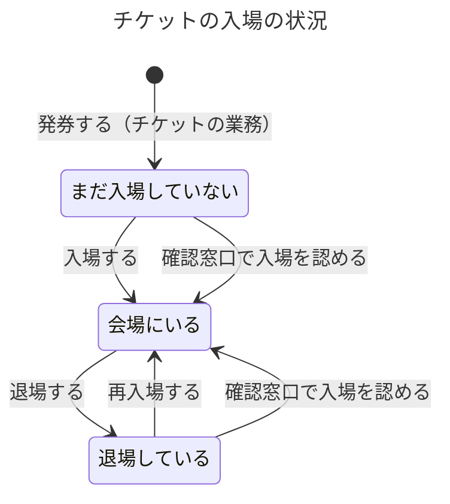

# 入場の業務知識

ステージパスの入場は、公演当日に、いまの保有者が自分の画面で見せたチケットだけを会場へ入れ、一枚のチケットで同時に二人を会場にいさせないための業務である。この資料は、会場の係員、主催者、運営スタッフと、入場を作る作り手が、入口と出口と確認窓口で同じ答えを出せるように読む。業務は、発券されたチケットが公演当日に入口で見せられたときに始まる。退場と再入場、通信が戻った端末から届いた記録の受け取りと、そこで見つかった食い違いの知らせまでを扱う。

# 概要

入場の業務は、入口で見せられた一枚のチケットについて、いま入場できるかを係員が判断し、入場、退場、止めたことを、後から順に説明できる形で残す業務である。紙のチケットでは、画面や券面を渡すことと、入場できる権利を移すことが区別できず、使えない券で来た人も、正しく買ったのに入れない人もいた（`input/業務要件.md`「なぜ作るのか」）。入場の業務が守りたい価値は、購入からリセールまでで決まった「いまの保有者」という一つの答えを、入口で同じように使うことである。

一番大事な決まりは、同じチケットで二人を入場させないことである。この決まりは入口の速さと引き換えにしない。ただし、会場の通信が切れている間だけは入場を止めないことを優先し、そのために起きた二重の入場は、通信が戻った後に必ず見つけて係員と主催者へ知らせる（`input/入場口の運用と非機能要件.md` の冒頭）。

入場の業務は、誰が保有者かを自分では決めない。保有者、分配、発券はチケットの業務が、出品はリセールの業務が、払い戻しは払い戻しの業務が持ち、入場はそれらの事実を読んで入場に使えるかを判断する。どの事実から判断するかは、業務の分け方でまだ答えが無いので仮置きしている（「まだ決まっていないこと」を参照）。公演、会場、再入場を許すか、再入場の回数の上限は、主催者の管理機能が決める。主催者が見る入場した人数は、主催者の集計の業務が入場の事実を読んで数える。来場者への知らせの送り方と、入口の端末へ情報を配る方法は、この業務の決まりではない。

# ユビキタス言語

業務の言葉と英名の対応は次のとおりである。英名は業務の言葉を英語にした名前で、業務イベントは過去形にした。ほかの業務や検証の外の持ち主が決める語は、持ち主の資料がまだ無いので英名を `未定` にしてある。

| 業務の言葉 | 英名 | 種類 | 持ち主 |
|---|---|---|---|
| 来場者 | 未定 | 業務用語 | 範囲の外: [業務要件（会員管理が持つ語）](../../input/業務要件.md) |
| 会場の係員 | 未定 | 業務用語 | 範囲の外: [業務要件（主催者の管理機能が持つ語）](../../input/業務要件.md) |
| 主催者 | 未定 | 業務用語 | 範囲の外: [業務要件（主催者の管理機能が持つ語）](../../input/業務要件.md) |
| 運営スタッフ | 未定 | 業務用語 | 範囲の外: [業務要件（ステージパスの運営が持つ語）](../../input/業務要件.md) |
| 公演 | 未定 | 業務用語 | 範囲の外: [業務要件（主催者の管理機能が持つ語）](../../input/業務要件.md) |
| チケット | 未定 | 業務用語 | [チケットの業務知識](../チケット/business-knowledge.md) |
| 保有者 | 未定 | 業務用語 | [チケットの業務知識](../チケット/business-knowledge.md) |
| 購入者 | 未定 | 業務用語 | [チケットの業務知識](../チケット/business-knowledge.md) |
| 同行者 | 未定 | 業務用語 | [チケットの業務知識](../チケット/business-knowledge.md) |
| 分配 | 未定 | 業務用語 | [チケットの業務知識](../チケット/business-knowledge.md) |
| 出品 | 未定 | 業務用語 | [リセールの業務知識](../リセール/business-knowledge.md) |
| 払い戻し | 未定 | 業務用語 | [払い戻しの業務知識](../払い戻し/business-knowledge.md) |
| 入場 | Entry | 業務用語 | この資料 |
| 退場 | Exit | 業務用語 | この資料 |
| 再入場 | Reentry | 業務用語 | この資料 |
| 止められた記録 | StopRecord | 業務用語 | この資料 |
| 入口 | EntranceGate | 業務用語 | この資料 |
| 出口 | ExitGate | 業務用語 | この資料 |
| 端末 | Terminal | 業務用語 | この資料 |
| 確認窓口 | ConfirmationDesk | 業務用語 | この資料 |
| 読み取った時刻 | ReadAt | 業務用語 | この資料 |
| 受け付けた時刻 | ReceivedAt | 業務用語 | この資料 |
| 食い違い | Discrepancy | 業務用語 | この資料 |
| 入場した | Entered | 業務イベント | この資料 |
| 再入場した | Reentered | 業務イベント | この資料 |
| 退場した | Exited | 業務イベント | この資料 |
| 止めた | EntryStopped | 業務イベント | この資料 |
| 確認窓口へ案内した | ReferredToDesk | 業務イベント | この資料 |
| 確認窓口で入場を認めた | AdmittedAtDesk | 業務イベント | この資料 |
| 端末の記録を受け取った | TerminalRecordsReceived | 業務イベント | この資料 |
| 食い違いを知らせた | DiscrepancyReported | 業務イベント | この資料 |
| まだ入場していない | NotEntered | 状態 | この資料 |
| 会場にいる | InVenue | 状態 | この資料 |
| 退場している | OutOfVenue | 状態 | この資料 |
| 入場する | Enter | コマンド | この資料 |
| 再入場する | Reenter | コマンド | この資料 |
| 退場する | Leave | コマンド | この資料 |
| 確認窓口で入場を認める | AdmitAtDesk | コマンド | この資料 |
| 端末の記録を受け取る | ReceiveTerminalRecords | コマンド | この資料 |
| 食い違いを知らせる | ReportDiscrepancy | コマンド | この資料 |
| チケットの入場の記録を確かめる | CheckEntryHistory | クエリ | この資料 |
| 確認窓口でチケットを確かめる | CheckTicketAtDesk | クエリ | この資料 |

## 業務用語

### 入場

来場者が、一枚のチケットを使って、入口から公演の会場へ入ったことである。初めて入るときも、退場した後にもう一度入るときも入場で、二度目以降を特に再入場と呼ぶ。入場は、どの公演の、どのチケットで、どの入口のどの端末で、いつ読み取ったかと一緒に残る。

### 退場

再入場を許す公演で、会場にいる来場者が、出口で記録を付けてから外へ出たことである。退場の記録があるチケットだけが、再入場できる。再入場を許さない公演では、会場から出ても退場の記録は付けない。

### 再入場

退場しているチケットで、もう一度入口から入ることである。公演が再入場を許し、主催者が回数の上限を決めていればその上限の中で行える。

### 止められた記録

入口で、あるチケットを入場させなかったときに残す記録である。どのチケットを、いつ、どの入口のどの端末で、どの理由で入場させなかったかを持つ。止められた来場者からの問い合わせに理由を答えるために残す。入場以外の業務で拒んだ操作は、この記録に入らない。確認窓口へ案内したことも止められた記録に含める（仮置き。「まだ決まっていないこと」を参照）。

### 入口と出口

入口は、係員がチケットを読み取り、入場させるかを判断する場所である。出口は、再入場を許す公演で、係員が退場の記録を付ける場所である。一つの会場に入口がいくつもあり、同じチケットが別の入口で使われたかを見分けるために、入場と止められた記録は入口ごとに残す。

### 端末

入口と出口で係員がチケットを読み取る道具で、会場が用意する。後から「どの端末でいつ起きたか」を説明するために、記録ごとにどの端末かを残す。端末へ何の情報を入れておくか、どう配るかは、この業務の決まりではない。

### 確認窓口

入口の読み取りで入場できるか決まらない来場者を案内する、入口とは別の窓口である。確認窓口では係員が保有者の本人確認をしてから入場を認めるかを判断する。確認窓口の係員は、保有者の氏名と本人確認に要る最小限の情報を見られる。入口の係員は見られない。

### 読み取った時刻と受け付けた時刻

読み取った時刻は、端末がチケットを読み取った時刻である。受け付けた時刻は、その記録をステージパスが受け取った時刻である。通信が生きていれば二つはほぼ同じだが、通信が切れていた端末の記録では受け付けた時刻が後になる。入場と退場の順序と食い違いの判断には読み取った時刻を業務の時刻として使い、受け付けた時刻も一緒に残す（仮置き。「まだ決まっていないこと」を参照）。

### 食い違い

一枚のチケットについて、入場の決まりでは起きてはならない入場が、通信の切れていた端末の記録で見つかったことである。退場を挟まずに二つの入場がある場合、保有者でない人の画面からの入場がある場合、入場に使えないチケットでの入場がある場合がこれに当たる。見つかった食い違いは、係員と主催者へ知らせる。

## 業務イベント

### 入場した

係員が入口で入場させ、チケットがまだ入場していない状態から、会場にいる状態になった。これ以後、同じチケットで入口から入ることはできず、退場の記録が付くまで再入場もできない。

### 再入場した

退場しているチケットで、係員が入口で再び入場させた。チケットは会場にいる状態に戻り、そのチケットの再入場の回数が一つ増える。

### 退場した

係員が出口で退場の記録を付け、チケットが会場にいる状態から、退場している状態になった。そのチケットで再入場できるようになる。

### 止めた

係員が入口で、拒む理由に当たるチケットを入場させなかった。チケットの状態は変わらず、理由と一緒に止められた記録が残る。

### 確認窓口へ案内した

食い違いが知らされたチケットが入口で見せられたので、係員が来場者を確認窓口へ案内した。チケットの状態は変わらず、止められた記録が残る（仮置き）。

### 確認窓口で入場を認めた

確認窓口の係員が、本人確認をした保有者に入場を認めた。チケットは会場にいる状態になる。

### 端末の記録を受け取った

通信が戻った端末から、切れていた間の入場、退場、止められた記録をまとめて受け取った。受け取った記録は捨てずに、読み取った時刻の順にそのチケットの記録へ加わる。

### 食い違いを知らせた

受け取った記録から食い違いが見つかったので、その公演の会場の係員と主催者へ、どのチケットの、どの端末でいつ起きた入場かを知らせた。

# 概念

## チケットの入場の状況

一枚のチケットが、公演の会場にいま入っているかは、そのチケットの入場、退場、確認窓口での入場の記録を、読み取った時刻の順にたどって初めて分かる。発券されたチケットはまだ入場していない状態にあり、入場すると会場にいる状態になり、退場すると退場している状態になる。入場の業務が判断に使うのは、この状況と、隣の業務が持つ「いまの保有者か」「入場に使えるか」の事実の二つである。

## 入場に使えるチケット

入口で入場させてよいのは、次の条件がすべてそろったチケットである。その入口の公演のチケットであること、公演当日であること、いまの保有者の画面から見せられたこと、出品されていないこと、分配の承諾を待っていないこと、払い戻しを決めた公演のものでないこと。保有者と分配はチケットの業務の、出品はリセールの業務の、払い戻しは払い戻しの業務の事実で、入場の業務はそれを読むだけである。分配の承諾待ちのチケットは、購入者の画面からは使えなくなり、同行者もまだ保有者ではないので、誰の画面からも入場に使えない（`input/業務要件.md`「同行者への分配」）。どの業務の事実から入場できる権利を決めるかは、業務の分け方で答えが無いので仮置きである。

## 公演当日

入場できるのは、チケットの公演の日と同じ日に読み取ったときだけである。公演当日は、公演の日の0時から24時までの暦日として扱う（`input/業務要件.md`「入場する」の「公演当日に」による。深夜をまたぐ公演は初期リリースで想定していない）。

# 常に守られること

### 一枚のチケットで、同時に会場にいるのは一人だけである

通信が生きている間は、会場にいるチケットでもう一人を入場させない。破れると、一枚分の代金で二人が会場に入り、席やスタンディングの定員を超え、正しく買った人が自分の席に座れなくなる。通信が切れている間だけはこの決まりが破れることがあり、そのときは通信が戻った後に必ず食い違いとして知らせる。

### 入場できるのは、公演当日に、いまの保有者の画面から見せられた、入場に使えるチケットだけである

リセールや分配で権利を手放した人の画面から入れば、新しい保有者が入れなくなる。出品中や払い戻しを決めた公演のチケットで入れば、リセールの買い手や払い戻しを受ける購入者との約束が崩れる。

### 端末から届いた入場、退場、止められた記録は、食い違っていても捨てない

食い違う記録を捨てると、二重に入った事実が見えなくなり、係員も主催者も後から何が起きたかを確かめられない。

### 一枚のチケットの入場と退場の順序は入れ替わらない

退場の後にしか再入場できず、再入場の回数は入場と退場の順から数える。順序が入れ替わると、退場していない来場者を再入場させたり、再入場の上限を数え違えたりする。リセールで権利が移った後に、元の保有者の画面から入場させてもならない（`input/入場口の運用と非機能要件.md`「整合性」）。

### 運営スタッフが、一枚のチケットのいつどこでの入場と退場を、後から順に説明できる

来場者から問い合わせがあったとき、運営スタッフは、そのチケットがいつ、どの入口で入場し、いつどの出口で退場し、いつ再入場したかを順に示して答える。止められた記録については、なぜ止めたかの理由も答える。止められた来場者からの問い合わせが多いからである。食い違いについては、どの端末でいつ起きた入場かを、係員と主催者へ説明できる（`input/業務要件.md`「後から説明できること」、`input/入場口の運用と非機能要件.md`「障害時の扱い」）。記録をいつまで残すか（3年、止められた記録は1年）は品質要求（`input/入場口の運用と非機能要件.md`「説明できることと保存期間」）に置いた。

# 状態と、その移り変わり

## チケットの入場は、会場にいるか、退場しているかを行き来する



公演が終わっても、この業務に終わりの状態は置かない。会場にいるから退場しているへ移れるのは、公演が再入場を許すときだけである。止めたことと確認窓口へ案内したことでは、状態は移らない。通信が切れていた端末の記録で、会場にいるチケットにもう一つ入場が加わっても状態は会場にいるのままで、その入場は食い違いとして知らせる。

# 業務の行い

## コマンド

### 入場する

入口の会場の係員だけが、見せられたチケットで来場者を入場させる。来場者は保有者として自分の画面を見せるだけで、自分で入場を記録することはできない。来場者が自分で入場を記録できれば、係員の目の届かないところで入場したことになり、同じチケットで二人が入っても止められない。

チケットがまだ入場していない状態にあり、入場に使えるチケットの条件をすべて満たすと入場でき、「入場した」が起きてチケットは会場にいる状態になる。読み取った時刻が公演の日の23時59分なら入場でき、翌日の0時なら入場できない。拒む理由に当たれば入場させず、「止めた」が起きて理由と一緒に止められた記録が残る。通信が生きていれば、リセールで買い手が付いた直後に見せられた画面では、新しい保有者を入場させ、元の保有者を止める（`input/入場口の運用と非機能要件.md`「開場前に端末へ入れておくもの」）。通信が切れている間は、端末が手元に持っている事実で判断する（仮置き）。

判断は、入場させる、止める、確認窓口へ案内する、の三つのどれかになる。止めるか確認窓口へ案内するかの分け方は仮置きである。下の拒む理由のうち、食い違いが知らされたチケットは確認窓口へ案内し、ほかは止める。画面が表示できない来場者は、読み取らずに係員が確認窓口へ案内する。

入場の判断の速さ（通信が生きているときに95%を1秒以内）と、入場に使う画面の表示が変わる間隔（30秒）は、品質要求（`input/入場口の運用と非機能要件.md`「性能」「入場コードの変わり方」）に置いた。

#### 拒む理由: 係員でない人が入場を記録する

入場は、係員がチケットと来場者を目の前で見て判断する行いである。来場者本人や他人が記録すると、実際に誰が入ったのかを誰も確かめていないことになる。

#### 拒む理由: 保有者でない人の画面から見せられたチケットで入場する

分配やリセールで権利が移った後の元の持ち主の画面は、入場に使えない。入場させれば、いまの保有者が自分の権利で入れなくなる（画面には譲渡済みと添える）。

#### 拒む理由: 別の公演のチケットで入場する

チケットは一つの公演に入場できる権利である。別の公演の会場へ入れると、その公演の席や定員を買っていない人が入る。

#### 拒む理由: 公演当日でないチケットで入場する

チケットは公演当日にだけ入場に使える。同じツアーの別の日も別の公演で、通し券は扱わない。

#### 拒む理由: 出品中のチケットで入場する

出品している間は、買い手が付けば権利がすぐに買い手へ移る。入場させた後に買い手が付くと、買い手は代金を払ったのに入れない。

#### 拒む理由: 分配の承諾を待っているチケットで入場する

購入者は分けたチケットを使えなくなり、同行者はまだ保有者ではない。どちらかを入場させると、承諾した後の同行者、または取り消した後の購入者との約束が崩れる。

#### 拒む理由: 払い戻しを決めた公演のチケットで入場する

払い戻しを決めた公演のチケットは、すべて入場に使えなくなり、購入者へ代金が返る。入場させれば、代金を返した権利で入場したことになる。

#### 拒む理由: 会場にいるチケットで入場する

一枚のチケットで同時に会場にいられるのは一人だけである。別の入口ですでに入場したチケットも、再入場を許す公演で退場の記録を付けずに外へ出たチケットも、会場にいるので止める。画面には、すでに入場済みと添える。

#### 拒む理由: 食い違いが知らされたチケットで入場する

食い違いが知らされたチケットは、入口の読み取りだけではどちらが正しい来場者か決まらない。止めずに確認窓口へ案内し、「確認窓口へ案内した」が起きる（仮置き）。

### 再入場する

入口の会場の係員だけが、退場しているチケットで来場者を再入場させる。理由は入場すると同じである。

公演が再入場を許し、チケットが退場している状態にあり、入場に使えるチケットの条件をすべて満たすと再入場でき、「再入場した」が起きてチケットは会場にいる状態に戻る。主催者が再入場の回数の上限を決めた公演では、これまでの再入場の回数が上限より少ないときだけ再入場できる。上限が2回なら、1回再入場したチケットは2回目ができ、2回再入場したチケットは3回目ができない。退場の記録が無いまま入口へ来たチケットは会場にいる状態なので、入場するの拒む理由「会場にいるチケットで入場する」で止める。そのほかの条件を満たさないときも、入場するの拒む理由で止める。

#### 拒む理由: 再入場の回数の上限に達したチケットで再入場する

主催者が決めた上限は、会場の出入りの管理のために置いた公演の条件である。超えて入れると、主催者が約束した出入りの管理が守れない。

### 退場する

出口の会場の係員だけが、退場の記録を付ける。来場者が自分で付けられると、実際に出ていないのに退場したことになり、同じチケットでもう一人を再入場させられる。

公演が再入場を許し、チケットが会場にいる状態にあると退場でき、「退場した」が起きてチケットは退場している状態になる。

#### 拒む理由: 再入場を許さない公演で退場を記録する

再入場を許さない公演では退場の記録を付けない。付けると、そのチケットで再入場できるように見え、入口の判断が分かれる。

#### 拒む理由: 会場にいないチケットで退場を記録する

まだ入場していないチケットや、すでに退場しているチケットに退場を付けると、入場と退場の順序が崩れ、再入場の回数を数え違える。

### 確認窓口で入場を認める

確認窓口の会場の係員だけが行える。入口の係員は保有者の氏名を見られないので、本人確認ができない。

係員が保有者本人だと確かめ、チケットが入場に使えるチケットの条件（その公演のもの、公演当日、出品中でない、分配の承諾待ちでない、払い戻しを決めた公演でない）を満たし、チケットがまだ入場していないか退場している状態にあると入場を認められる。認めると「確認窓口で入場を認めた」が起きて、チケットは会場にいる状態になる。この最低条件は仮置きである。会場にいる状態のチケットや、食い違いが知らされたチケットで、販売の記録、本人の情報、使われた記録のどれを優先して判断するかは、主催者と会場が決めるまで未決である。

#### 拒む理由: 保有者本人と確かめられない来場者を確認窓口で入場させる

確認窓口は、読み取りで決まらない来場者が本人であることを確かめる場所である。確かめずに入れると、画面を持たない他人が保有者の権利で入れてしまう。

#### 拒む理由: 入場に使えないチケットで確認窓口で入場を認める

本人であっても、出品中、分配の承諾待ち、払い戻しを決めた公演、別の公演、公演当日でないチケットには入場できる権利が無い。確認窓口で認めれば、入口で守った決まりが窓口で破れる（仮置き）。

### 端末の記録を受け取る

ステージパスが、通信の戻った入口と出口の端末から受け取る。端末は会場の係員が使っているもので、受け取る判断は係員がしない。

受け取った入場、退場、止められた記録は、食い違っていても一件も捨てずに、読み取った時刻の順にチケットの記録へ加え、「端末の記録を受け取った」が起きる。受け取ると、ステージパスは同じチケットのほかの記録と照らし、食い違いがあれば食い違いを知らせる。同じ記録が二度届いたときに一件として扱うことは、記録の受け取り方の問題なのでコマンドデータモデルと設計に委ねた。

### 食い違いを知らせる

ステージパスが、端末の記録を受け取って食い違いを見つけたときに行う。

食い違いは、退場を挟まずに同じチケットの入場が二つある、保有者でない人の画面からの入場がある、入場に使えないチケットでの入場がある、のどれかである。見つけたら、その公演の会場の係員と主催者へ、どのチケットの、どの端末で、いつ読み取った入場かを知らせ、「食い違いを知らせた」が起きる。どちらの入場も取り消さず「入場した」事実のまま残す。どちらの入場を正しいとするか、来場者に後から何を求めるかは未決である。知らせを届ける手段と速さは、この業務の決まりではない。

## クエリ

### チケットの入場の記録を確かめる

運営スタッフだけが確かめられる。問い合わせに答えるためである。来場者や他人に見せると、誰がいつどの入口にいたかが漏れる。

見せるのは、一枚のチケットの入場、再入場、退場、止められた記録（理由を含む）、確認窓口へ案内したこと、確認窓口で入場を認めたこと、知らせた食い違いで、それぞれにどの入口か出口か、どの端末か、読み取った時刻と受け付けた時刻を添える。読み取った時刻の古い順に並べ、同じ読み取った時刻なら受け付けた時刻の古い順にする。起きた順に説明できるようにするためである（並びの基準は仮置き）。

#### 拒む理由: 運営スタッフ以外がチケットの入場の記録を確かめる

誰がいつどこで会場を出入りしたかは、その来場者のものである。問い合わせに答える運営スタッフのほかには見せない。

### 確認窓口でチケットを確かめる

確認窓口の会場の係員だけが確かめられる。本人確認をして入場を認めるかを判断するためである。

見せるのは、そのチケットの保有者の氏名と、本人確認に要る最小限の情報、チケットがいまどの状態にあるか、入場に使えないならどの理由で使えないか、そのチケットの入場、退場、止められた記録、知らせた食い違いである。記録は読み取った時刻の古い順に並べる。

#### 拒む理由: 入口の係員が保有者の氏名を確かめる

入口の係員の判断に、保有者の氏名は要らない。入口で氏名が見えれば、多くの来場者の氏名が必要も無く人目に触れる（`input/入場口の運用と非機能要件.md`「個人情報と安全」）。

# 導出されること

チケットがいまどの状態にあるかは、そのチケットの入場、確認窓口で入場を認めたこと、退場、再入場を、読み取った時刻の順にたどって決まる。最後が入場か再入場か確認窓口での入場なら会場にいる、最後が退場なら退場している、一つも無ければまだ入場していない。再入場の回数は、そのチケットの「再入場した」の数である。

# 同時に起きたとき

### 同時に起きること: 通信が生きている間に、同じチケットが二つの入口でほぼ同時に見せられる

先に判断を受け付けた一方だけが入場し、もう一方は拒む理由「会場にいるチケットで入場する」で止める。一枚のチケットで同時に会場にいるのは一人だけだからである。止められた側には入場した事実が生まれない（BDD-024）。

### 同時に起きること: 通信が切れている間に、同じチケットが二つの入口で入場に使われる

どちらの端末も手元の事実で判断するので、両方が入場させてしまうことがある。通信が戻って記録を受け取ると、両方の入場を捨てずに残し、食い違いとして係員と主催者へ知らせる。どちらを正しいとするかは決めない（BDD-025）。

# まだ決まっていないこと

### 入場できる権利を、どの業務のどの事実から決めるか（業務の分け方の問い、仮置き）

仮置き：入場できるかは、チケットの業務の保有者と分配、リセールの業務の出品、払い戻しの業務の払い戻しの事実を読んで決め、入場の業務はそれらを定義し直さない。根拠は `input/業務要件.md`「関係する人」「同行者への分配」「出品する」「払い戻し」。採らなかった案は、入場の業務が保有者と入場に使えるかを自分の記録として持つ案で、同じ権利に答えが二つできる。決めるのは依頼元（業務の分け方の持ち主）とチケットの業務の担当。

### 業務の時刻を、読み取った時刻にするか（業務の分け方の問い、仮置き）

仮置き：入場と退場の順序と食い違いの判断には端末が読み取った時刻を使い、受け付けた時刻も残す。根拠は、通信が切れていた端末の記録が後から届くことと、「どの端末でいつ起きたか」を説明できることの要求（`input/業務要件.md`「通信が切れているとき」、`input/入場口の運用と非機能要件.md`「障害時の扱い」）。採らなかった案は受け付けた時刻を使う案で、切れていた間の入場の順を説明できない。販売とリセールでも同じ答えにするかを含め、依頼元が決める。

### 入口で止めるか確認窓口へ案内するかの分け方（仮置き）

仮置き：食い違いが知らされたチケットは確認窓口へ案内し、ほかの拒む理由では止める。根拠は、要件がすでに入場したチケットと退場の記録の無い再入場を「止める」とし、確認窓口を「状態が食い違っている」来場者のためとしていること（`input/業務要件.md`「入場する」）。採らなかった案は、すでに入場したチケットも確認窓口へ回す案で、要件の文に反し、窓口に列ができる。決めるのは主催者と会場。

### 確認窓口へ案内したことを止められた記録に含めるか（仮置き）

仮置き：含める。根拠は、止められた記録を残す理由が止められた来場者からの問い合わせであり、確認窓口へ回された来場者も同じ問い合わせをすること（`input/業務要件.md`「後から説明できること」）。採らなかった案は記録しない案。決めるのは主催者と運営スタッフ。

### 通信が切れている間に二つの入口で使われたチケットを、どちらを正しいとするか（未決、扱いの一部を仮置き）

仮置き：どちらの入場も取り消さずに残し、食い違いとして知らせる。どちらを正しいとするかと、来場者に後から何を求めるかは置いていない。根拠は、要件がこの点を未決とし（`input/業務要件.md`「まだ決まっていないこと」）、届いた記録を捨てないと定めていること。採らなかった案は、読み取った時刻の早い方を正しいとする案で、要件の未決を先に決めることになる。決めるのは主催者、会場、法務。

### 通信が切れている間に、元の保有者の画面が見せられたとき（仮置き）

仮置き：端末は手元の事実で判断し、元の保有者を入場させてしまったら、通信が戻った後に食い違いとして知らせる。根拠は、通信が切れている間は入場を止めないことを優先するという要件（`input/入場口の運用と非機能要件.md` の冒頭と「開場前に端末へ入れておくもの」）。採らなかった案は、元の保有者を確認窓口へ回す案で、端末は変更を知らないのでその場で判断できない。決めるのは主催者と会場。

### 確認窓口で入場を認める条件と判断の基準（仮置きと未決）

仮置き：最低条件は、保有者本人と確かめたことと、入場に使えるチケットであることの二つ。根拠は `input/業務要件.md`「入場する」。採らなかった案は、確認窓口では係員の判断ですべて認められる案で、入場に使えない決まりが窓口で破れる。会場にいるチケットや食い違いのあるチケットで、販売の記録、本人の情報、使われた記録のどれを優先するかは未決で、主催者と会場が決める。

### 公演の途中で中止になったときの、会場にいるチケットの扱い（未決）

払い戻しの業務の未決（`input/業務要件.md`「払い戻し」）と結びつく。途中で中止になった公演のチケットが「払い戻しを決めた公演」として入場に使えなくなるのか、会場にいる来場者に何が起きるのかは、払い戻しの業務の決まりが決まれば決まる。決めるのは主催者と払い戻しの業務の担当。

### 持ち主の資料がまだ無い語の英名（未定）

チケット、保有者、購入者、同行者、分配は `out/チケット/business-knowledge.md`、出品は `out/リセール/business-knowledge.md`、払い戻しは `out/払い戻し/business-knowledge.md` が置かれたときに、その英名に替える。来場者、会場の係員、主催者、運営スタッフ、公演は、検証の外の持ち主が英名を決めるまで `未定` のままにする。

# BDD

ここまでの決まりが、具体の場面でどう働くかを示す。**ここに上で書いていない決まりを持ち込まない。** 公演 P-0101 は2026年11月14日の公演で、開場は16:30、開演は18:00、主催者は再入場を許し、再入場の回数の上限を2回に決めている。公演 P-0102 は2026年11月15日の公演で、再入場を許さない。

## 入場する

### [BDD-001] いまの保有者の画面から見せたチケットで入場する

```gherkin
Given: チケット T-0001 は公演 P-0101 のもので、保有者は来場者 M-0001 である
  And: チケット T-0001 は出品されておらず、分配の承諾を待っておらず、公演 P-0101 は払い戻しを決めていない
  And: チケット T-0001 はまだ入場していない
When: 入口 A-3 の係員が、2026年11月14日 16:42に来場者 M-0001 の画面のチケット T-0001 を端末 A-3-2 で読み取り、入場させる
Then: 「入場した」が起き、チケット T-0001 は会場にいる状態になる
  And: 入場は、入口 A-3、端末 A-3-2、読み取った時刻2026年11月14日 16:42と一緒に残る
```

### [BDD-002] 通信が生きていれば、リセールで買い手が付いた直後の元の保有者は止める

```gherkin
Given: チケット T-0002 は公演 P-0101 のもので、2026年11月14日 16:50に来場者 M-0003 がリセールで買い、保有者は来場者 M-0003 である
  And: 入口 A-3 の端末 A-3-2 は通信が生きている
  And: チケット T-0002 はまだ入場していない
When: 入口 A-3 の係員が、2026年11月14日 16:51に元の保有者の来場者 M-0002 の画面のチケット T-0002 を読み取る
Then: 入場させず、「止めた」が起きる
  And: 止められた記録に、チケット T-0002、入口 A-3、端末 A-3-2、2026年11月14日 16:51、理由「譲渡済み」が残る
  NOTE: Rule: 保有者でない人の画面から見せられたチケットで入場する
    Reason: 権利が移った後の元の持ち主の画面は入場に使えない
```

### [BDD-003] リセールで買った新しい保有者は入場できる

```gherkin
Given: チケット T-0002 は公演 P-0101 のもので、保有者は来場者 M-0003 である
  And: チケット T-0002 は出品されておらず、分配の承諾を待っておらず、まだ入場していない
When: 入口 A-5 の係員が、2026年11月14日 16:55に来場者 M-0003 の画面のチケット T-0002 を読み取り、入場させる
Then: 「入場した」が起き、チケット T-0002 は会場にいる状態になる
```

### [BDD-004] 別の公演のチケットは止める

```gherkin
Given: チケット T-0010 は公演 P-0102 のもので、保有者は来場者 M-0010 である
  And: 入口 A-3 は公演 P-0101 の入口である
When: 入口 A-3 の係員が、2026年11月14日 17:00に来場者 M-0010 の画面のチケット T-0010 を読み取る
Then: 入場させず、「止めた」が起き、理由「公演が違う」の止められた記録が残る
  NOTE: Rule: 別の公演のチケットで入場する
    Reason: チケットは一つの公演に入場できる権利である
```

### [BDD-005] 公演の日の23時59分に読み取ったチケットは入場できる

```gherkin
Given: チケット T-0011 は公演 P-0101 のもので、保有者は来場者 M-0011 である
  And: チケット T-0011 は入場に使えるチケットの条件をすべて満たし、まだ入場していない
When: 入口 A-1 の係員が、2026年11月14日 23:59に来場者 M-0011 の画面のチケット T-0011 を読み取り、入場させる
Then: 「入場した」が起き、チケット T-0011 は会場にいる状態になる
```

### [BDD-006] 公演の翌日に読み取ったチケットは止める

```gherkin
Given: チケット T-0011 は公演 P-0101 のもので、保有者は来場者 M-0011 である
  And: チケット T-0011 はまだ入場していない
When: 入口 A-1 の係員が、2026年11月15日 00:00に来場者 M-0011 の画面のチケット T-0011 を読み取る
Then: 入場させず、「止めた」が起き、理由「公演当日でない」の止められた記録が残る
  NOTE: Rule: 公演当日でないチケットで入場する
    Reason: チケットは公演当日にだけ入場に使える
```

### [BDD-007] 出品中のチケットは止める

```gherkin
Given: チケット T-0012 は公演 P-0101 のもので、保有者の来場者 M-0012 が出品しており、まだ買い手は付いていない
When: 入口 A-2 の係員が、2026年11月14日 17:10に来場者 M-0012 の画面のチケット T-0012 を読み取る
Then: 入場させず、「止めた」が起き、理由「出品中」の止められた記録が残る
  NOTE: Rule: 出品中のチケットで入場する
    Reason: 出品している間は入場に使えない
```

### [BDD-008] 分配の承諾を待っているチケットは、購入者の画面からは止める

```gherkin
Given: チケット T-0013 は公演 P-0101 のもので、購入者の来場者 M-0013 が同行者 M-0014 へ分け、同行者 M-0014 はまだ承諾していない
  And: チケット T-0013 の保有者は来場者 M-0013 のままである
When: 入口 A-2 の係員が、2026年11月14日 17:12に来場者 M-0013 の画面のチケット T-0013 を読み取る
Then: 入場させず、「止めた」が起き、理由「分配の承諾待ち」の止められた記録が残る
  NOTE: Rule: 分配の承諾を待っているチケットで入場する
    Reason: 分けたチケットは購入者の画面から使えず、同行者はまだ保有者ではない
```

### [BDD-009] 払い戻しを決めた公演のチケットは止める

```gherkin
Given: チケット T-0020 は公演 P-0103 のもので、保有者は来場者 M-0020 である
  And: 主催者は公演 P-0103 の払い戻しを決めている
When: 公演 P-0103 の入口 B-1 の係員が、公演当日に来場者 M-0020 の画面のチケット T-0020 を読み取る
Then: 入場させず、「止めた」が起き、理由「払い戻し」の止められた記録が残る
  NOTE: Rule: 払い戻しを決めた公演のチケットで入場する
    Reason: 払い戻しを決めた公演のチケットは、すべて入場に使えない
```

### [BDD-010] 別の入口ですでに入場したチケットは止める

```gherkin
Given: チケット T-0001 は公演 P-0101 のもので、2026年11月14日 16:42に入口 A-3 で入場し、会場にいる
  And: 入口 A-3 と入口 C-1 の端末は、どちらも通信が生きている
When: 入口 C-1 の係員が、2026年11月14日 17:20にチケット T-0001 を読み取る
Then: 入場させず、「止めた」が起き、理由「すでに入場済み」の止められた記録が残る
  And: チケット T-0001 は会場にいる状態のまま変わらない
  NOTE: Rule: 会場にいるチケットで入場する
    Reason: 一枚のチケットで同時に会場にいるのは一人だけである
```

### [BDD-011] 来場者が自分で入場を記録することはできない

```gherkin
Given: チケット T-0021 は公演 P-0101 のもので、保有者は来場者 M-0021 で、まだ入場していない
When: 来場者 M-0021 が、係員を通さずに自分でチケット T-0021 の入場を記録しようとする
Then: 入場は生まれず、チケット T-0021 はまだ入場していない状態のままである
  NOTE: Rule: 係員でない人が入場を記録する
    Reason: 入場は、係員がチケットと来場者を目の前で見て判断する行いである
```

### [BDD-012] 食い違いが知らされたチケットは確認窓口へ案内する（仮置き）

```gherkin
Given: チケット T-0030 は公演 P-0101 のもので、食い違いが知らされている
  And: チケット T-0030 は退場している
When: 入口 A-4 の係員が、2026年11月14日 18:40にチケット T-0030 を読み取る
Then: 入場させず、「確認窓口へ案内した」が起き、理由「食い違い」の止められた記録が残る
  And: チケット T-0030 は退場している状態のまま変わらない
  NOTE: Rule: 食い違いが知らされたチケットで入場する
    Reason: 入口の読み取りだけではどちらが正しい来場者か決まらない
```

## 再入場する

### [BDD-013] 退場したチケットで再入場する

```gherkin
Given: チケット T-0001 は公演 P-0101 のもので、2026年11月14日 16:42に入場し、17:30に出口 E-1 で退場し、再入場はまだしていない
  And: 保有者は来場者 M-0001 で、チケット T-0001 は入場に使えるチケットの条件をすべて満たす
When: 入口 A-3 の係員が、2026年11月14日 17:45に来場者 M-0001 の画面のチケット T-0001 を読み取り、再入場させる
Then: 「再入場した」が起き、チケット T-0001 は会場にいる状態に戻る
  And: チケット T-0001 の再入場の回数は1回になる
```

### [BDD-014] 退場の記録が無いまま再入場しようとしたチケットは止める

```gherkin
Given: チケット T-0003 は公演 P-0101 のもので、2026年11月14日 16:45に入場し、退場の記録は無い
When: 入口 A-3 の係員が、2026年11月14日 17:50にチケット T-0003 を読み取る
Then: 入場させず、「止めた」が起き、理由「すでに入場済み」の止められた記録が残る
  NOTE: Rule: 会場にいるチケットで入場する
    Reason: 退場の記録が無いチケットは会場にいる
```

### [BDD-015] 再入場を1回したチケットは2回目の再入場ができる

```gherkin
Given: チケット T-0004 は公演 P-0101 のもので、再入場を1回し、その後に出口で退場している
  And: 公演 P-0101 の再入場の回数の上限は2回である
When: 入口 A-1 の係員が、2026年11月14日 19:10にチケット T-0004 を読み取り、再入場させる
Then: 「再入場した」が起き、チケット T-0004 は会場にいる状態になり、再入場の回数は2回になる
```

### [BDD-016] 再入場を2回したチケットは3回目の再入場ができない

```gherkin
Given: チケット T-0004 は公演 P-0101 のもので、再入場を2回し、その後に出口で退場している
  And: 公演 P-0101 の再入場の回数の上限は2回である
When: 入口 A-1 の係員が、2026年11月14日 20:00にチケット T-0004 を読み取る
Then: 入場させず、「止めた」が起き、理由「再入場の上限」の止められた記録が残る
  And: チケット T-0004 は退場している状態のまま変わらない
  NOTE: Rule: 再入場の回数の上限に達したチケットで再入場する
    Reason: 主催者が決めた再入場の回数の上限を超えて入れない
```

## 退場する

### [BDD-017] 再入場を許す公演で、会場にいるチケットに退場を記録する

```gherkin
Given: チケット T-0001 は公演 P-0101 のもので、会場にいる
When: 出口 E-1 の係員が、2026年11月14日 17:30にチケット T-0001 の退場を記録する
Then: 「退場した」が起き、チケット T-0001 は退場している状態になる
```

### [BDD-018] 再入場を許さない公演では退場を記録しない

```gherkin
Given: チケット T-0040 は公演 P-0102 のもので、会場にいる
  And: 公演 P-0102 の主催者は再入場を許していない
When: 係員が、2026年11月15日 17:30にチケット T-0040 の退場を記録しようとする
Then: 退場は記録されず、チケット T-0040 は会場にいる状態のまま変わらない
  NOTE: Rule: 再入場を許さない公演で退場を記録する
    Reason: 再入場を許さない公演では退場の記録を付けない
```

### [BDD-019] まだ入場していないチケットに退場は記録しない

```gherkin
Given: チケット T-0021 は公演 P-0101 のもので、まだ入場していない
When: 出口 E-1 の係員が、2026年11月14日 17:35にチケット T-0021 の退場を記録しようとする
Then: 退場は記録されず、チケット T-0021 はまだ入場していない状態のまま変わらない
  NOTE: Rule: 会場にいないチケットで退場を記録する
    Reason: 入場と退場の順序が崩れる
```

## 確認窓口で入場を認める

### [BDD-020] 本人と確かめた保有者に、確認窓口で入場を認める

```gherkin
Given: チケット T-0050 は公演 P-0101 のもので、保有者は来場者 M-0050 で、まだ入場していない
  And: チケット T-0050 は入場に使えるチケットの条件をすべて満たす
  And: 来場者 M-0050 のスマートフォンは画面が表示できず、入口の係員が確認窓口へ案内した
When: 確認窓口の係員が、2026年11月14日 17:05に来場者 M-0050 を保有者本人と確かめ、入場を認める
Then: 「確認窓口で入場を認めた」が起き、チケット T-0050 は会場にいる状態になる
```

### [BDD-021] 保有者本人と確かめられない来場者は、確認窓口でも入場させない

```gherkin
Given: チケット T-0050 は公演 P-0101 のもので、保有者は来場者 M-0050 で、まだ入場していない
  And: 確認窓口に来た人の本人確認の情報は、来場者 M-0050 のものと一致しない
When: 確認窓口の係員が、2026年11月14日 17:08にその人のチケット T-0050 での入場を判断する
Then: 入場は認められず、チケット T-0050 はまだ入場していない状態のまま変わらない
  NOTE: Rule: 保有者本人と確かめられない来場者を確認窓口で入場させる
    Reason: 本人と確かめずに入れると、他人が保有者の権利で入れてしまう
```

### [BDD-022] 出品中のチケットは、本人でも確認窓口で入場を認めない（仮置き）

```gherkin
Given: チケット T-0012 は公演 P-0101 のもので、保有者の来場者 M-0012 が出品しており、まだ買い手は付いていない
  And: 確認窓口の係員が来場者 M-0012 を保有者本人と確かめた
When: 確認窓口の係員が、2026年11月14日 17:15にチケット T-0012 での入場を判断する
Then: 入場は認められず、チケット T-0012 はまだ入場していない状態のまま変わらない
  NOTE: Rule: 入場に使えないチケットで確認窓口で入場を認める
    Reason: 出品中のチケットには、本人であっても入場できる権利が無い
```

## 端末の記録を受け取る

### [BDD-023] 通信が戻った端末の記録を捨てずに読み取った時刻の順に加える

```gherkin
Given: 入口 A-6 の端末 A-6-1 は、2026年11月14日 17:00から17:10まで通信が切れていた
  And: 端末 A-6-1 は、その間にチケット T-0060 の入場を17:02に、チケット T-0061 の入場を17:04に読み取り、チケット T-0062 を17:06に理由「公演が違う」で止めた
When: ステージパスが、2026年11月14日 17:11に端末 A-6-1 の記録を受け取る
Then: 「端末の記録を受け取った」が起き、三件の記録はどれも捨てられずに残る
  And: どの記録にも、読み取った時刻（17:02、17:04、17:06）と受け付けた時刻（17:11）が残る
  And: チケット T-0060 と T-0061 は会場にいる状態になる
```

## 同時に起きたとき

### [BDD-024] 通信が生きている間に二つの入口で同時に見せられたチケットは、一方だけが入場する

```gherkin
Given: チケット T-0070 は公演 P-0101 のもので、入場に使えるチケットの条件をすべて満たし、まだ入場していない
  And: 入口 A-3 と入口 C-1 の端末は、どちらも通信が生きている
When: 2026年11月14日 17:30に、入口 A-3 と入口 C-1 でチケット T-0070 がほぼ同時に読み取られ、入口 A-3 の判断が先に受け付けられる
Then: 入口 A-3 で「入場した」が起き、チケット T-0070 は会場にいる状態になる
  And: 入口 C-1 では入場した事実は生まれず、「止めた」が起き、理由「すでに入場済み」の止められた記録が残る
```

### [BDD-025] 通信が切れている間に二つの入口で入場したチケットは、両方を残して食い違いとして知らせる

```gherkin
Given: チケット T-0080 は公演 P-0101 のもので、まだ入場していない
  And: 入口 A-6 の端末 A-6-1 と入口 C-2 の端末 C-2-1 は、2026年11月14日 17:00から17:10まで通信が切れていた
  And: 端末 A-6-1 は17:03に、端末 C-2-1 は17:05に、チケット T-0080 を入場させた
When: ステージパスが、2026年11月14日 17:11に二つの端末の記録を受け取る
Then: チケット T-0080 の二つの入場は、どちらも捨てられずに残る
  And: 「食い違いを知らせた」が起き、公演 P-0101 の会場の係員と主催者に、チケット T-0080 が端末 A-6-1 で17:03に、端末 C-2-1 で17:05に入場したことが知らされる
  And: どちらの入場を正しいとするかは決めない
```

## 食い違いを知らせる

### [BDD-026] 通信が切れている間にリセールの元の保有者が入場したら、食い違いとして知らせる（仮置き）

```gherkin
Given: チケット T-0090 は公演 P-0101 のもので、2026年11月14日 17:01に来場者 M-0091 がリセールで買い、保有者は来場者 M-0091 である
  And: 入口 A-6 の端末 A-6-1 は17:00から17:10まで通信が切れており、保有者が来場者 M-0090 だという事実しか持っていない
  And: 端末 A-6-1 は17:04に、元の保有者の来場者 M-0090 の画面のチケット T-0090 を入場させた
When: ステージパスが、2026年11月14日 17:11に端末 A-6-1 の記録を受け取る
Then: 17:04の入場は捨てられずに残る
  And: 「食い違いを知らせた」が起き、会場の係員と主催者に、チケット T-0090 が保有者でない人の画面から端末 A-6-1 で17:04に入場したことが知らされる
```

## チケットの入場の記録を確かめる

### [BDD-027] 運営スタッフは、一枚のチケットの記録を読み取った時刻の順に確かめられる

```gherkin
Given: チケット T-0065 には、2026年11月14日の、17:30に出口 E-1 での退場、17:02に入口 A-6 の端末 A-6-1 での入場、17:45に入口 A-3 での再入場、17:25に入口 C-1 で理由「すでに入場済み」の止められた記録がある
  And: 17:02の入場は通信が切れていた端末 A-6-1 の記録で、受け付けた時刻は17:11である。ほかの記録は読み取った時刻に受け付けた
When: 運営スタッフが、2026年11月16日にチケット T-0065 の入場の記録を確かめる
Then: 17:02の入場、17:25の止められた記録と理由、17:30の退場、17:45の再入場の順に、入口か出口、端末、読み取った時刻、受け付けた時刻と一緒に見える
```

### [BDD-028] 来場者は、チケットの入場の記録を確かめられない

```gherkin
Given: チケット T-0001 の保有者は来場者 M-0001 で、入場と退場の記録がある
When: 来場者 M-0021 がチケット T-0001 の入場の記録を確かめる
Then: 何も見えない
  NOTE: Rule: 運営スタッフ以外がチケットの入場の記録を確かめる
    Reason: 誰がいつどこで会場を出入りしたかは、その来場者のものである
```

## 確認窓口でチケットを確かめる

### [BDD-029] 確認窓口の係員には、保有者の氏名と入場に使えない理由が見える

```gherkin
Given: チケット T-0012 は公演 P-0101 のもので、保有者の来場者 M-0012 が出品している
  And: チケット T-0012 には、17:10に入口 A-2 で理由「出品中」の止められた記録がある
When: 確認窓口の係員が、2026年11月14日 17:14にチケット T-0012 を確かめる
Then: 来場者 M-0012 の氏名と本人確認に要る最小限の情報、まだ入場していない状態、入場に使えない理由「出品中」、17:10の止められた記録が見える
```

### [BDD-030] 入口の係員には、保有者の氏名は見えない

```gherkin
Given: チケット T-0001 の保有者は来場者 M-0001 である
When: 入口 A-3 の係員が、チケット T-0001 の保有者の氏名を確かめる
Then: 氏名は見えない
  NOTE: Rule: 入口の係員が保有者の氏名を確かめる
    Reason: 入口の係員の判断に、保有者の氏名は要らない
```
