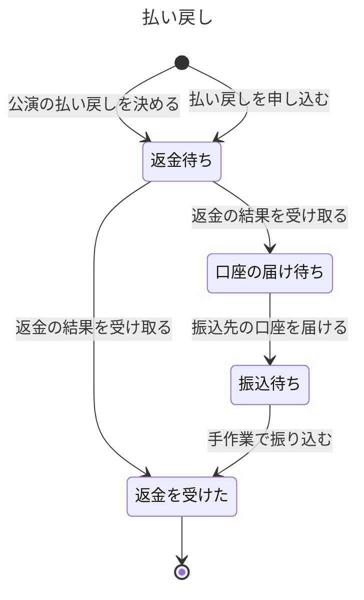

# 払い戻しの業務知識

主催者、運営スタッフ、来場者が、公演の中止や延期のときに、どのチケットの代金を誰へいくら返すか、いつ返し終えたかを同じ言葉で判断するための業務知識である。後ろに続くコマンドデータモデルは、この資料だけを業務の根拠にする。払い戻しは、主催者が中止した公演の払い戻しを決めたとき、または延期した公演で来場者が払い戻しを申し込んだときに始まり、代金が返金か手作業の振込で返ったときに終わる。

# 概要

払い戻しは、主催者の都合で予定どおりに入場できなくなったチケットについて、代金を払った人へ一枚につき一度だけ代金を返し、そのチケットを入場に使えなくする業務である。代金を払った人へ返すのは、分配は無償で、リセールでは買い手が代金を払っているからである（業務要件「払い戻し」「同行者への分配」）。一枚に一度だけ返すのは、二度返せば主催者か運営が同じ代金を二重に失うからである（業務要件「出品者への支払いと払い戻しの返金は、失敗しても諦めない」）。返すと決めたチケットを入場に使えなくするのは、代金を返した人がそのまま入場できれば、権利と代金の両方を持つ人が生まれるからである。

払い戻しは、公演の中止と延期のときだけ行う。来場者の都合で行けなくなったときは払い戻さず、正規のリセールで手放してもらう（業務要件「払い戻し」）。

この業務が担わないことは次のとおりである。公演を中止する・延期するという決定そのもの、公演の日時、販売の条件は、主催者の管理機能が持つ。誰がいまの保有者かはチケットの業務が、リセールで誰が買ったかと出品者への支払いはリセールの業務が、購入とその代金は販売の業務が、入場に使われたかは入場の業務が持つ。この業務はそれらの事実を読むだけで、定義し直さない。代金を返すことの中で起きることは決済事業者（ペイゲート社、架空）が持ち、この業務は結果の知らせだけを受け取る。

返金の依頼を成功の知らせが来るまで続けること、同じ依頼に同じ番号を付けて決済事業者が重複を見分けられるようにすることは、仕組みの手段なので業務の決まりに入れず、実装の関心としてコマンドデータモデルとその先の設計へ送った。

# ユビキタス言語

業務の言葉と英名の対応は次のとおりである。持ち主が「この資料」の語はここで決め、ほかの業務や範囲の外の語は持ち主と同じ言葉で使う。持ち主の資料がまだ無い語は、持ち主が英名を決めるまで英名を `未定` にしている。

| 業務の言葉 | 英名 | 種類 | 持ち主 |
|---|---|---|---|
| 払い戻し | Refund | 業務用語 | この資料 |
| 返金先 | RefundDestination | 業務用語 | この資料 |
| 返金額 | RefundAmount | 業務用語 | この資料 |
| 手数料を含めるか | IncludesFees | 業務用語 | この資料 |
| 受付期間 | RefundAcceptancePeriod | 業務用語 | この資料 |
| 振込先の口座 | BankAccount | 業務用語 | この資料 |
| 公演の払い戻しを決めた | PerformanceRefundDecided | 業務イベント | この資料 |
| 延期の払い戻しを受け付けた | PostponementRefundsAccepted | 業務イベント | この資料 |
| 払い戻しを申し込んだ | RefundRequested | 業務イベント | この資料 |
| 返金を依頼した | RefundOrdered | 業務イベント | この資料 |
| 返金した | RefundMade | 業務イベント | この資料 |
| 返金できなかった | RefundFailed | 業務イベント | この資料 |
| 振込先の口座を届けた | BankAccountSubmitted | 業務イベント | この資料 |
| 手作業で振り込んだ | ManualTransferMade | 業務イベント | この資料 |
| 返金待ち | AwaitingRefund | 状態 | この資料 |
| 口座の届け待ち | AwaitingBankAccount | 状態 | この資料 |
| 振込待ち | AwaitingTransfer | 状態 | この資料 |
| 返金を受けた | Refunded | 状態 | この資料 |
| 公演の払い戻しを決める | DecidePerformanceRefund | コマンド | この資料 |
| 延期の払い戻しを受け付ける | AcceptPostponementRefunds | コマンド | この資料 |
| 払い戻しを申し込む | RequestRefund | コマンド | この資料 |
| 返金する | MakeRefund | コマンド | この資料 |
| 返金の結果を受け取る | ReceiveRefundResult | コマンド | この資料 |
| 振込先の口座を届ける | SubmitBankAccount | コマンド | この資料 |
| 手作業で振り込む | TransferManually | コマンド | この資料 |
| チケット | 未定 | 業務用語 | [チケットの業務知識](../チケット/business-knowledge.md) |
| 購入者 | 未定 | 業務用語 | [チケットの業務知識](../チケット/business-knowledge.md) |
| 保有者 | 未定 | 業務用語 | [チケットの業務知識](../チケット/business-knowledge.md) |
| 同行者 | 未定 | 業務用語 | [チケットの業務知識](../チケット/business-knowledge.md) |
| 分配 | 未定 | 業務用語 | [チケットの業務知識](../チケット/business-knowledge.md) |
| 購入 | 未定 | 業務用語 | [販売の業務知識](../販売/business-knowledge.md) |
| 出品 | 未定 | 業務用語 | [リセールの業務知識](../リセール/business-knowledge.md) |
| 出品者 | 未定 | 業務用語 | [リセールの業務知識](../リセール/business-knowledge.md) |
| リセールの買い手 | 未定 | 業務用語 | [リセールの業務知識](../リセール/business-knowledge.md) |
| リセールの購入 | 未定 | 業務用語 | [リセールの業務知識](../リセール/business-knowledge.md) |
| 入場 | 未定 | 業務用語 | [入場の業務知識](../入場/business-knowledge.md) |
| 来場者 | 未定 | 業務用語 | 範囲の外: [業務要件（会員管理）](../../input/業務要件.md) |
| 主催者 | 未定 | 業務用語 | 範囲の外: [業務要件（主催者の管理機能）](../../input/業務要件.md) |
| 運営スタッフ | 未定 | 業務用語 | 範囲の外: [業務要件（ステージパスの運営）](../../input/業務要件.md) |
| 公演 | 未定 | 業務用語 | 範囲の外: [業務要件（主催者の管理機能）](../../input/業務要件.md) |
| 中止 | 未定 | 業務用語 | 範囲の外: [業務要件（主催者の管理機能）](../../input/業務要件.md) |
| 延期 | 未定 | 業務用語 | 範囲の外: [業務要件（主催者の管理機能）](../../input/業務要件.md) |
| 決済事業者 | 未定 | 業務用語 | 範囲の外: [業務要件（決済事業者との境界）](../../input/業務要件.md) |

## 業務用語

### 払い戻し

一枚のチケットについて、代金を返すという約束である。中止では主催者が払い戻しを決めたとき、延期では保有者が払い戻しを申し込んだときに、一枚ごとに一つ生まれる。購入を何枚まとめてしても、払い戻しはチケットの枚数だけある。払い戻しが生まれたチケットは、入場に使えない。

### 返金先

代金を返す相手と、返す支払い方法である。チケットが最後にリセールで移っていれば、そのリセールの買い手と、その人がリセールで払った方法になる。リセールで移っていなければ、購入者と、購入時の支払い方法になる。いまの保有者ではない。同行者に分けたチケットでも、代金を払ったのは購入者だからである。返金先は、払い戻しが生まれた時点で決まり、その後に変わらない。

### 返金額

一枚の払い戻しで返す額である。リセールで移っていないチケットではそのチケットの購入時の代金、最後にリセールで移ったチケットではリセールの買い手がリセールで払った代金である。主催者が手数料を含めると決めた払い戻しでは、そのチケットの購入時の手数料（システム利用料、発券手数料）を足す。

### 手数料を含めるか

主催者が、払い戻しを決めるとき、または延期の払い戻しを受け付けるときに、公演ごとに決める値で、含めるか含めないかのどちらかである。返金額を変える（業務要件「払い戻し」）。

### 受付期間

延期した公演で、主催者が払い戻しの申込を受け付けると決めた期間である。始まりの時刻から終わりの時刻までで、両端を含む（仮置き。「まだ決まっていないこと」を参照）。この期間の外では払い戻しを申し込めない。

### 振込先の口座

返金できなかった払い戻しについて、返金先の人が届ける銀行の口座である。運営スタッフは、この口座へ手作業で振り込む。

## 業務イベント

### 公演の払い戻しを決めた

主催者が、中止した公演の払い戻しを決めた。その公演のチケットはすべて入場に使えなくなり、入場に使われていないチケットのうち、まだ払い戻しが無いものごとに、返金待ちの払い戻しが生まれる。

### 延期の払い戻しを受け付けた

主催者が、延期した公演について、受付期間と手数料を含めるかを決めて払い戻しを受け付けた。チケットは新しい日時で有効のままで、保有者は受付期間の間に払い戻しを申し込める。

### 払い戻しを申し込んだ

延期した公演のチケットの保有者が、払い戻しを申し込んだ。そのチケットに返金待ちの払い戻しが生まれ、チケットは入場に使えなくなる。

### 返金を依頼した

運営スタッフが、返金待ちの払い戻しについて、返金先へ返金額を返すよう決済事業者へ依頼した。払い戻しは返金待ちのままで、結果の知らせを待つ。

### 返金した

決済事業者が、返金先へ返金額を返したと知らせてきた。払い戻しは返金を受けたになり、終わる。

### 返金できなかった

決済事業者が、返金先の支払い方法（解約されたカードなど）へ返せなかったと知らせてきた。払い戻しは口座の届け待ちになり、返金先の人に振込先の口座を届けてもらう。

### 振込先の口座を届けた

返金できなかった払い戻しの返金先の人が、振込先の口座を届けた。払い戻しは振込待ちになる。

### 手作業で振り込んだ

運営スタッフが、届けられた振込先の口座へ返金額を手作業で振り込んだ。払い戻しは返金を受けたになり、終わる。

# 概念

## 公演の払い戻しには、中止と延期の二つの始まり方がある

中止では、主催者が払い戻しを決めた時点で、その公演の対象のチケットすべてに払い戻しが生まれる。来場者の申込は要らない（仮置き。「まだ決まっていないこと」を参照）。延期では、チケットは新しい日時で有効のままで、主催者が受け付けた受付期間の間に、保有者が申し込んだチケットにだけ払い戻しが生まれる。延期の公演が後で中止になることはあり、そのときは申し込まれていなかったチケットにだけ新しく払い戻しが生まれる。

## 払い戻しは、生まれてから返金を受けるまでの一枚ごとの約束である

払い戻しが生まれると、返金先、返金額が決まり、それ以降変わらない。運営スタッフが返金を依頼し、決済事業者が返したと知らせれば終わる。返せなかったと知らせてきたときは、返金先の人が振込先の口座を届け、運営スタッフが手作業で振り込めば終わる。どちらの道で終わっても、一枚の払い戻しで代金が返るのは一度だけである。

# 常に守られること

### 一枚のチケットに、払い戻しは一つだけで、代金は一度だけ返る

同じチケットに払い戻しが二つあったり、返金と手作業の振込の両方が行われたりすれば、主催者か運営が同じ代金を二重に失う。延期で申し込まれたチケットの公演が後で中止になっても、新しい払い戻しは生まれない（業務要件「決済事業者との境界」）。

### 払い戻しが生まれたチケットと、払い戻しを決めた公演のチケットは、入場に使えない

代金を返した人がそのまま入場できれば、同じチケットで権利と代金の両方を持つ人が生まれ、座席や定員の約束も崩れる（業務要件「払い戻し」）。どの事実から入場できるかを決めるかの業務をまたぐ答えは仮置きで、この業務はこの二つの事実を入場を妨げる事実として持つ（「まだ決まっていないこと」を参照）。

### 入場に使われたチケットには、払い戻しが生まれない

入場した人は、そのチケットの権利を使い終えている。使った権利の代金を返せば、公演を見た人に代金を返すことになる（業務要件「払い戻し」）。

### 代金は、いまの保有者ではなく、代金を払った人へ返る

分配は無償なので、同行者へ代金を返すと、払っていない代金を受け取る人ができる。リセールで移ったチケットでは、最後のリセールの買い手が代金を払った人である（業務要件「払い戻し」）。

### 返金先と返金額は、払い戻しが生まれた後に変わらない

後から変わると、運営スタッフが来場者へ、誰にいくら返したかを一つの答えで示せなくなる。

### 払い戻しについて起きたことを、運営スタッフが起きた順に後から説明できる

来場者から「まだ返ってこない」「なぜ振込になったのか」と問い合わせを受けたとき、運営スタッフは一枚のチケットについて、払い戻しを決めた・申し込んだ、返金を依頼した、返金した・できなかった、振込先の口座を届けた、手作業で振り込んだ、を起きた順に示して答える。手作業で振り込んだことも説明の対象である（業務要件「出品者への支払いと払い戻しの返金は、失敗しても諦めない」「後から説明できること」、非機能「説明できることと保存期間」）。説明できる期間（公演の後3年以上）は品質要求に置いた。

# 状態と、その移り変わり

## 払い戻しは、返金か手作業の振込で終わる



返金を依頼しても、払い戻しは返金待ちのままである。依頼しただけでは、代金が返ったかどうかが分からないからである。返金を受けたは終わりの状態で、そこから移らない。口座の届け待ちから、もう一度決済事業者へ返金を依頼する道は無い（業務要件は、返金できないときは手作業で振り込むとだけ定めている）。

公演の払い戻しの決定と延期の払い戻しの受付は、公演についての一度きりの事実で、状態を持たない。

# 業務の行い

## コマンド

### 公演の払い戻しを決める

主催者だけが行える（仮置き。「まだ決まっていないこと」を参照）。払い戻しを決めると公演のすべてのチケットが入場に使えなくなるので、その判断の責任は公演を中止した主催者に一つに決める。ほかの人が行えば、主催者の知らないうちに来場者が入場できなくなり、主催者が代金を失う。

主催者が中止した公演についてだけ、一度だけ決められる。決めるときに手数料を含めるかを決める。決めると「公演の払い戻しを決めた」が起き、その公演のチケットはすべて入場に使えなくなる。同時に、入場に使われていないチケットのうち、まだ払い戻しが無いものごとに返金待ちの払い戻しが生まれる。延期で払い戻しを申し込まれていたチケットには、新しい払い戻しは生まれない。返金先はこの時点の事実で決まる。公演の途中で中止した場合も、入場に使われたチケットには払い戻しを生まない（仮置き。「まだ決まっていないこと」を参照）。リセールの出品者への支払いは、この行いでは変えない（仮置き。同）。

#### 拒む理由: 中止していない公演の払い戻しを決める

中止していない公演のチケットを入場に使えなくすると、公演に行ける来場者の権利を奪う。延期の公演は、延期の払い戻しを受け付けるで扱う。

#### 拒む理由: 払い戻しを決めた公演の払い戻しをもう一度決める

一つの公演の払い戻しは一度だけ決める。二度決めると、同じチケットに払い戻しが二つ生まれるおそれがある。

#### 拒む理由: 主催者でない人が公演の払い戻しを決める

公演の全チケットを入場に使えなくする判断は、公演を中止した主催者の責任である。運営スタッフは主催者の依頼を受けて返金を担うが、決定そのものは行わない。

### 延期の払い戻しを受け付ける

主催者だけが行える。受付期間は主催者が決める（業務要件「払い戻し」）。ほかの人が行えば、主催者の知らないうちに有効なチケットの払い戻しが始まる。

主催者が延期した公演で、払い戻しをまだ決めていない公演についてだけ、一度だけ行える。受付期間の始まりと終わり、手数料を含めるかを決める。行うと「延期の払い戻しを受け付けた」が起きる。チケットは新しい日時で有効のままで、この行いでは払い戻しは生まれない。

#### 拒む理由: 延期していない公演で払い戻しを受け付ける

予定どおり行われる公演で払い戻しを受け付けると、来場者の都合による払い戻しを受け付けることになる。その道はリセールである。

#### 拒む理由: 払い戻しを決めた公演で延期の払い戻しを受け付ける

中止で払い戻しを決めた公演のチケットには、すでに払い戻しが生まれているか、入場に使われている。申込を受け付ける対象が無い。

### 払い戻しを申し込む

延期の払い戻しを受け付けた公演のチケットの、いまの保有者だけが申し込める（仮置き。「まだ決まっていないこと」を参照）。延期後の日時に行けないのは入場する保有者だからである。保有者でない人が申し込めば、入場するつもりの保有者の知らないうちにチケットが入場に使えなくなる。

申し込めるのは、受付期間の始まりの時刻から終わりの時刻まで（両端を含む）で、そのチケットが入場に使われておらず、出品中でも分配の承諾待ちでもなく、払い戻しがまだ無いときである。申し込むと「払い戻しを申し込んだ」が起き、返金待ちの払い戻しが生まれ、チケットは入場に使えなくなる。返金先と返金額は、公演の払い戻しを決めるときと同じ決まりで、申し込んだ時点の事実から決まる。したがって、同行者が申し込んでも代金は購入者へ返る。

#### 拒む理由: 受付期間の外に払い戻しを申し込む

受付期間は、主催者が延期の払い戻しを引き受けると約束した期間である。期間の外まで受け付けると、主催者が新しい日時の公演の来場者の数を見通せない。

#### 拒む理由: 保有者でない人が払い戻しを申し込む

分配で保有者が同行者に変わった後の購入者のように、保有者でない人が申し込むと、入場するつもりの保有者のチケットが入場に使えなくなる。

#### 拒む理由: 入場に使われたチケットの払い戻しを申し込む

入場した人は、そのチケットの権利を使い終えている。

#### 拒む理由: 出品中か分配の承諾待ちのチケットの払い戻しを申し込む

一枚のチケットに同時に進められる移転は一つだけである。出品中や承諾待ちの間に払い戻しを受け付けると、リセールの買い手や同行者がチケットを受け取った後に、そのチケットが入場に使えなくなる（業務をまたぐ扱いは仮置き。「まだ決まっていないこと」を参照）。

#### 拒む理由: 払い戻しがあるチケットの払い戻しを申し込む

一枚のチケットに払い戻しは一つだけである。

### 返金する

運営スタッフが行う。主催者の依頼を受けた払い戻しの実行は運営スタッフが担うからである（業務要件「関係する人」）。

返金待ちの払い戻しについて、返金先へ返金額を返すよう決済事業者へ依頼する。行うと「返金を依頼した」が起き、払い戻しは返金待ちのままである。結果の知らせが来ない間に同じ払い戻しの返金を依頼し直しても、代金は一度しか返らない。依頼を成功まで続ける手段は仕組みに委ねた。

#### 拒む理由: 返金待ちでない払い戻しを返金する

返金を受けた払い戻しをもう一度返金すれば、代金が二度返る。口座の届け待ちと振込待ちの払い戻しは、手作業の振込で返すと決まっている。

### 返金の結果を受け取る

運営スタッフが、決済事業者からの知らせを受けて行う。返金が終わったかを業務上判断するのは運営スタッフだからである。

返金を依頼した返金待ちの払い戻しについて、決済事業者が返したと知らせてきたら「返金した」が起き、払い戻しは返金を受けたになる。返金先の支払い方法へ返せなかったと知らせてきたら「返金できなかった」が起き、払い戻しは口座の届け待ちになる。

#### 拒む理由: 返金待ちでない払い戻しの返金の結果を受け取る

返金を受けた払い戻しや、手作業の振込へ移った払い戻しの結果を変えると、代金が返ったかどうかの答えが二つになる。

### 振込先の口座を届ける

その払い戻しの返金先の人だけが届けられる。代金を受け取る人が自分の口座を届けるからである。ほかの人が届ければ、代金が返金先でない人の口座へ振り込まれる。

口座の届け待ちの払い戻しについて届けられる。届けると「振込先の口座を届けた」が起き、払い戻しは振込待ちになる。

#### 拒む理由: 返金先でない人が振込先の口座を届ける

代金を払った人でない人の口座へ振り込めば、代金を払った人に代金が返らない。

#### 拒む理由: 口座の届け待ちでない払い戻しに振込先の口座を届ける

返金待ちの払い戻しは決済事業者を通して返る。返金を受けた払い戻しに届けを受けると、二度返すおそれが生まれる。

### 手作業で振り込む

運営スタッフだけが行える（業務要件「出品者への支払いと払い戻しの返金は、失敗しても諦めない」）。

振込待ちの払い戻しについて、届けられた振込先の口座へ返金額を振り込む。振り込むと「手作業で振り込んだ」が起き、払い戻しは返金を受けたになる。

#### 拒む理由: 振込待ちでない払い戻しを手作業で振り込む

口座が届いていなければ振り込む先が無い。返金を受けた払い戻しに振り込めば、代金が二度返る。

## クエリ

なし。分け方の一覧は、この業務に読み取りの行いを置いていない。運営スタッフが口座の届け待ちの払い戻しを探す読み取りと、一枚のチケットの払い戻しの経緯を見る読み取りは要ると推定するが、どの業務に置くかは「まだ決まっていないこと」に置いた。

# 導出されること

返金先は、払い戻しが生まれた時点で、そのチケットが最後にリセールで移っていればそのリセールの買い手とその人の支払い方法、移っていなければ購入者と購入時の支払い方法である。

返金額は、最後にリセールで移ったチケットならリセールの買い手がリセールで払った代金、そうでなければそのチケットの購入時の代金に、手数料を含めると決めた払い戻しではそのチケットの購入時の手数料を足した額である。

業務知識に置かない値は次の置き場に置いた。決済事業者が受け付けられる返金の依頼の速さ（1秒あたり100件と仮定）と、払い戻しの申込の応答時間（95%を2秒以内）は品質要求に、払い戻しの事実を説明できる期間（公演の後3年以上）は品質要求に置いた。

# 同時に起きたとき

### 同時に起きること: 同じチケットの払い戻しが二度申し込まれる

先に受け付けた申込だけが通り、払い戻しは一つだけ生まれる。一枚のチケットに払い戻しは一つだけだからである（BDD-027）。

### 同時に起きること: 公演の払い戻しを決めるのと、リセールの購入が同じチケットで重なる

先に成立した方が通る。リセールの購入が先に成立していれば、返金先はそのリセールの買い手になる。払い戻しの決定が先なら、そのチケットの返金先は決定の時点の事実で決まり、後から来たリセールの購入で変わらない。返金先は払い戻しが生まれた時点で決まるからである（BDD-028、BDD-029）。

### 同時に起きること: 払い戻しの申込と入場が同じチケットで重なる

先に受け付けた方が通る。申込が先なら入場に使えず、入場が先なら払い戻しは生まれない。一枚のチケットで権利と代金の両方を持つ人を生まないためである（BDD-030）。

### 同時に起きること: 二人の運営スタッフが同じ払い戻しを手作業で振り込む

先に受け付けた一人の振込だけが通り、もう一人の振込は行われない。代金は一度だけ返るからである（BDD-031）。

# まだ決まっていないこと

### 業務をまたぐ答え: 入場できる権利を誰が持つかを、どの事実から決めるか

仮置きである。保有者はチケットの業務の事実とリセールの業務の事実から決まり、入場できるかは、それに加えて入場を妨げる事実が無いことで決まるとし、この業務は「公演の払い戻しを決めた」と「払い戻しを申し込んだ」を入場を妨げる事実として持つ、と置いた。根拠は、業務要件「なぜ作るのか」が権利の答えを一つにすることを求め、分け方が保有者の語をチケットの業務だけに持たせていることである。採らなかった案は、払い戻しの業務が保有者の状態そのものを変える（権利を失わせる）形である。分け方に答えが無いため、依頼元の指示で推奨を仮置きした。決めるのは分け方の持ち主である依頼元で、チケット、リセール、入場の担当と同じ答えにそろえる必要がある。

### 業務をまたぐ答え: 移転の排他をどの業務の判断として置くか

仮置きである。一枚に同時に進められる移転は一つだけという判断はチケットの業務に置き、払い戻しの申込も同じ排他に加える、と置いた。そのため「出品中か分配の承諾待ちのチケットの払い戻しを申し込む」を拒む。根拠は業務要件「分配とリセールの関係」と非機能「整合性」である。採らなかった案は、払い戻しの申込を排他に含めず、申込で出品と分配を打ち切る形である。決めるのは依頼元で、チケット、リセールの担当と答えをそろえる。

### 業務をまたぐ答え: 業務の時刻

仮置きである。出来事が起きた時刻を業務の時刻とし、受付期間は申し込んだ時刻で、入場に使われたかは入場した時刻で判断する、と置いた。根拠は非機能「障害時の扱い」が、いつ起きたかを説明できることを求めていることである。採らなかった案は、ステージパスが受け付けた時刻を使う形である。決めるのは依頼元で、入場、販売、リセールの担当と答えをそろえる。

### 業務をまたぐ答え: 後から誰に何を説明するか

仮置きである。運営スタッフが来場者の問い合わせに答えるために、一枚のチケットについて起きたことを起きた順に説明する、と置いた。払い戻しで説明する事実の範囲は業務要件と非機能の文で決まっているが、業務をまたいで同じ答えにすることが分け方で決まっていない。採らなかった案は、主催者への公演ごとの説明も求める形である（要件は主催者に払い戻しの説明を求めていない）。決めるのは依頼元である。

### 公演の払い戻しを決めるのは主催者だけか

仮置きである。主催者だけが行え、運営スタッフは返金と手作業の振込を担う、と置いた。根拠は業務要件「関係する人」の「公演の中止や延期を決めるのも主催者」「運営スタッフは…主催者の依頼を受けた払い戻しの実行を担う」と、「払い戻し」の「主催者は払い戻しを決める」である。採らなかった案は、運営スタッフが主催者の依頼を受けて決定の行いを行う形である。決めるのは事業部と主催者である。

### 中止の払い戻しに来場者の申込が要るか

仮置きである。申込は要らず、決定の時点で払い戻しが生まれる、と置いた。根拠は、業務の決まりを持つ業務要件「払い戻し」に中止の申込の手順が無いことである。「利用規模と負荷」は中止の払い戻しの申込が発表の直後に山になると書いており、要件の中で食い違っている。採らなかった案は、中止でも来場者の申込を要する形で、これを採ると中止にも「払い戻しを申し込む」が要り、申し込まれなかったチケットの扱いを決める必要が生まれる。決めるのは事業部である。

### 延期の払い戻しを申し込めるのは誰で、誰へ返すか

仮置きである。申し込めるのはいまの保有者だけで、返金先と返金額は中止と同じ決まりにする、と置いた。根拠は業務要件「払い戻し」の「延期後の日時に行けない来場者」が入場する人を指すことと、返金先を購入者とする決まりが中止の段落にあることである。採らなかった案は、購入者が申し込む形と、保有者へ返す形である。決めるのは事業部と主催者である。

### 公演の途中で中止した場合

仮置きである。入場に使われたチケットは払い戻さない決まりをそのまま当て、入場に使われていないチケットだけ払い戻す、と置いた。根拠は業務要件「払い戻し」の第一文が条件を付けずに入場済みのチケットを除いていることと、最も狭い払い戻しなら後で広げても返した代金を取り戻さずに済むことである。採らなかった案は、入場済みのチケットも全額または一部を払い戻す形である。要件は未決としており、決めるのは主催者、会場、法務である。

### リセールで移ったチケットの払い戻しで、出品者への支払いをどうするか

仮置きである。払い戻しの業務は出品者への支払いを変えず、リセールの買い手へ返すことだけを行う、と置いた。根拠は、業務要件「払い戻し」がリセールの買い手へ返すことまでは決め、出品者の扱いを未決としていることである。リセールで二度以上移ったチケットの、途中のリセールの買い手（次に出品した人）も、出品者としてここに含まれる。採らなかった案は、出品者への支払いを止めて出品者へ定価を返す形と、支払い済みの代金を出品者から戻してもらう形である。要件は未決としており、決めるのは主催者と法務で、決まればリセールの業務か払い戻しの業務に決まりを足す。

### 受付期間の終わりの時刻を含むか

仮置きである。両端を含む、と置いた。根拠は、主催者が「〜まで」と案内すれば来場者はその時刻を含むと読むことである。採らなかった案は、終わりの時刻を含まない形である。決めるのは主催者である。

### 通信断の入口で入場した記録が、払い戻しの申込の後に届いたとき

仮説である。申込の時点で入場の事実が無ければ受け付け、後から届いた入場の記録との食い違いは、入場の業務の「食い違いを知らせる」に委ねる、と置いた。根拠は、業務要件「通信が切れているとき」が食い違いの扱いを未決にしており、払い戻しの側で先に答えを決めると入場の業務と食い違うことである。採らなかった案は、後から入場が分かった払い戻しを取り消す形である。受付期間が延期後の公演日と重なるときだけ起きる。書く途中で見つかった論点で、次の grill の候補である。決めるのは主催者と会場で、入場の担当と答えをそろえる。

### 購入一件に付く手数料の、一枚あたりの額

仮説である。一枚あたりの手数料は販売の業務の購入の事実から決まるものとし、この業務では定義し直さない、と置いた。根拠は、購入と手数料の事実の持ち主が販売の業務であることである。採らなかった案は、この業務で購入の手数料を枚数で割る形である。決めるのは販売の担当と事業部である。

### 払い戻しの読み取りをどの業務に置くか

分け方の一覧は、払い戻しの業務に読み取りの行いを置いていない。運営スタッフが口座の届け待ちの払い戻しを探す読み取りと、一枚のチケットの払い戻しの経緯を見る読み取りは、手作業の振込と問い合わせへの対応に要ると推定する。どの業務に置き、一件ごとに何を見せるかが決まれば、この業務のクエリとして足す。決めるのは依頼元である。

# BDD

ここまでの決まりが、具体の場面でどう働くかを示す。公演 P-100 は2026年11月20日に予定していた座席指定の公演、公演 P-200 は2026年11月20日から2027年1月15日へ延期した公演とする。仮置きの決まりに拠る場面は、その決まりが仮置きであることを見出しの下の場面に含めて読む。

## 公演の払い戻しを決める

### [BDD-001] 中止した公演の払い戻しを決めると、同行者に分けたチケットでも購入者への払い戻しが生まれる

```gherkin
Given: 主催者は公演 P-100 を中止した
  And: 購入者 M-001 はチケット T-101 と T-102 を1枚8,000円、購入時の手数料1枚440円で、カードで購入した
  And: チケット T-102 は同行者 M-002 への分配が承諾され、保有者は M-002 である
  And: どちらのチケットも入場に使われておらず、払い戻しも無い
When: 主催者が2026年11月10日 10:00に公演 P-100 の払い戻しを、手数料を含めないと決める
Then: 「公演の払い戻しを決めた」が起き、公演 P-100 のチケットはすべて入場に使えなくなる
  And: チケット T-101 と T-102 のそれぞれに返金待ちの払い戻しが生まれる
  And: どちらも返金先は購入者 M-001 と購入時のカード、返金額は8,000円である
```

### [BDD-002] 手数料を含めると決めた払い戻しでは、返金額に購入時の手数料が入る

```gherkin
Given: 主催者は公演 P-100 を中止した
  And: 購入者 M-001 のチケット T-101 は、代金8,000円、購入時の手数料440円で、入場に使われておらず、払い戻しも無い
When: 主催者が2026年11月10日に公演 P-100 の払い戻しを、手数料を含めると決める
Then: チケット T-101 に返金待ちの払い戻しが生まれる
  And: 返金額は8,440円、返金先は購入者 M-001 である
```

### [BDD-003] リセールで移ったチケットは、最後のリセールの買い手へリセールで払った代金を返す

```gherkin
Given: 主催者は公演 P-100 を中止した
  And: 購入者 M-001 が買ったチケット T-103 は、リセールの買い手 M-003 が2026年10月20日にリセールで8,000円を払って買い、保有者は M-003 である
  And: チケット T-103 は入場に使われておらず、払い戻しも無い
When: 主催者が2026年11月10日に公演 P-100 の払い戻しを、手数料を含めないと決める
Then: チケット T-103 に返金待ちの払い戻しが生まれる
  And: 返金先はリセールの買い手 M-003 とその人がリセールで払った方法、返金額は8,000円である
  And: 出品者 M-001 への支払いは、この行いでは変わらない
```

### [BDD-004] 中止していない公演の払い戻しは決められない

```gherkin
Given: 公演 P-300 は中止も延期もされておらず、2026年12月5日に予定どおり行われる
When: 主催者が2026年11月10日に公演 P-300 の払い戻しを決める
Then: 払い戻しは生まれず、公演 P-300 のチケットは入場に使えるままである
  NOTE: Rule: 中止していない公演の払い戻しを決める
    Reason: 公演に行ける来場者の権利を奪わない
```

### [BDD-005] 払い戻しを決めた公演の払い戻しは、もう一度決められない

```gherkin
Given: 主催者は2026年11月10日に公演 P-100 の払い戻しを決め、チケット T-101 に返金待ちの払い戻しがある
When: 主催者が2026年11月12日に公演 P-100 の払い戻しをもう一度決める
Then: 新しい払い戻しは生まれず、チケット T-101 の払い戻しは一つのままである
  NOTE: Rule: 払い戻しを決めた公演の払い戻しをもう一度決める
    Reason: 一つの公演の払い戻しは一度だけ決める
```

### [BDD-006] 運営スタッフは公演の払い戻しを決められない

```gherkin
Given: 主催者は公演 P-100 を中止したが、払い戻しをまだ決めていない
When: 運営スタッフ S-01 が2026年11月10日に公演 P-100 の払い戻しを決める
Then: 払い戻しは生まれない
  NOTE: Rule: 主催者でない人が公演の払い戻しを決める
    Reason: 公演の全チケットを入場に使えなくする判断は、公演を中止した主催者の責任である
```

### [BDD-007] 延期で払い戻しを申し込んだチケットには、後で中止しても新しい払い戻しは生まれない

```gherkin
Given: 公演 P-200 は延期され、チケット T-201 には2026年11月15日に申し込まれた返金待ちの払い戻しがある
  And: チケット T-202 は入場に使われておらず、払い戻しも無い
  And: 主催者はその後、公演 P-200 を中止した
When: 主催者が2026年12月1日に公演 P-200 の払い戻しを決める
Then: チケット T-202 にだけ返金待ちの払い戻しが生まれる
  And: チケット T-201 の払い戻しは一つのままで、代金が二度返ることはない
```

### [BDD-008] 途中で中止した公演では、入場に使われたチケットに払い戻しは生まれない

```gherkin
Given: 公演 P-400 は2026年11月20日に開演した後、途中で中止された
  And: チケット T-401 は2026年11月20日 17:40に入場に使われ、チケット T-402 は入場に使われていない
When: 主催者が2026年11月21日に公演 P-400 の払い戻しを決める
Then: チケット T-402 にだけ返金待ちの払い戻しが生まれる
  And: チケット T-401 に払い戻しは生まれない（途中の中止の扱いは仮置き）
```

## 延期の払い戻しを受け付ける

### [BDD-009] 延期した公演で受付期間を決めて払い戻しを受け付ける

```gherkin
Given: 主催者は公演 P-200 を2026年11月20日から2027年1月15日へ延期し、払い戻しを決めていない
When: 主催者が2026年11月5日に、受付期間を2026年11月6日 10:00から2026年11月30日 23:59まで、手数料を含めるとして延期の払い戻しを受け付ける
Then: 「延期の払い戻しを受け付けた」が起きる
  And: 公演 P-200 のチケットは2027年1月15日の公演で有効のままで、払い戻しはまだ生まれない
```

### [BDD-010] 延期していない公演では払い戻しを受け付けられない

```gherkin
Given: 公演 P-300 は中止も延期もされていない
When: 主催者が2026年11月5日に公演 P-300 で延期の払い戻しを受け付ける
Then: 延期の払い戻しの受付は始まらない
  NOTE: Rule: 延期していない公演で払い戻しを受け付ける
    Reason: 来場者の都合による払い戻しは受け付けず、リセールで手放してもらう
```

### [BDD-011] 払い戻しを決めた公演では延期の払い戻しを受け付けられない

```gherkin
Given: 主催者は公演 P-100 の払い戻しを2026年11月10日に決めた
When: 主催者が2026年11月12日に公演 P-100 で延期の払い戻しを受け付ける
Then: 延期の払い戻しの受付は始まらない
  NOTE: Rule: 払い戻しを決めた公演で延期の払い戻しを受け付ける
    Reason: 申込を受け付ける対象のチケットが無い
```

## 払い戻しを申し込む

### [BDD-012] 同行者が延期の払い戻しを申し込むと、購入者への払い戻しが生まれる

```gherkin
Given: 公演 P-200 の延期の払い戻しの受付期間は2026年11月6日 10:00から2026年11月30日 23:59までである
  And: 購入者 M-001 が買ったチケット T-203 は、同行者 M-002 への分配が承諾され、保有者は M-002 である
  And: チケット T-203 は入場に使われておらず、出品中でも分配の承諾待ちでもなく、払い戻しも無い
When: 同行者 M-002 が2026年11月20日 12:00にチケット T-203 の払い戻しを申し込む
Then: 「払い戻しを申し込んだ」が起き、チケット T-203 に返金待ちの払い戻しが生まれる
  And: チケット T-203 は入場に使えなくなる
  And: 返金先は購入者 M-001 と購入時の支払い方法である
```

### [BDD-013] 受付期間の終わりの時刻ちょうどの申込は受け付ける

```gherkin
Given: 公演 P-200 の受付期間は2026年11月6日 10:00から2026年11月30日 23:59までである
  And: 保有者 M-004 のチケット T-204 は入場に使われておらず、出品中でも分配の承諾待ちでもなく、払い戻しも無い
When: 保有者 M-004 が2026年11月30日 23:59にチケット T-204 の払い戻しを申し込む
Then: チケット T-204 に返金待ちの払い戻しが生まれる（終わりの時刻を含むのは仮置き）
```

### [BDD-014] 受付期間が終わった後の申込は受け付けない

```gherkin
Given: 公演 P-200 の受付期間は2026年11月6日 10:00から2026年11月30日 23:59までである
  And: 保有者 M-004 のチケット T-205 は入場に使われておらず、出品中でも分配の承諾待ちでもなく、払い戻しも無い
When: 保有者 M-004 が2026年12月1日 00:00にチケット T-205 の払い戻しを申し込む
Then: 払い戻しは生まれず、チケット T-205 は2027年1月15日の公演で有効のままである
  NOTE: Rule: 受付期間の外に払い戻しを申し込む
    Reason: 受付期間は主催者が延期の払い戻しを引き受けると約束した期間である
```

### [BDD-015] 分配を承諾された後の購入者は払い戻しを申し込めない

```gherkin
Given: 公演 P-200 の受付期間は2026年11月6日 10:00から2026年11月30日 23:59までである
  And: チケット T-203 は購入者 M-001 から同行者 M-002 への分配が承諾され、保有者は M-002 である
When: 購入者 M-001 が2026年11月20日にチケット T-203 の払い戻しを申し込む
Then: 払い戻しは生まれず、チケット T-203 は同行者 M-002 が入場に使えるままである
  NOTE: Rule: 保有者でない人が払い戻しを申し込む
    Reason: 入場するつもりの保有者のチケットを入場に使えなくしない
```

### [BDD-016] 入場に使われたチケットは払い戻しを申し込めない

```gherkin
Given: 公演 P-200 の受付期間は2026年11月6日 10:00から2027年1月20日 23:59までである
  And: 保有者 M-004 のチケット T-206 は2027年1月15日 17:30に入場に使われた
When: 保有者 M-004 が2027年1月16日にチケット T-206 の払い戻しを申し込む
Then: 払い戻しは生まれない
  NOTE: Rule: 入場に使われたチケットの払い戻しを申し込む
    Reason: 入場した人は、そのチケットの権利を使い終えている
```

### [BDD-017] 出品中のチケットは払い戻しを申し込めない

```gherkin
Given: 公演 P-200 の受付期間は2026年11月6日 10:00から2026年11月30日 23:59までである
  And: 保有者 M-004 のチケット T-207 は出品中で、買い手はまだ付いていない
When: 保有者 M-004 が2026年11月20日にチケット T-207 の払い戻しを申し込む
Then: 払い戻しは生まれず、チケット T-207 は出品中のままである
  NOTE: Rule: 出品中か分配の承諾待ちのチケットの払い戻しを申し込む
    Reason: 一枚のチケットに同時に進められる移転は一つだけである（業務をまたぐ扱いは仮置き）
```

### [BDD-018] 払い戻しがあるチケットは、もう一度申し込めない

```gherkin
Given: 公演 P-200 の受付期間は2026年11月6日 10:00から2026年11月30日 23:59までである
  And: チケット T-204 には保有者 M-004 が2026年11月20日に申し込んだ返金待ちの払い戻しがある
When: 保有者 M-004 が2026年11月21日にチケット T-204 の払い戻しを申し込む
Then: 新しい払い戻しは生まれず、チケット T-204 の払い戻しは一つのままである
  NOTE: Rule: 払い戻しがあるチケットの払い戻しを申し込む
    Reason: 一枚のチケットに払い戻しは一つだけである
```

## 返金する

### [BDD-019] 返金待ちの払い戻しを返金すると、返金を依頼したまま返金待ちで結果を待つ

```gherkin
Given: チケット T-101 の払い戻しは返金待ちで、返金先は購入者 M-001 と購入時のカード、返金額は8,000円である
When: 運営スタッフ S-01 が2026年11月10日 11:00にチケット T-101 の払い戻しを返金する
Then: 「返金を依頼した」が起きる
  And: 払い戻しは返金待ちのままである
```

### [BDD-020] 返金を受けた払い戻しは、もう一度返金しない

```gherkin
Given: チケット T-101 の払い戻しは返金を受けたである
When: 運営スタッフ S-01 が2026年11月15日にチケット T-101 の払い戻しを返金する
Then: 返金は依頼されず、払い戻しは返金を受けたのままである
  NOTE: Rule: 返金待ちでない払い戻しを返金する
    Reason: 代金は一度だけ返る
```

## 返金の結果を受け取る

### [BDD-021] 決済事業者が返したと知らせると、払い戻しは返金を受けたになる

```gherkin
Given: チケット T-101 の払い戻しは返金待ちで、2026年11月10日 11:00に返金を依頼した
When: 運営スタッフ S-01 が2026年11月10日 11:05に、決済事業者から返したという知らせを受け取る
Then: 「返金した」が起き、払い戻しは返金を受けたになる
```

### [BDD-022] 解約されたカードへ返せなかったと知らせると、払い戻しは口座の届け待ちになる

```gherkin
Given: チケット T-102 の払い戻しは返金待ちで、返金先は購入者 M-001 と購入時のカードである
  And: 2026年11月10日 11:00に返金を依頼した
When: 運営スタッフ S-01 が2026年11月10日 11:05に、決済事業者からカードが解約されていて返せなかったという知らせを受け取る
Then: 「返金できなかった」が起き、払い戻しは口座の届け待ちになる
```

### [BDD-023] 返金を受けた払い戻しの結果は、後から来た知らせで変わらない

```gherkin
Given: チケット T-101 の払い戻しは2026年11月10日 11:05に返金を受けたになった
When: 運営スタッフ S-01 が2026年11月10日 11:30に、同じ払い戻しについて返せなかったという知らせを受け取る
Then: 払い戻しは返金を受けたのままである
  NOTE: Rule: 返金待ちでない払い戻しの返金の結果を受け取る
    Reason: 代金が返ったかどうかの答えを二つにしない
```

## 振込先の口座を届ける

### [BDD-024] 返金先の人が口座を届けると、払い戻しは振込待ちになる

```gherkin
Given: チケット T-102 の払い戻しは口座の届け待ちで、返金先は購入者 M-001 である
When: 購入者 M-001 が2026年11月12日に振込先の口座を届ける
Then: 「振込先の口座を届けた」が起き、払い戻しは振込待ちになる
```

### [BDD-025] 返金先でない同行者は振込先の口座を届けられない

```gherkin
Given: チケット T-102 の払い戻しは口座の届け待ちで、返金先は購入者 M-001 である
  And: チケット T-102 は払い戻しを決める前に同行者 M-002 への分配が承諾されていた
When: 同行者 M-002 が2026年11月12日にチケット T-102 の払い戻しの振込先の口座を届ける
Then: 払い戻しは口座の届け待ちのままである
  NOTE: Rule: 返金先でない人が振込先の口座を届ける
    Reason: 代金を払った人でない人の口座へ振り込まない
```

### [BDD-026] 返金待ちの払い戻しには振込先の口座を届けられない

```gherkin
Given: チケット T-101 の払い戻しは返金待ちで、返金先は購入者 M-001 である
When: 購入者 M-001 が2026年11月10日 11:02にチケット T-101 の払い戻しの振込先の口座を届ける
Then: 払い戻しは返金待ちのままである
  NOTE: Rule: 口座の届け待ちでない払い戻しに振込先の口座を届ける
    Reason: 返金待ちの払い戻しは決済事業者を通して返る
```

## 手作業で振り込む

### [BDD-032] 振込待ちの払い戻しを手作業で振り込むと、返金を受けたになる

```gherkin
Given: チケット T-102 の払い戻しは振込待ちで、返金先は購入者 M-001、返金額は8,000円である
When: 運営スタッフ S-01 が2026年11月13日に届けられた口座へ8,000円を手作業で振り込む
Then: 「手作業で振り込んだ」が起き、払い戻しは返金を受けたになる
  And: 運営スタッフは、返金できなかったこと、口座を届けたこと、手作業で振り込んだことを、起きた順に後から説明できる
```

### [BDD-033] 口座が届いていない払い戻しは手作業で振り込めない

```gherkin
Given: チケット T-102 の払い戻しは口座の届け待ちである
When: 運営スタッフ S-01 が2026年11月11日にチケット T-102 の払い戻しを手作業で振り込む
Then: 振込は行われず、払い戻しは口座の届け待ちのままである
  NOTE: Rule: 振込待ちでない払い戻しを手作業で振り込む
    Reason: 振り込む先が無い
```

## 同時に起きたとき

### [BDD-027] 同じチケットの払い戻しが同時に二度申し込まれると、払い戻しは一つだけ生まれる

```gherkin
Given: 公演 P-200 の受付期間は2026年11月6日 10:00から2026年11月30日 23:59までである
  And: 保有者 M-004 のチケット T-208 は入場に使われておらず、出品中でも分配の承諾待ちでもなく、払い戻しも無い
When: 保有者 M-004 が2026年11月20日 12:00に、二つの端末から同時にチケット T-208 の払い戻しを申し込む
Then: 先に受け付けた申込で返金待ちの払い戻しが一つ生まれる
  And: もう一つの申込では払い戻しは生まれない
```

### [BDD-028] リセールの購入が払い戻しの決定より先に成立すると、返金先はリセールの買い手になる

```gherkin
Given: 主催者は公演 P-100 を中止した
  And: 出品者 M-001 のチケット T-104 は出品中である
  And: 主催者が公演 P-100 の払い戻しを決めるのと同じときに、M-005 がチケット T-104 をリセールで8,000円を払って買った
When: リセールの購入が先に成立し、その後に払い戻しの決定が受け付けられる
Then: チケット T-104 に返金待ちの払い戻しが生まれる
  And: 返金先はリセールの買い手 M-005、返金額は8,000円である
```

### [BDD-029] 払い戻しの決定が先に受け付けられると、後から来たリセールの購入で返金先は変わらない

```gherkin
Given: 主催者は公演 P-100 を中止した
  And: 出品者 M-001 のチケット T-105 は出品中で、M-001 は購入者である
  And: 主催者が公演 P-100 の払い戻しを決めるのと同じときに、M-005 がチケット T-105 をリセールで買おうとした
When: 払い戻しの決定が先に受け付けられる
Then: チケット T-105 に返金待ちの払い戻しが生まれ、返金先は購入者 M-001 である
  And: 後から来たリセールの購入で、この払い戻しの返金先は M-005 に変わらない
```

### [BDD-030] 払い戻しの申込と入場が同時に起きると、先に受け付けた方だけが通る

```gherkin
Given: 公演 P-200 の受付期間は2026年11月6日 10:00から2027年1月15日 23:59までである
  And: 保有者 M-004 のチケット T-209 は入場に使われておらず、払い戻しも無い
  And: 2027年1月15日 17:30に、M-004 が払い戻しを申し込むのと同じときに、入口でチケット T-209 が提示された
When: 払い戻しの申込が先に受け付けられる
Then: チケット T-209 に返金待ちの払い戻しが生まれる
  And: チケット T-209 は入場に使えず、入場は通らない
```

### [BDD-031] 二人の運営スタッフが同じ払い戻しを同時に手作業で振り込むと、一人の振込だけが通る

```gherkin
Given: チケット T-102 の払い戻しは振込待ちで、返金額は8,000円である
When: 運営スタッフ S-01 と S-02 が2026年11月13日 14:00に同時にチケット T-102 の払い戻しを手作業で振り込む
Then: 先に受け付けた一人の振込だけが行われ、払い戻しは返金を受けたになる
  And: もう一人の振込は行われず、代金は二度返らない
```
