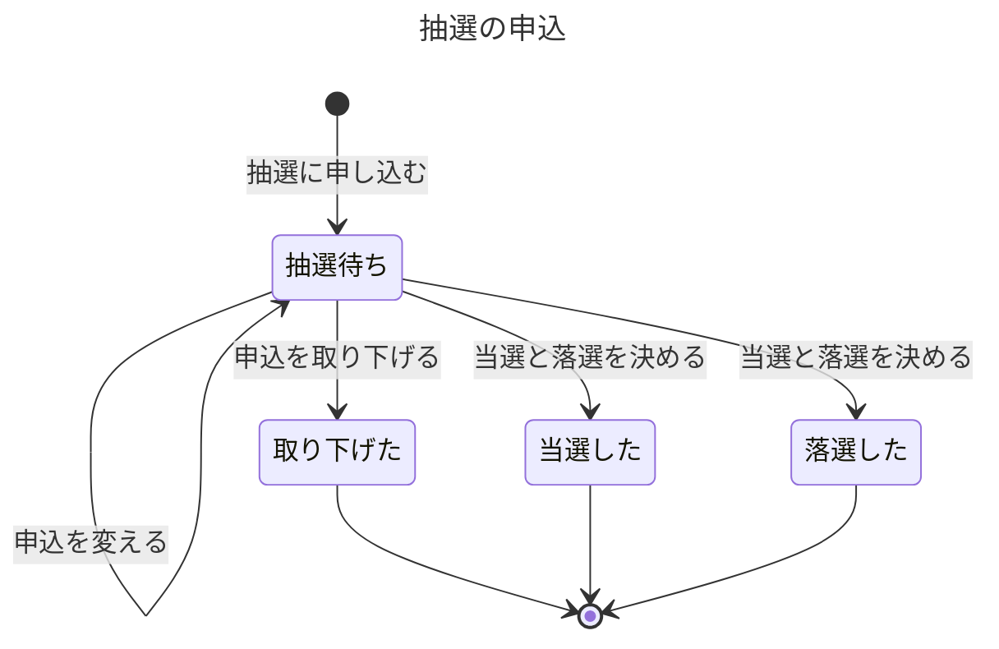
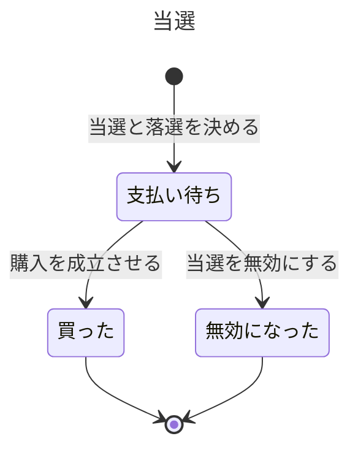
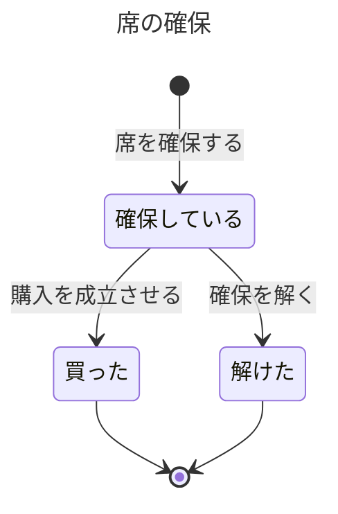

# 販売の業務知識

ステージパスの販売の担当と主催者、来場者が、抽選の申込、当選、席の確保、代金の受け取りを同じ言葉で判断し、**代金を受け取った来場者には必ず席を渡し、席を渡せない代金は全額返す**ための業務知識である。販売は、来場者が抽選に申し込むか先着で席を確保したときに始まり、購入が成立するか、成立させなかった代金を返したときに終わる。成立した購入からチケットを発券するのはチケットの業務で、販売はそこから先を扱わない。

# 概要

販売は、限られた席を、一つの席に一人だけ、一人が決められた枚数までという約束を守って来場者へ売る業務である。人気の公演は抽選で、抽選で売り切らなかった席や抽選をしない公演は先着で売る。どちらの方式でも、来場者が代金を払い、ステージパスがその代金を受け取って購入を成立させたときに、席はその来場者のものになる。守りたい価値は、代金を受け取ったのに席が無い来場者と、同じ席を二人に売った状態を、決して残さないことである。代金は外部の決済事業者を通して受け取るので、結果は遅れて届き、二度届くこともある。販売は、届いた結果を受け付けた時刻で期限と照らし、購入を成立させるか、代金を返すかを一つに決める。

販売は、公演、席、席の種類、価格、販売の方式、受付期間、支払期限、一人が買える枚数の上限、当選の決め方を決めない。これらは主催者の管理機能が決め、販売は所与として使う。会員と本人確認は会員管理が、代金の受け取りと返金の中で起きることは決済事業者が担う。成立した購入からのチケットの発券と、その後の分配、リセール、入場、払い戻しは、それぞれチケット、リセール、入場、払い戻しの業務が担う。成立した購入の代金を後から返すのは払い戻しの業務であり、販売が返すのは、購入を成立させなかった代金だけである。

# ユビキタス言語

業務の言葉と英名の対応は次のとおりである。販売が作り、変えるもの（抽選の申込、当選、席の確保、購入、整理番号）の語はこの資料が決める。チケットと購入者はチケットの業務が、役割の語と、公演や席のように主催者が決めるものの語は範囲の外の持ち主が決めるので、英名を `未定` として空けている。

| 業務の言葉 | 英名 | 種類 | 持ち主 |
|---|---|---|---|
| 抽選 | Lottery | 業務用語 | この資料 |
| 抽選の申込 | LotteryEntry | 業務用語 | この資料 |
| 当選 | LotteryWin | 業務用語 | この資料 |
| 席の確保 | SeatHold | 業務用語 | この資料 |
| 確保の期限 | HoldExpiresAt | 業務用語 | この資料 |
| 代金 | Payment | 業務用語 | この資料 |
| 受け付けた時刻 | ReceivedAt | 業務用語 | この資料 |
| 購入 | Purchase | 業務用語 | この資料 |
| 整理番号 | QueueNumber | 業務用語 | この資料 |
| 残りの枚数 | RemainingCount | 業務用語 | この資料 |
| 抽選に申し込んだ | LotteryEntered | 業務イベント | この資料 |
| 申込を変えた | LotteryEntryChanged | 業務イベント | この資料 |
| 申込を取り下げた | LotteryEntryWithdrawn | 業務イベント | この資料 |
| 当選と落選を決めた | LotteryDrawn | 業務イベント | この資料 |
| 当選を無効にした | LotteryWinVoided | 業務イベント | この資料 |
| 席を確保した | SeatHeld | 業務イベント | この資料 |
| 確保を解いた | SeatHoldReleased | 業務イベント | この資料 |
| 代金を受け取った | PaymentReceived | 業務イベント | この資料 |
| 購入が成立した | PurchaseCompleted | 業務イベント | この資料 |
| 代金を返した | PaymentRefunded | 業務イベント | この資料 |
| 抽選待ち | AwaitingDraw | 状態 | この資料 |
| 当選した | Won | 状態 | この資料 |
| 落選した | Lost | 状態 | この資料 |
| 取り下げた | Withdrawn | 状態 | この資料 |
| 支払い待ち | AwaitingPayment | 状態 | この資料 |
| 買った | Bought | 状態 | この資料 |
| 無効になった | Voided | 状態 | この資料 |
| 確保している | Holding | 状態 | この資料 |
| 解けた | Released | 状態 | この資料 |
| 抽選に申し込む | EnterLottery | コマンド | この資料 |
| 申込を変える | ChangeLotteryEntry | コマンド | この資料 |
| 申込を取り下げる | WithdrawLotteryEntry | コマンド | この資料 |
| 当選と落選を決める | DrawLottery | コマンド | この資料 |
| 当選を無効にする | VoidLotteryWin | コマンド | この資料 |
| 席を確保する | HoldSeat | コマンド | この資料 |
| 確保を解く | ReleaseSeatHold | コマンド | この資料 |
| 代金を払う | PayForPurchase | コマンド | この資料 |
| 購入を成立させる | CompletePurchase | コマンド | この資料 |
| 代金を返す | RefundPayment | コマンド | この資料 |
| 自分の抽選の申込を確かめる | ListMyLotteryEntries | クエリ | この資料 |
| 空いている席を確かめる | ListAvailableSeats | クエリ | この資料 |
| チケット | 未定 | 業務用語 | [チケットの業務知識](../チケット/business-knowledge.md) |
| 購入者 | 未定 | 業務用語 | [チケットの業務知識](../チケット/business-knowledge.md) |
| 発券する | 未定 | コマンド | [チケットの業務知識](../チケット/business-knowledge.md) |
| 来場者 | 未定 | 業務用語 | 範囲の外: [業務要件（会員管理）](../../input/業務要件.md) |
| 主催者 | 未定 | 業務用語 | 範囲の外: [業務要件（主催者の管理機能）](../../input/業務要件.md) |
| ステージパスの運営スタッフ | 未定 | 業務用語 | 範囲の外: [業務要件（ステージパスの運営）](../../input/業務要件.md) |
| 決済事業者 | 未定 | 業務用語 | 範囲の外: [業務要件（決済事業者との境界）](../../input/業務要件.md) |
| 取引の番号 | 未定 | 業務用語 | 範囲の外: [業務要件（決済事業者との境界）](../../input/業務要件.md) |
| 公演 | 未定 | 業務用語 | 範囲の外: [業務要件（主催者の管理機能）](../../input/業務要件.md) |
| 席 | 未定 | 業務用語 | 範囲の外: [業務要件（主催者の管理機能）](../../input/業務要件.md) |
| 席の種類 | 未定 | 業務用語 | 範囲の外: [業務要件（主催者の管理機能）](../../input/業務要件.md) |
| 定員 | 未定 | 業務用語 | 範囲の外: [業務要件（主催者の管理機能）](../../input/業務要件.md) |
| 価格 | 未定 | 業務用語 | 範囲の外: [業務要件（主催者の管理機能）](../../input/業務要件.md) |
| 販売の方式 | 未定 | 業務用語 | 範囲の外: [業務要件（主催者の管理機能）](../../input/業務要件.md) |
| 受付期間 | 未定 | 業務用語 | 範囲の外: [業務要件（主催者の管理機能）](../../input/業務要件.md) |
| 支払期限 | 未定 | 業務用語 | 範囲の外: [業務要件（主催者の管理機能）](../../input/業務要件.md) |
| 販売開始日時 | 未定 | 業務用語 | 範囲の外: [業務要件（主催者の管理機能）](../../input/業務要件.md) |
| 一人が買える枚数の上限 | 未定 | 業務用語 | 範囲の外: [業務要件（主催者の管理機能）](../../input/業務要件.md) |
| 当選の決め方 | 未定 | 業務用語 | 範囲の外: [業務要件（主催者の管理機能）](../../input/業務要件.md) |

## 業務用語

### 抽選

一つの公演について、主催者が決めた受付期間に申込を集め、主催者が決めた日時と当選の決め方で当選と落選を決める一回の売り方である。支払期限を過ぎて販売に戻った席を主催者が二次抽選に回すと、それは別の一回の抽選になる。

### 抽選の申込

来場者が一回の抽選に出す、公演、席の種類、枚数の申し出である。申込の時点では代金も席も決まらない。一人が一回の抽選に持てる抽選待ちの申込は一件だけである。

### 当選

抽選で選ばれた申込から生まれる、申し込んだ席の種類と枚数を支払期限までに買える権利である。座席指定の公演でも、当選は席の種類と枚数だけを約束し、どの席かは約束しない。席は購入が成立したときに決まる。

### 席の確保

先着で来場者が選んだ席を、代金を払うまでの間だけその来場者のために押さえておくことである。スタンディングの公演では、席の代わりに、席の種類の定員のうちの枚数を押さえる。確保は購入ではなく、確保の期限を過ぎれば解ける。

### 確保の期限

席を確保した時刻の10分後である。この時刻までに受け付けた代金なら、確保した席で購入を成立させる。

### 代金

来場者が一つの当選か一つの席の確保について払うお金で、決済事業者が付けた一つの取引の番号で見分ける。額は、席の種類の価格に枚数を掛けたものと、購入時の手数料の合計である。

### 受け付けた時刻

ステージパスが、決済事業者から代金を受け取ったという知らせを受け付けた時刻である。支払期限と確保の期限に間に合ったかは、この時刻で判断する。決済事業者の中で支払いが成立した時刻は判断に使わない（仮置き。まだ決まっていないことを参照）。

### 購入

受け取った代金と引き換えに、来場者がある公演の席（またはスタンディングの整理番号）を枚数分手にした事実である。購入が成立すると、その来場者がチケットの業務でいう購入者になり、チケットの業務が枚数分のチケットを発券する。成立した購入は、販売の中では取り消さない。

### 整理番号

スタンディングの公演で、購入が成立したときに一枚ごとに付ける番号である。一つの公演で同じ番号を二人に付けない。付ける順は決まっていない。

### 残りの枚数

一つの公演の一つの席の種類について、まだ誰にも約束していない枚数である。席を確保できるか、抽選で何枚まで当選にできるかを、この枚数で判断する。

## 業務イベント

### 抽選に申し込んだ

来場者が一回の抽選に申込を出した。申込は抽選待ちになり、その枚数が一人が買える枚数の上限に数えられる。

### 申込を変えた

来場者が受付期間の間に、抽選待ちの申込の席の種類か枚数を変えた。上限に数える枚数も変わる。

### 申込を取り下げた

来場者が受付期間の間に、抽選待ちの申込を取り下げた。その申込は抽選の対象から外れ、上限にも数えなくなる。

### 当選と落選を決めた

主催者が決めた日時に、一回の抽選の抽選待ちの申込すべてについて、当選か落選かを決めた。当選した申込ごとに支払い待ちの当選が生まれ、その枚数だけ席の種類の残りの枚数が減る。

### 当選を無効にした

支払期限までに代金を受け付けなかった当選を、無効にした。その枚数は販売に戻り、席の種類の残りの枚数が増える。戻した枚数を二次抽選に回すか先着に回すかは主催者が決める。

### 席を確保した

来場者が先着で席を確保した。確保の期限までの間、その席はほかの来場者が確保できない。

### 確保を解いた

確保の期限を過ぎても代金を受け付けなかった席の確保を解いた。その席はまた空いている席になる。

### 代金を受け取った

決済事業者から、ある当選か席の確保について代金を受け取ったという知らせを受け付けた。この時点で、購入を成立させるか代金を返すかを決めなければならない。

### 購入が成立した

受け取った代金と引き換えに、来場者が席か整理番号を枚数分手にした。当選か席の確保は買ったになり、チケットの業務が発券する。

### 代金を返した

購入を成立させなかった代金を、全額返した。返したことは来場者に知らせる。

# 概念

## 席の種類ごとの約束の枚数

販売が守る席の約束は、一つの公演の一つの席の種類ごとに数える。約束には三つある。支払いを待っている当選は、席を決めずに枚数だけを押さえる。確保している席の確保は、特定の席（スタンディングでは枚数）を押さえる。成立した購入は、席か整理番号を持つ。この三つの枚数の合計が、その席の種類の席数（スタンディングでは定員）を超えないかぎり、同じ席を二人に売ることは起きない。残りの枚数は、この合計を席数から引いた枚数である。

## 一人の来場者が一つの公演で持つ枚数

一人が買える枚数の上限は、抽選と先着を合わせた枚数に効く。そこで、抽選待ちの申込、支払い待ちの当選、確保している席の確保、成立した購入の枚数を合わせて数える（仮置き）。取り下げた申込、落選した申込、無効になった当選、解けた確保、代金を返した支払いは数えない。リセールで買った枚数は販売の上限には数えない。

## 代金の行き先は、購入か返金のどちらか一つ

受け取った代金は、購入を成立させるか、全額返すかのどちらか一つに必ず行き着く。代金を受け取ったのに席が無い来場者と、席を渡したのに代金が無い購入のどちらも、最後に残してはならないからである。どちらになるかは、受け付けた時刻が期限に間に合ったかで決まる。

# 常に守られること

### 一つの席は、同時に一人の確保か一つの購入にしか属さない

同じ席を二人が持つと、当日の入口で二人のうち一人が入れず、正しく買った来場者が困る。

### スタンディングの公演では、同じ整理番号を二人に付けず、購入の枚数の合計は定員を超えない

定員を超えて売ると、会場が入れる人数を超え、来場者の安全と主催者の信用が損なわれる。

### 席の種類ごとに、支払い待ちの当選、確保している席、成立した購入の枚数の合計は、その席の種類の席数を超えない

当選者に約束した枚数を先着で売ってしまうと、支払期限までに払った当選者に渡す席が無くなる。

### 一人が一つの公演で持つ枚数は、一人が買える枚数の上限を超えない

上限は主催者が公演ごとに決め、多くの公演で4枚である。超えて売ると、一人が席を抱え込み、ほかの来場者が買えなくなる。

### 受け取った代金は、購入になるか全額返されるかのどちらかに必ず行き着く

代金を受け取った後に席が確保できていなかったと分かったままの来場者がいると、お金を払ったのに入場できない。どちらにも行き着かない代金が残ると、運営スタッフは来場者に何が起きたかを答えられない。

### 一つの代金から成立する購入は一つだけである

決済事業者は同じ知らせを二度送ることがある。二度目の知らせで購入を二度成立させると、一回の支払いで二倍の席を渡し、チケットも二度発券される。

### 成立した購入は、販売の中では取り消さない

成立した購入を後から届いた知らせで覆すと、席を手にした来場者が理由も分からず席を失う。公演の中止などで代金を返すのは払い戻しの業務である。

### 運営スタッフは、一枚のチケットのもとになった購入を、順に説明できる

来場者から問い合わせがあったとき、運営スタッフは、誰がどの方式（抽選の当選か先着の確保か）で、いつ代金を受け取り、いつ購入が成立したかを順に示して答える。購入を成立させずに代金を返したときは、誰にいつ全額を返したかも示す。説明できないと、「払ったのに買えていない」という来場者に答えられない。この説明は公演の後も少なくとも3年間求められる。申込の変更の経過と、拒んだ操作は説明の対象にしない（相手と目的は仮置き）。

# 状態と、その移り変わり

## 抽選の申込は抽選で当選か落選に分かれる



当選した申込のその先は、申込から生まれた当選が引き継ぐ。取り下げた、当選した、落選したの申込は変わらない。

## 当選は支払期限までに買うか、無効になる



無効になった当選は、後から代金を受け付けても買ったに戻らない。

## 席の確保は10分の中で買うか、解ける



解けた確保は、後から代金を受け付けても買ったに戻らない。購入は成立した事実で、販売の中では状態を持たない。

# 業務の行い

## コマンド

### 抽選に申し込む

来場者が自分のために申し込む。申し込んだ来場者が、当選したときに代金を払い、購入者になる人だからである。

申し込めるのは、販売の方式が抽選の公演で、その抽選の受付期間の間（終わりの時刻ちょうどを含む）である。選ぶのは席の種類と1枚以上の枚数で、その来場者がこの公演で持つ枚数に申し込む枚数を足しても、一人が買える枚数の上限を超えてはならない。上限が4枚で、先着で1枚買っている来場者は3枚まで申し込め、4枚は申し込めない。同じ抽選に抽選待ちの申込をすでに持つ来場者は、新しく申し込めない。申し込むと抽選待ちの申込が生まれ、「抽選に申し込んだ」が起きる。代金は確定しない。

#### 拒む理由: 受付期間の外で抽選に申し込む

受付期間の後に申込を受けると、締め切った後の申込が当選を争い、期間内に申し込んだ来場者の当選の機会が減る。受付期間の無い、抽選をしない公演も同じ理由で申し込めない。

#### 拒む理由: 抽選待ちの申込がある抽選に申し込む

一人が一回の抽選に複数の申込を出すと、当選の機会が申込の数だけ増え、一人一件の公平が崩れる。

#### 拒む理由: 上限を超える枚数で抽選に申し込む

申込の枚数のまま当選すると、その来場者は上限を超えて買えてしまう。

### 申込を変える

申込を出した来場者本人だけが変えられる。ほかの来場者が変えると、申し込んだ人の知らないうちに当選する席の種類や枚数が変わり、払うつもりの無い代金を求められる。

変えられるのは、抽選待ちの申込を、受付期間の間（終わりの時刻ちょうどを含む）に変えるときである。変えた後の枚数は、この申込を除いてその来場者が持つ枚数に足しても、一人が買える枚数の上限を超えてはならない。変えると「申込を変えた」が起きる。

#### 拒む理由: 他人の申込を変える

申込の中身は、当選したら代金を払う本人の約束である。

#### 拒む理由: 受付期間を過ぎて申込を変える

受付期間の後は、当選と落選を決める対象がそろっている。後から中身を変えると、決めた前提が崩れる。

#### 拒む理由: 上限を超える枚数に申込を変える

変えた枚数のまま当選すると、その来場者は上限を超えて買えてしまう。

### 申込を取り下げる

申込を出した来場者本人だけが取り下げられる。ほかの来場者が取り下げると、申し込んだ人が当選の機会を知らないうちに失う。

取り下げられるのは、抽選待ちの申込を、受付期間の間（終わりの時刻ちょうどを含む）に取り下げるときである。取り下げると申込は取り下げたになり、「申込を取り下げた」が起きる。取り下げた後に、同じ受付期間の中で申し込み直せる（仮置き）。

#### 拒む理由: 他人の申込を取り下げる

当選の機会を手放すかは、申し込んだ本人が決める。

#### 拒む理由: 受付期間を過ぎて申込を取り下げる

受付期間の後に取り下げを認めると、当選と落選を決める対象が揺れ、決めた後なら当選を支払い無しで手放す別の道になる。当選を手放すなら、支払期限を過ぎて無効になる道がある。

### 当選と落選を決める

主催者の判断である。決める日時と当選の決め方を主催者が公演ごとに決めるので、その日時にステージパスが決めても、判断の持ち主は主催者である（仮置き）。

決められるのは、その抽選の受付期間が終わった後の、主催者が決めた日時である。その抽選の抽選待ちの申込すべてについて、当選の決め方で選んだ順に、申込の席の種類の残りの枚数が申込の枚数以上なら当選にし、足りなければ落選にする。当選は申し込んだ席の種類と枚数のまま決め、一部の枚数だけの当選は作らない（仮置き）。当選にした申込ごとに支払い待ちの当選が生まれ、主催者が決めた支払期限が付く。「当選と落選を決めた」が起きる。当選者には席の種類と枚数を知らせ、座席は知らせない。

#### 拒む理由: 受付期間が終わる前に当選と落選を決める

受付期間の間は来場者がまだ申し込み、変え、取り下げられる。その前に決めると、期間内に申し込んだ来場者が抽選から漏れる。

### 当選を無効にする

主催者の判断である。支払期限は主催者が決めるので、期限の到来で無効にする判断の持ち主も主催者である（仮置き）。

無効にできるのは、支払期限を過ぎても支払い待ちのままの当選である。支払期限ちょうどまでに代金を受け付けていれば間に合っている。無効にすると当選は無効になったになり、その枚数が席の種類の残りの枚数に戻り、「当選を無効にした」が起きる。戻した枚数を二次抽選に回すか先着に回すかは主催者が決める。

#### 拒む理由: 支払期限が来ていない当選を無効にする

支払期限までは、当選者が払えば買える約束の期間内である。

#### 拒む理由: 買った当選を無効にする

買った当選は購入になっている。成立した購入は販売の中では取り消さない。

### 席を確保する

来場者が自分のために確保する。確保した来場者が代金を払い、購入者になる人だからである。

確保できるのは、販売の方式に先着がある公演で、販売開始日時の後（ちょうどを含む）である。座席指定の公演では、空いている席を選ぶか、空いている席を自動で割り当てる。スタンディングの公演では枚数を選ぶ。確保する枚数が席の種類の残りの枚数以下で、どの席もほかの確保にも購入にも属しておらず、その来場者がこの公演で持つ枚数に足しても一人が買える枚数の上限を超えないときに確保できる。確保すると確保しているの席の確保が生まれ、確保の期限は確保した時刻の10分後になり、「席を確保した」が起きる。販売開始直後に順番を待ってもらう画面（待合室）と、確保の要求の多さへの備えは、品質要求（入場口の運用と非機能要件の「性能」）に置いた。

#### 拒む理由: 先着で売っていない公演の席を確保する

販売開始日時の前に確保を認めると、公開の時刻を待っていた来場者が買えない。先着のない公演の席は、抽選の当選者に約束する枚数である。

#### 拒む理由: 空いていない席を確保する

ほかの来場者が確保しているか買った席を確保させると、同じ席を二人に売る。その来場者には、その席がもう買えないことを知らせる。

#### 拒む理由: 残りの枚数が足りない席の種類で確保する

席が空いて見えても、支払い待ちの当選者に約束した枚数を先着で売ると、当選者が払ったときに渡す席が無くなる。

#### 拒む理由: 上限を超える枚数の席を確保する

抽選と先着を合わせた上限を超えて売ると、一人が席を抱え込む。

### 確保を解く

ステージパスの運営スタッフの判断である。確保の10分はステージパスの決まりだからである（仮置き）。

解けるのは、確保の期限を過ぎても代金を受け付けていない、確保しているの席の確保である。解くと確保は解けたになり、その席はまた空いている席になり、「確保を解いた」が起きる。確保の期限の間に決済事業者の応答が返らないときに確保を延ばすかは、設計で決める（入場口の運用と非機能要件の「性能」）。

#### 拒む理由: 確保の期限が来ていない確保を解く

確保の期限までは、来場者が払えば買える約束の期間内である。

### 代金を払う

支払い待ちの当選の当選者本人か、確保しているの席の確保をした来場者本人が払う。払った人が購入者になるので、ほかの人が払うと、購入者と、当選した人や確保した人が食い違う。

払えるのは、支払い待ちの当選の支払期限までか、確保しているの確保の期限までである。額は代金の額で、支払いは決済事業者が受け付ける。決済事業者が代金を受け取ったと知らせ、ステージパスがそれを受け付けると「代金を受け取った」が起きる。支払いの結果を待つ間に来場者へ見せること、決済事業者へ結果を確かめること、結果が分からない状態を知らせるまでの時間は、決済事業者との技術処理と品質要求に置いた。

#### 拒む理由: 他人の当選や確保の代金を払う

購入者は、当選した人か確保した人でなければならない。

#### 拒む理由: 期限を過ぎた当選や確保の代金を払う

無効になった当選と解けた確保の枠は、すでに販売に戻っている。

### 購入を成立させる

ステージパスの運営スタッフの判断である。代金を受け取った後に購入を成立させるか代金を返すかは、ステージパスの決まりで決まるからである（仮置き）。

成立させるのは、「代金を受け取った」ときに、その代金の当選が支払い待ちで受け付けた時刻が支払期限まで（ちょうどを含む）のとき、またはその代金の席の確保が確保しているで受け付けた時刻が確保の期限まで（ちょうどを含む）のときである。受け付けた時刻で判断し、決済事業者の中で支払いが成立した時刻では判断しない（仮置き）。先着の確保では確保した席で、抽選の当選では、その席の種類の購入にも確保にも属さない席を枚数分、販売がこのときに決める。スタンディングの公演では、まだ誰にも付けていない整理番号を一枚ごとに付ける。成立させると当選か確保は買ったになり、払った来場者が購入者になり、「購入が成立した」が起き、チケットの業務が枚数分を発券する。成立させられないときは、受け取った代金を全額返す。

#### 拒む理由: 支払期限の後に受け付けた代金で購入を成立させる

当選の枚数は支払期限で販売に戻り、別の人に売れていることがある。期限の後の代金を受け入れるかを席の残りで変えると、来場者も運営スタッフも結果を前もって判断できない（仮置き）。

#### 拒む理由: 確保が解けた後に受け付けた代金で購入を成立させる

確保が解けた席は、ほかの来場者が確保して買えている。すでに別の人に売れていれば、成立させると同じ席を二人に売る。席がまだ残っていても成立させない（仮置き）。

#### 拒む理由: 購入を成立させた代金でもう一度購入を成立させる

同じ代金の知らせが二度届いても、一回の支払いで二倍の席を渡さない。この代金は返しもしない。

### 代金を返す

ステージパスの運営スタッフの判断である。購入を成立させなかった代金を返すのはステージパスの決まりだからである（仮置き）。

返すのは、購入を成立させられなかった代金で、額は受け取った代金の全額である。返すことは決済事業者に委ね、決済事業者が返したと知らせると「代金を返した」が起き、返したことを来場者に知らせる。返す依頼を決済事業者に届けるまで繰り返すことと、同じ依頼を二度払いにしない工夫は、技術処理（コマンドデータモデル）に置いた。来場者への知らせ方は物理設計に置いた。

#### 拒む理由: 購入が成立した代金を返す

成立した購入の代金を返すのは、公演の中止などを決める払い戻しの業務である。販売が返すと、席を持ったまま代金が戻る。

#### 拒む理由: 返した代金をもう一度返す

同じ代金を二度返すと、ステージパスが受け取った以上のお金を来場者に払う。

## クエリ

### 自分の抽選の申込を確かめる

来場者本人だけが、自分の申込を確かめられる。当選の知らせは遅れて届くことも届かないこともあるので、来場者は自分で当選と支払期限を確かめる。他人の申込を見せると、誰がどの公演に行こうとしているかが漏れる。

見せるのは、その来場者の抽選待ち、当選した、落選したの申込の、公演、席の種類、枚数、状態である。当選した申込には、当選が支払い待ちか、買ったか、無効になったかと、支払期限を添える。取り下げた申込は見せない（仮置き）。支払い待ちの当選を支払期限の近い順に先に並べ、残りを申し込んだ日時の新しい順に並べる（仮置き）。期限の迫った支払いを見落とさないためである。一度に見せる件数は API の契約に置いた。

#### 拒む理由: 他人の抽選の申込を確かめる

どの公演に申し込んだかは、申し込んだ本人のものである。

### 空いている席を確かめる

先着で席を選ぶ来場者が確かめる。確かめるだけで席の約束は変わらないので、来場者なら誰でも確かめられる。

見せるのは、一つの公演の一つの席の種類について、残りの枚数と、残りの枚数が1枚以上のときに、どの確保にも購入にも属さない席である。スタンディングの公演では残りの枚数だけを見せる。席は主催者が決めた席の並びの順に並べる（仮置き）。一度に見せる件数は API の契約に置いた。

# 導出されること

確保の期限は、席を確保した時刻に10分を足した時刻である。席の種類の残りの枚数は、その席の種類の席数（スタンディングでは定員）から、支払い待ちの当選の枚数、確保しているの確保の枚数、成立した購入の枚数を引いた枚数である。一人の来場者が一つの公演で持つ枚数は、その来場者の抽選待ちの申込、支払い待ちの当選、確保しているの確保、成立した購入の枚数の合計である。代金の額は、席の種類の価格に枚数を掛けたものに、購入時の手数料を足した額である。

# 同時に起きたとき

### 同時に起きること: 同じ席を二人が同時に確保する

先に受け付けた一人だけが確保できる。一つの席は一人の確保にしか属さないからである。もう一人には、その席がもう買えないことを知らせ、代金を払う手続きへ進ませないので、代金を受け取ってから席が無いと分かることは起きない（BDD-037）。

### 同時に起きること: 同じ来場者が上限をまたいで二つの確保をする

先に受け付けた確保だけが通る。一人が持つ枚数は上限を超えないからである。もう一方の確保は生まれない（BDD-038）。

### 同時に起きること: 確保の期限と代金の受け付けが重なる

受け付けた時刻が確保の期限まで（ちょうどを含む）なら購入が成立し、確保は解かない。期限を過ぎて受け付けたなら、確保を解いた後の代金として全額返す。どちらかは受け付けた時刻だけで決まる（BDD-039）。

### 同時に起きること: 解けた席を別の人が買った後に、前の人の代金が届く

先に購入を成立させた来場者が席を得る。後から受け付けた代金では購入を成立させず、全額返す。成立した購入は覆さない（BDD-040）。

### 同時に起きること: 支払期限と代金の受け付けが重なる

受け付けた時刻が支払期限まで（ちょうどを含む）なら購入が成立し、当選は無効にしない。期限を過ぎて受け付けたなら当選は無効になり、代金は全額返す（BDD-041）。

# まだ決まっていないこと

次の項目のうち、はじめの三つは業務の分け方に足りなかった答えで、依頼元の指示で推奨を仮置きした。

- **業務の時刻（仮置き）:** 支払期限と確保の期限は、ステージパスが代金を受け取った知らせを受け付けた時刻で判断すると仮に置いた。根拠は、決済事業者の結果は知らせが届くまで分からず（業務要件「決済事業者との境界」）、数十分遅れることもあるので、起きた時刻で判断すると、すでに解いた確保や売った席の判断を覆すことになる点である。採らなかった案は、決済事業者の中で支払いが成立した時刻で判断する案で、期限の直前に払った来場者には有利だが判断が確定しない。入場とリセールにも同じ答えが要るので、決めるのは依頼元（業務の分け方の持ち主）である。
- **二つの代金のどちらを先とするか（仮置き）:** 先に購入を成立させた方を先とし、後から受け付けた代金は全額返すと仮に置いた。根拠は、席がすでに別の人に売れていれば後の代金を返すという要件（業務要件「席が無いのに代金を受け取ったときは返す」）と、業務の時刻の仮置きと揃うことである。採らなかった案は、決済事業者の成立時刻の早い方を先とする案で、成立済みの購入を取り消すことになる。リセールにも同じ答えが要るので、決めるのは依頼元である。
- **後から説明する相手と目的（仮置き）:** 運営スタッフが問い合わせに答えるため、購入の方式、代金を受け取った時刻、購入が成立した時刻と、返した代金を順に説明できるとした。根拠は業務要件「後から説明できること」と、入場口の運用と非機能要件「説明できることと保存期間」である。採らなかった案は、申込の変更と取り下げの経過まで説明する案で、要件が求めていない。すべてのコマンドを持つ業務に同じ答えが要るので、決めるのは依頼元である。
- **支払期限の後に受け付けた代金（仮置き）:** 購入を成立させず全額返すと仮に置いた。根拠は、当選の枚数は支払期限で販売に戻る（業務要件「抽選で申し込む」）ことと、要件がこの場合の返金を想定していることである。採らなかった案は、席が残っていれば成立させる案である。要件は未決としており、決めるのは主催者と法務である。
- **確保が解けた後に受け付けた代金で、席が残っているとき（仮置き）:** 購入を成立させず全額返すと仮に置いた。根拠は、支払期限の後の代金と同じ扱いにすれば、期限を過ぎた代金は販売の方式によらず返す、という一つの決まりで判断できることである。採らなかった案は、席が残っていれば成立させる案である。要件は未決としており、決めるのは主催者と法務である。
- **判断の持ち主（仮置き）:** 当選と落選を決めると当選を無効にするは主催者、確保を解く、購入を成立させる、代金を返すはステージパスの運営スタッフの判断と仮に置いた。根拠は、当選の日時、決め方、支払期限を主催者が決め、確保の10分と返金の決まりはステージパスの決まりであることである。採らなかった案は、すべてをステージパスの運営スタッフの判断とする案である。決めるのは依頼元と主催者である。
- **上限に数える枚数（仮置き）:** 抽選待ちの申込、支払い待ちの当選、確保している確保、成立した購入を数えると仮に置いた。根拠は、上限が抽選と先着を合わせた数であり、申込と確保を数えないと両方が成立して上限を超えることである。採らなかった案は、成立した購入だけを数える案である。決めるのは主催者である。
- **販売のクエリの範囲と並び（仮置き）:** 自分の抽選の申込を確かめると空いている席を確かめるの二つを置き、申込は支払い待ちの当選を支払期限の近い順に先に、残りを申し込んだ日時の新しい順に、席は主催者が決めた席の並びの順に並べると仮に置いた。取り下げた申込は見せない。根拠は、来場者が知らせに頼らず画面で状態を確かめられること（入場口の運用と非機能要件「整合性」）と、先着で空いている席を選ぶこと（業務要件「先着で買う」）である。採らなかった案は、支払いの状況を確かめるクエリを置く案で、結果が届くまでの扱いとして仕組みに委ねた。決めるのは主催者とステージパスの運営である。
- **取り下げた後の申し込み直し（仮置き）:** 同じ受付期間の中で申し込み直せると仮に置いた。根拠は、一件だけの決まりは同時に二件を持たないためのものと読めることである。採らなかった案は、取り下げたら同じ抽選には申し込めない案である。決めるのは主催者である。
- **当選の枚数（仮置き）:** 申し込んだ席の種類と枚数のまま当選するか落選するかのどちらかで、一部の枚数だけの当選は作らないと仮に置いた。根拠は、要件が当選した席の種類と枚数を知らせるとだけ書くことである。採らなかった案は、残りの枚数に合わせて枚数を減らして当選にする案である。決めるのは主催者である。
- **二次抽選への申込（仮置き）:** 申込は一件だけ、を一回の抽選の中の決まりとし、一次で落選した来場者も二次抽選に申し込めると仮に置いた。根拠は、二次抽選は別の受付期間を持つ別の抽選として扱えることである。採らなかった案は、同じ公演に一件だけを二次抽選にもまたがせる案である。決めるのは主催者である。
- **期限ちょうどの扱い（仮置き）:** 受付期間、支払期限、確保の期限は、ちょうどの時刻を含むと仮に置いた。根拠は、要件の「支払期限までに」「10分の中で」をちょうどを含む意味に読んだことである。採らなかった案は、ちょうどの時刻を含めない案である。決めるのは主催者とステージパスの運営である。
- **整理番号を付ける順:** 購入の順に付けるか、抽選の当選の順に付けるかは要件に無い。どの来場者が前に並べるかが変わるので、主催者が決める。
- **確保の期限の間に決済事業者の応答が返らないときに確保を延ばすか:** 要件は設計で決めるとしている（入場口の運用と非機能要件「性能」）。延ばすなら確保の期限の決まりが変わるので、設計の担当が決めた答えを受けてこの資料を深める。
- **購入時の手数料の額:** システム利用料と発券手数料があることは分かるが（業務要件「払い戻し」）、額と誰が決めるかは要件に無い。代金の額が変わるので、ステージパスの運営と主催者が決める。

# BDD

ここまでの決まりが、具体の場面でどう働くかを示す。**ここに上で書いていない決まりを持ち込まない。** 例では、座席指定の公演 P-100（S席の価格12,000円、一人が買える枚数の上限4枚、抽選の受付期間は2026年10月1日 10:00から2026年10月7日 23:59まで、当選と落選を決める日時は2026年10月10日 12:00、支払期限は2026年10月13日 23:59、先着の販売開始日時は2026年10月20日 10:00）と、スタンディングの公演 P-200（定員500人）を使う。

## 抽選に申し込む

### [BDD-001] 受付期間の間に申し込むと抽選待ちの申込が生まれる

```gherkin
Given: 来場者 M-001 は公演 P-100 に申込も当選も確保も購入も持っていない
  And: 公演 P-100 の抽選の受付期間は2026年10月1日 10:00から2026年10月7日 23:59までである
When: 来場者 M-001 が2026年10月3日 20:00に、公演 P-100 の S席2枚で抽選に申し込む
Then: 来場者 M-001 の S席2枚の申込が抽選待ちで生まれる
  And: 代金は確定しない
```

### [BDD-002] 受付期間の終わりちょうどなら申し込める

```gherkin
Given: 来場者 M-002 は公演 P-100 に申込も当選も確保も購入も持っていない
When: 来場者 M-002 が2026年10月7日 23:59に、公演 P-100 の S席1枚で抽選に申し込む
Then: 来場者 M-002 の S席1枚の申込が抽選待ちで生まれる
```

### [BDD-003] 受付期間を過ぎると申し込めない

```gherkin
Given: 来場者 M-003 は公演 P-100 に申込も当選も確保も購入も持っていない
When: 来場者 M-003 が2026年10月8日 00:00に、公演 P-100 の S席1枚で抽選に申し込む
Then: 申込は生まれない
  NOTE: Rule: 受付期間の外で抽選に申し込む
    Reason: 締め切った後の申込は、期間内に申し込んだ来場者の当選の機会を減らす
```

### [BDD-004] 抽選待ちの申込がある来場者は同じ抽選に二件目を申し込めない

```gherkin
Given: 来場者 M-001 は公演 P-100 の抽選に S席2枚の抽選待ちの申込を持っている
When: 来場者 M-001 が2026年10月4日に、公演 P-100 の S席1枚で抽選に申し込む
Then: 二件目の申込は生まれず、S席2枚の申込だけが抽選待ちで残る
  NOTE: Rule: 抽選待ちの申込がある抽選に申し込む
    Reason: 一人が一回の抽選に出せる申込は一件だけである
```

### [BDD-005] 上限まで残りが3枚の来場者は3枚なら申し込める

```gherkin
Given: 来場者 M-004 は公演 P-100 で先着の購入を1枚持ち、ほかに申込も当選も確保も持っていない
  And: 公演 P-100 の一人が買える枚数の上限は4枚である
When: 来場者 M-004 が受付期間の間に、公演 P-100 の S席3枚で抽選に申し込む
Then: 来場者 M-004 の S席3枚の申込が抽選待ちで生まれ、この公演で持つ枚数は4枚になる
```

### [BDD-006] 上限を超える枚数では申し込めない

```gherkin
Given: 来場者 M-004 は公演 P-100 で先着の購入を1枚持ち、ほかに申込も当選も確保も持っていない
  And: 公演 P-100 の一人が買える枚数の上限は4枚である
When: 来場者 M-004 が受付期間の間に、公演 P-100 の S席4枚で抽選に申し込む
Then: 申込は生まれない
  NOTE: Rule: 上限を超える枚数で抽選に申し込む
    Reason: 当選すれば、この公演で持つ枚数が5枚になり上限を超える
```

## 申込を変える

### [BDD-007] 受付期間の間なら申込の枚数を変えられる

```gherkin
Given: 来場者 M-001 は公演 P-100 の抽選に S席2枚の抽選待ちの申込を持ち、この公演にほかの枚数は持っていない
When: 来場者 M-001 が2026年10月5日に、この申込を S席4枚に変える
Then: 申込は S席4枚の抽選待ちになる
```

### [BDD-008] 受付期間を過ぎると申込を変えられない

```gherkin
Given: 来場者 M-001 は公演 P-100 の抽選に S席2枚の抽選待ちの申込を持っている
When: 来場者 M-001 が2026年10月8日 09:00に、この申込を S席3枚に変える
Then: 申込は S席2枚の抽選待ちのまま変わらない
  NOTE: Rule: 受付期間を過ぎて申込を変える
    Reason: 受付期間の後は当選と落選を決める対象がそろっている
```

### [BDD-009] 他人の申込は変えられない

```gherkin
Given: 来場者 M-001 は公演 P-100 の抽選に S席2枚の抽選待ちの申込を持っている
When: 来場者 M-005 が受付期間の間に、来場者 M-001 の申込を S席4枚に変える
Then: 来場者 M-001 の申込は S席2枚の抽選待ちのまま変わらない
  NOTE: Rule: 他人の申込を変える
    Reason: 申込の中身は、当選したら代金を払う本人の約束である
```

### [BDD-010] 上限を超える枚数には申込を変えられない

```gherkin
Given: 来場者 M-004 は公演 P-100 で先着の購入を1枚持ち、S席2枚の抽選待ちの申込を持っている
  And: 公演 P-100 の一人が買える枚数の上限は4枚である
When: 来場者 M-004 が受付期間の間に、この申込を S席4枚に変える
Then: 申込は S席2枚の抽選待ちのまま変わらない
  NOTE: Rule: 上限を超える枚数に申込を変える
    Reason: 当選すれば、この公演で持つ枚数が5枚になり上限を超える
```

## 申込を取り下げる

### [BDD-011] 受付期間の間に取り下げると上限に数えなくなる

```gherkin
Given: 来場者 M-001 は公演 P-100 の抽選に S席2枚の抽選待ちの申込を持ち、この公演にほかの枚数は持っていない
When: 来場者 M-001 が2026年10月6日に、この申込を取り下げる
Then: 申込は取り下げたになり、抽選の対象から外れる
  And: 来場者 M-001 がこの公演で持つ枚数は0枚になる
```

### [BDD-012] 受付期間を過ぎると取り下げられない

```gherkin
Given: 来場者 M-001 は公演 P-100 の抽選に S席2枚の抽選待ちの申込を持っている
When: 来場者 M-001 が2026年10月9日に、この申込を取り下げる
Then: 申込は抽選待ちのまま変わらない
  NOTE: Rule: 受付期間を過ぎて申込を取り下げる
    Reason: 受付期間の後に取り下げると、当選と落選を決める対象が揺れる
```

### [BDD-013] 他人の申込は取り下げられない

```gherkin
Given: 来場者 M-001 は公演 P-100 の抽選に S席2枚の抽選待ちの申込を持っている
When: 来場者 M-005 が受付期間の間に、来場者 M-001 の申込を取り下げる
Then: 来場者 M-001 の申込は抽選待ちのまま変わらない
  NOTE: Rule: 他人の申込を取り下げる
    Reason: 当選の機会を手放すかは、申し込んだ本人が決める
```

## 当選と落選を決める

### [BDD-014] 残りの枚数に収まる順に当選にし、収まらない申込は落選にする

```gherkin
Given: 公演 P-100 の S席の残りの枚数は3枚である
  And: 抽選の受付期間は2026年10月7日 23:59に終わり、S席の抽選待ちの申込は、来場者 M-001 の2枚、来場者 M-002 の1枚、来場者 M-006 の2枚である
  And: 主催者の当選の決め方で選んだ順は、来場者 M-006、来場者 M-002、来場者 M-001 である
When: 主催者が決めた2026年10月10日 12:00に、当選と落選を決める
Then: 来場者 M-006 の申込と来場者 M-002 の申込は当選したになり、それぞれ S席2枚と S席1枚の支払い待ちの当選が支払期限2026年10月13日 23:59で生まれる
  And: 来場者 M-001 の申込は、残りの枚数が0枚で足りないので落選したになる
  And: S席の残りの枚数は0枚になり、当選者には座席を知らせない
```

### [BDD-015] 受付期間が終わる前には当選と落選を決められない

```gherkin
Given: 公演 P-100 の抽選の受付期間は2026年10月7日 23:59までである
  And: S席の抽選待ちの申込が3件ある
When: 2026年10月7日 12:00に当選と落選を決める
Then: どの申込も抽選待ちのまま変わらず、当選は生まれない
  NOTE: Rule: 受付期間が終わる前に当選と落選を決める
    Reason: 受付期間の間は来場者がまだ申し込み、変え、取り下げられる
```

## 当選を無効にする

### [BDD-016] 支払期限を過ぎた支払い待ちの当選は無効になり、枚数が販売に戻る

```gherkin
Given: 来場者 M-006 は公演 P-100 の S席2枚の当選を支払い待ちで持ち、支払期限は2026年10月13日 23:59である
  And: 来場者 M-006 の代金は受け付けていない
  And: S席の残りの枚数は0枚である
When: 主催者の決まりに従い、2026年10月14日 00:00に当選を無効にする
Then: 当選は無効になったになる
  And: S席の残りの枚数は2枚になり、二次抽選か先着に回すかは主催者が決める
```

### [BDD-017] 支払期限の前には当選を無効にできない

```gherkin
Given: 来場者 M-006 は公演 P-100 の S席2枚の当選を支払い待ちで持ち、支払期限は2026年10月13日 23:59である
When: 2026年10月13日 23:00に当選を無効にする
Then: 当選は支払い待ちのまま変わらない
  NOTE: Rule: 支払期限が来ていない当選を無効にする
    Reason: 支払期限までは、当選者が払えば買える約束の期間内である
```

### [BDD-018] 買った当選は無効にならない

```gherkin
Given: 来場者 M-002 の公演 P-100 の S席1枚の当選は、2026年10月12日に購入が成立して買ったになっている
When: 2026年10月14日 00:00に、この当選を無効にする
Then: 当選は買ったのまま変わらず、購入も変わらない
  NOTE: Rule: 買った当選を無効にする
    Reason: 成立した購入は販売の中では取り消さない
```

## 席を確保する

### [BDD-019] 販売開始日時の後に空いている席を確保すると10分の確保が生まれる

```gherkin
Given: 公演 P-100 の S席の残りの枚数は5枚で、席 1階A列10番はどの確保にも購入にも属していない
  And: 来場者 M-007 は公演 P-100 に申込も当選も確保も購入も持っていない
When: 来場者 M-007 が2026年10月20日 10:00に、席 1階A列10番を確保する
Then: 来場者 M-007 の席 1階A列10番の確保が確保しているで生まれ、確保の期限は2026年10月20日 10:10である
  And: S席の残りの枚数は4枚になる
```

### [BDD-020] 販売開始日時の前には確保できない

```gherkin
Given: 公演 P-100 の先着の販売開始日時は2026年10月20日 10:00である
When: 来場者 M-007 が2026年10月20日 09:59に、S席1枚を確保する
Then: 確保は生まれない
  NOTE: Rule: 先着で売っていない公演の席を確保する
    Reason: 販売開始日時を待っていた来場者が買えなくなる
```

### [BDD-021] ほかの来場者が確保している席は確保できない

```gherkin
Given: 席 1階A列10番は来場者 M-007 が確保しているで、確保の期限は2026年10月20日 10:10である
When: 来場者 M-008 が2026年10月20日 10:02に、席 1階A列10番を確保する
Then: 来場者 M-008 の確保は生まれず、その席がもう買えないことを知らせる
  NOTE: Rule: 空いていない席を確保する
    Reason: 一つの席は同時に一人の確保か一つの購入にしか属さない
```

### [BDD-022] 支払い待ちの当選に約束した枚数は先着で確保できない

```gherkin
Given: 公演 P-100 の S席の席数は100席で、購入が96枚、支払い待ちの当選が4枚あり、確保しているの確保は無い
  And: 当選にはまだ席が決まっていないので、S席のうち4席はどの確保にも購入にも属していない
When: 来場者 M-009 が2026年10月20日 10:05に、S席1枚を確保する
Then: 確保は生まれない
  NOTE: Rule: 残りの枚数が足りない席の種類で確保する
    Reason: S席の残りの枚数は0枚で、空いた4席は当選者に約束した枚数である
```

### [BDD-023] 上限を超える枚数は確保できない

```gherkin
Given: 来場者 M-002 は公演 P-100 で S席1枚の購入と、S席2枚の抽選待ちの申込を持っている
  And: 公演 P-100 の一人が買える枚数の上限は4枚である
When: 来場者 M-002 が2026年10月20日 10:00に、S席2枚を確保する
Then: 確保は生まれない
  NOTE: Rule: 上限を超える枚数の席を確保する
    Reason: 確保すると、この公演で持つ枚数が5枚になり上限を超える
```

### [BDD-024] スタンディングの公演では枚数で確保する

```gherkin
Given: 公演 P-200 はスタンディングで定員500人、購入が497枚、確保しているの確保は無い
  And: 来場者 M-010 は公演 P-200 に何も持っておらず、上限は4枚である
When: 来場者 M-010 が販売開始日時の後に、3枚を確保する
Then: 来場者 M-010 の3枚の確保が確保しているで生まれ、残りの枚数は0枚になる
```

## 確保を解く

### [BDD-025] 確保の期限を過ぎても代金を受け付けていない確保は解ける

```gherkin
Given: 来場者 M-007 は席 1階A列10番を確保しているで、確保の期限は2026年10月20日 10:10である
  And: 来場者 M-007 の代金は受け付けていない
When: 2026年10月20日 10:10を過ぎて、運営スタッフの決まりに従い確保を解く
Then: 確保は解けたになり、席 1階A列10番はまた空いている席になる
```

### [BDD-026] 確保の期限の前には確保を解かない

```gherkin
Given: 来場者 M-007 は席 1階A列10番を確保しているで、確保の期限は2026年10月20日 10:10である
When: 2026年10月20日 10:08に確保を解く
Then: 確保は確保しているのまま変わらない
  NOTE: Rule: 確保の期限が来ていない確保を解く
    Reason: 確保の期限までは、来場者が払えば買える約束の期間内である
```

## 代金を払う

### [BDD-027] 他人の当選の代金は払えない

```gherkin
Given: 来場者 M-006 は公演 P-100 の S席2枚の当選を支払い待ちで持ち、支払期限は2026年10月13日 23:59である
When: 来場者 M-005 が2026年10月12日に、来場者 M-006 の当選の代金を払う
Then: 支払いは受け付けず、当選は支払い待ちのまま変わらない
  NOTE: Rule: 他人の当選や確保の代金を払う
    Reason: 購入者は、当選した人か確保した人でなければならない
```

### [BDD-028] 解けた確保の代金は払えない

```gherkin
Given: 来場者 M-007 の席 1階A列10番の確保は、2026年10月20日 10:10を過ぎて解けたになっている
When: 来場者 M-007 が2026年10月20日 10:12に、この確保の代金を払う
Then: 支払いは受け付けず、確保は解けたのまま変わらない
  NOTE: Rule: 期限を過ぎた当選や確保の代金を払う
    Reason: 解けた確保の席は、すでに販売に戻っている
```

## 購入を成立させる

### [BDD-029] 支払期限までに受け付けた代金で、当選の購入が成立し席が決まる

```gherkin
Given: 来場者 M-006 は公演 P-100 の S席2枚の当選を支払い待ちで持ち、支払期限は2026年10月13日 23:59である
  And: 席 1階C列5番と1階C列6番は、どの確保にも購入にも属していない S席である
When: ステージパスが2026年10月12日 21:00に、来場者 M-006 の当選の代金24,000円と購入時の手数料を受け取った知らせを受け付ける
Then: 購入が成立し、当選は買ったになる
  And: 販売が席 1階C列5番と1階C列6番をこの購入に決め、来場者 M-006 が購入者になり、チケットの業務が2枚を発券する
```

### [BDD-030] 同じ代金の知らせが二度届いても、購入は一つだけである

```gherkin
Given: 来場者 M-006 の取引の番号 T-5001 の代金で、2026年10月12日 21:00に S席2枚の購入が成立している
When: ステージパスが2026年10月12日 21:03に、同じ取引の番号 T-5001 の代金を受け取った知らせをもう一度受け付ける
Then: 二つ目の購入は成立せず、チケットも発券しない
  And: 代金は返さず、成立した購入はそのまま変わらない
  NOTE: Rule: 購入を成立させた代金でもう一度購入を成立させる
    Reason: 一つの代金から成立する購入は一つだけである
```

### [BDD-031] 支払期限の後に受け付けた代金では購入が成立せず、全額返す

```gherkin
Given: 来場者 M-001 の公演 P-100 の S席2枚の当選は、支払期限2026年10月13日 23:59を過ぎて無効になったになっている
  And: 決済事業者の中では2026年10月13日 23:58に支払いが成立していた
When: ステージパスが2026年10月14日 00:20に、この当選の代金を受け取った知らせを受け付ける
Then: 購入は成立せず、当選は無効になったのまま変わらない
  And: 受け取った代金の全額を返す
  NOTE: Rule: 支払期限の後に受け付けた代金で購入を成立させる
    Reason: 当選の枚数は支払期限で販売に戻っている（受け付けた時刻で判断するのは仮置き）
```

### [BDD-032] 確保が解けた後に受け付けた代金は、席が残っていても購入にしない

```gherkin
Given: 来場者 M-007 の席 1階A列10番の確保は、2026年10月20日 10:10を過ぎて解けたになっている
  And: 席 1階A列10番は、その後どの確保にも購入にも属していない
When: ステージパスが2026年10月20日 10:25に、この確保の代金を受け取った知らせを受け付ける
Then: 購入は成立せず、確保は解けたのまま変わらない
  And: 受け取った代金の全額を返す
  NOTE: Rule: 確保が解けた後に受け付けた代金で購入を成立させる
    Reason: 解けた確保の席は販売に戻っている（席が残っていても返すのは仮置き）
```

### [BDD-033] スタンディングの購入では、まだ付けていない整理番号を一枚ごとに付ける

```gherkin
Given: 来場者 M-010 は公演 P-200 の3枚を確保しているで、確保の期限は2026年10月20日 10:10である
  And: 公演 P-200 では整理番号498、499、500をまだ誰にも付けていない
When: ステージパスが2026年10月20日 10:06に、この確保の代金を受け取った知らせを受け付ける
Then: 購入が成立し、確保は買ったになる
  And: 3枚には、まだ誰にも付けていない整理番号が一枚ずつ、互いに重ならずに付く
```

## 代金を返す

### [BDD-034] 購入を成立させなかった代金を返すと、来場者に知らせる

```gherkin
Given: 来場者 M-001 の取引の番号 T-5002 の代金は、支払期限の後に受け付けたので購入を成立させなかった
When: 運営スタッフの決まりに従い、この代金の全額を返し、決済事業者が返したと知らせる
Then: 代金は返したになり、来場者 M-001 に返したことを知らせる
```

### [BDD-035] 購入が成立した代金は販売では返さない

```gherkin
Given: 来場者 M-006 の取引の番号 T-5001 の代金で S席2枚の購入が成立している
When: 販売がこの代金を返す
Then: 代金は返さず、購入はそのまま変わらない
  NOTE: Rule: 購入が成立した代金を返す
    Reason: 成立した購入の代金を返すのは払い戻しの業務である
```

### [BDD-036] 返した代金はもう一度返さない

```gherkin
Given: 来場者 M-001 の取引の番号 T-5002 の代金は、全額を返してある
When: 販売が取引の番号 T-5002 の代金をもう一度返す
Then: 二度目は返さない
  NOTE: Rule: 返した代金をもう一度返す
    Reason: 同じ代金を二度返すと、受け取った以上のお金を払う
```

## 同時に起きたとき

### [BDD-037] 同じ席を二人が同時に確保すると、一人だけが確保できる

```gherkin
Given: 席 1階A列1番はどの確保にも購入にも属しておらず、S席の残りの枚数は1枚以上である
  And: 来場者 M-011 と来場者 M-012 は、どちらも公演 P-100 に何も持っていない
When: 来場者 M-011 と来場者 M-012 が2026年10月20日 10:00に同時に、席 1階A列1番を確保する
Then: 先に受け付けた一人の確保だけが確保しているで生まれる
  And: もう一人の確保は生まれず、その席がもう買えないことを知らせ、その人から代金は受け取らない
```

### [BDD-038] 上限まで1枚の来場者が同時に二つ確保すると、一つだけが通る

```gherkin
Given: 来場者 M-013 は公演 P-100 で S席3枚の購入を持ち、上限は4枚である
  And: 席 1階B列1番と1階B列2番は、どちらもどの確保にも購入にも属していない
When: 来場者 M-013 が2026年10月20日 10:00に同時に、席 1階B列1番と1階B列2番をそれぞれ1枚ずつ確保する
Then: 先に受け付けた一つの確保だけが確保しているで生まれ、この公演で持つ枚数は4枚になる
  And: もう一つの確保は生まれない
```

### [BDD-039] 確保の期限ちょうどに受け付けた代金なら購入が成立し、確保は解かない

```gherkin
Given: 来場者 M-007 は席 1階A列10番を確保しているで、確保の期限は2026年10月20日 10:10である
  And: 同じ時刻に、確保の期限の到来で確保を解こうとしている
When: ステージパスが2026年10月20日 10:10に、この確保の代金を受け取った知らせを受け付ける
Then: 購入が成立し、確保は買ったになる
  And: 確保を解く行いは通らず、席 1階A列10番は空いている席に戻らない
```

### [BDD-040] 解けた席を別の人が買った後に届いた前の人の代金は、全額返す

```gherkin
Given: 来場者 M-007 の席 1階A列10番の確保は、2026年10月20日 10:10を過ぎて解けたになった
  And: 来場者 M-014 が2026年10月20日 10:11に同じ席を確保し、10:15に代金を受け付けて購入が成立している
When: ステージパスが2026年10月20日 10:30に、来場者 M-007 の確保の代金を受け取った知らせを受け付ける
Then: 来場者 M-014 の購入はそのまま変わらない
  And: 来場者 M-007 の購入は成立せず、受け取った代金の全額を返す
```

### [BDD-041] 支払期限ちょうどに受け付けた代金なら、当選は無効にならない

```gherkin
Given: 来場者 M-002 は公演 P-100 の S席1枚の当選を支払い待ちで持ち、支払期限は2026年10月13日 23:59である
  And: 同じ時刻に、支払期限の到来で当選を無効にしようとしている
When: ステージパスが2026年10月13日 23:59に、この当選の代金を受け取った知らせを受け付ける
Then: 購入が成立し、当選は買ったになる
  And: 当選を無効にする行いは通らず、S席の残りの枚数は増えない
```

## 自分の抽選の申込を確かめる

### [BDD-042] 支払い待ちの当選が支払期限の近い順に先に見え、取り下げた申込は見えない

```gherkin
Given: 来場者 M-015 は、公演 P-100 の当選を支払い待ちで持ち、支払期限は2026年10月13日 23:59である
  And: 来場者 M-015 は、公演 P-300 の当選を支払い待ちで持ち、支払期限は2026年10月11日 23:59である
  And: 来場者 M-015 は、公演 P-400 に2026年10月2日に申し込んで抽選待ちで、公演 P-500 に2026年9月20日に申し込んで落選した
  And: 来場者 M-015 は、公演 P-600 の申込を取り下げた
When: 来場者 M-015 が2026年10月10日 18:00に、自分の抽選の申込を確かめる
Then: 公演 P-300 の当選、公演 P-100 の当選、公演 P-400 の抽選待ち、公演 P-500 の落選の順に見え、当選には支払期限が添えられる
  And: 取り下げた公演 P-600 の申込は見えない
```

### [BDD-043] 他人の抽選の申込は確かめられない

```gherkin
Given: 来場者 M-015 は公演 P-100 の当選を支払い待ちで持っている
When: 来場者 M-005 が来場者 M-015 の抽選の申込を確かめる
Then: 何も見えない
  NOTE: Rule: 他人の抽選の申込を確かめる
    Reason: どの公演に申し込んだかは、申し込んだ本人のものである
```

## 空いている席を確かめる

### [BDD-044] どの確保にも購入にも属さない席が、席の並びの順に見える

```gherkin
Given: 公演 P-100 の S席の残りの枚数は2枚である
  And: 席 1階A列1番は購入、1階A列2番は確保しているで、1階A列3番と1階A列4番はどの確保にも購入にも属していない
When: 来場者 M-016 が2026年10月20日 10:30に、公演 P-100 の S席の空いている席を確かめる
Then: 残りの枚数2枚と、1階A列3番、1階A列4番が主催者が決めた席の並びの順に見える
  And: 1階A列1番と1階A列2番は見えない
```

### [BDD-045] 残りの枚数が0枚なら、空いて見える席があっても見せない

```gherkin
Given: 公演 P-100 の S席の残りの枚数は0枚で、支払い待ちの当選に約束した枚数のために4席がどの確保にも購入にも属していない
When: 来場者 M-016 が公演 P-100 の S席の空いている席を確かめる
Then: 残りの枚数0枚が見え、席は一つも見えない
```
