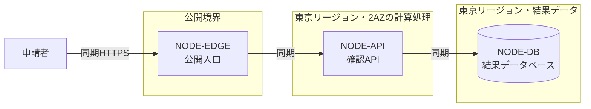

# クラウドアーキテクチャ — 申請結果確認

**申請結果確認のプロバイダーはAWSで合意し、管理サービスを使った単一リージョン・複数AZ構成を第一候補とする。** 確定直後の確認集中を読み取り経路の容量で受け止めることと、少人数で運用できることを優先したためである。集中倍率（`WL-OQ-001`）と確認経路（`REQ-OQ-001`）が未決なので、この構成は実装へ渡せる最終決定ではない。設計者と運用責任者は `ADR-001` を承認済みとして実装しない。

## 設計入力と制約

| 入力ID | 根拠状態 | 内容 | 設計への影響 |
|---|---|---|---|
| CON-001 | agreed_decision | 運用担当2人、担当者はAWSの本番運用経験を持ち、プロバイダーにはAWSを採用する | プロバイダー、計算処理、可観測性 |
| REQ-001 | agreed_decision | 申請者が確定した申請結果と次の行動を確認できる | 計算処理、データベース |
| DRV-001 | hypothesis | 確定直後の確認集中でも確認できる | エッジ、計算処理 |
| WL-001 | hypothesis | 確認ピーク80件/秒（1分窓） | 計算処理、エッジ |
| QR-001 | agreed_decision | 集中10分間の確認成功率99.9%以上 | リージョン/AZ、バックアップ/DR |
| QR-002 | hypothesis | 確認の95パーセンタイル800ミリ秒以下 | エッジ、計算処理 |
| REQ-OQ-001 | open_question | 確認経路が未決 | エッジ（通知製品を選ばない） |

## 代替案比較

| 選定項目 | 採用候補 | 代替案 | 根拠ID | 利点 | 不利・リスク | 状態 |
|---|---|---|---|---|---|---|
| プロバイダー | AWS | GCP | CON-001 | 既存運用経験を再利用できる | 単一プロバイダーへ依存する | agreed_decision |
| リージョン/AZ | 東京リージョン・2AZ | 東京＋大阪の複数リージョン | QR-001、CON-001 | AZ障害に耐えつつ運用対象を増やさない | リージョン障害への継続性を持たない | hypothesis |
| 計算処理 | ECS on Fargate | EKS、Lambda | REQ-001、WL-001、CON-001 | 常駐APIを保ちつつ制御面の運用を減らせる | コンテナの更新と容量検証は残る | hypothesis |
| ネットワーク | VPC＋Application Load Balancer | API Gateway直結 | WL-001、QR-001 | 2AZへの振り分けを同じ構成で扱える | ALBの費用が固定で残る | hypothesis |
| ストレージ | S3（静的資産とバックアップ置き場） | EFS | WL-001 | 静的資産の配信とバックアップ先を分けずに済む | 結果データの参照元には使わない | hypothesis |
| データベース | Aurora PostgreSQL互換 | RDS for PostgreSQL、DynamoDB | REQ-001、QR-001 | 複数AZを同じ境界で扱える | 費用とフェイルオーバー時間を検証する必要がある | hypothesis |
| メッセージング | 非該当 | SQS | REQ-001 | 該当なし | 確認は読み取りだけで非同期の配送が無い。通知経路は `REQ-OQ-001` の決定後に再評価する | not_applicable |
| ID管理 | 非該当 | Cognito | CON-001 | 該当なし | 利用者認証は組織のID基盤へ委ねる | not_applicable |
| エッジ | CloudFront | ALB直接公開 | WL-001、QR-002 | 集中時間帯の読み取りを入口で吸収できる | 設定対象が一つ増える | hypothesis |
| 可観測性 | CloudWatch | Datadog | CON-001、QR-001 | 追加の契約と運用対象を増やさない | 高度な相関分析は自前で組む | hypothesis |
| バックアップ/DR | 未決 | 同一リージョン内スナップショット、大阪への複製 | QR-001、ARC-OQ-001 | 該当なし | リージョン障害時の復旧目標が決まるまで方式を選べない | open_question |
| デリバリー | GitHub ActionsからECSへのローリング更新 | CodePipeline | CON-001 | 既存のリポジトリ運用に合わせられる | 本番承認の手順は運用手順で決める | hypothesis |

## 採用構成

| 図ノードID | 役割 | 採用サービス | リージョン/AZ・可用性単位 | 根拠ID | 状態 |
|---|---|---|---|---|---|
| NODE-EDGE | 公開入口。申請者からのHTTPSを受ける | CloudFront＋Application Load Balancer | 入口はグローバル、転送先は東京リージョンの2AZ | WL-001、QR-002 | hypothesis |
| NODE-API | 確認API。申請結果の確認を受け付ける | ECS on Fargate | 東京リージョンの2AZへタスクを分散 | REQ-001、DRV-001、WL-001、QR-001、QR-002 | hypothesis |
| NODE-DB | 結果データベース。確定した申請結果を保持する | Aurora PostgreSQL互換 | 東京リージョンの2AZへまたがるクラスター | REQ-001、QR-001 | hypothesis |

## ADR

| ADR ID | 判断 | 候補 | 根拠ID | 結果・トレードオフ | 再検討条件 | 状態 |
|---|---|---|---|---|---|---|
| ADR-001 | AWSの管理サービスを中心に単一リージョン・複数AZで構成する | 単一リージョンと複数リージョン、管理サービスと自前運用 | REQ-001、DRV-001、WL-001、QR-001、QR-002、CON-001 | 得るのは管理対象の削減とAZ障害への耐性。失うのはリージョン障害への継続性 | `ARC-OQ-001` が単一リージョンでは満たせない値になったとき | hypothesis |

## インフラ構成図

## 障害・縮退経路

| 経路ID | 起点 | 影響 | 縮退 | 検知・復旧 | 関連ID |
|---|---|---|---|---|---|
| FAIL-001 | NODE-DB | 結果データベースが停止し、確認が止まる | 静的な障害案内だけを返し、古い結果を表示しない | データベース監視で検知し、同じリージョン内で自動切替する | QR-001、ADR-001 |

## 要求トレーサビリティ

| 要求ID | 負荷ID | 品質要求ID | ADR ID | 図ノードID | 検証 |
|---|---|---|---|---|---|
| REQ-001、DRV-001 | WL-001 | QR-001、QR-002 | ADR-001 | NODE-EDGE、NODE-API、NODE-DB | 80件/秒を10分与え、成功率と95パーセンタイルを測る |

## 仮説と未決

| ID | 根拠状態 | 内容 | 設計感度 | 検証計画 | 影響先 |
|---|---|---|---|---|---|
| ARC-HYP-001 | hypothesis | 単一リージョン・複数AZで `QR-001` を満たせる | 入口とデータベースの可用性単位 | 障害注入と月額費用を検証する | ADR-001、NODE-EDGE、NODE-DB |
| ARC-OQ-001 | open_question | リージョン障害時に何時間で復旧すべきか | バックアップ/DR、リージョン数 | `QR-OQ-001` を事業責任者と合意する | ADR-001、NODE-DB |
| WL-OQ-001 | open_question | 確定日の集中倍率は上流で未決のため継続する | 最大タスク数、DB容量、費用 | 直近2四半期の確認記録を取得する | ADR-001、NODE-API、NODE-DB |
| REQ-OQ-001 | open_question | 確認経路は上流で未決のため継続する | エッジ | 事業責任者の決定を要求発見資料へ戻す | ADR-001、NODE-EDGE |

## この資料に書かないもの

要求、利用場面、業務ルール、論理データモデルはそれぞれの基準資料で扱う。アプリケーション内部のクラスやAPI契約、Terraformコード、監視と復旧の具体的な操作手順も、この資料の対象外である。
